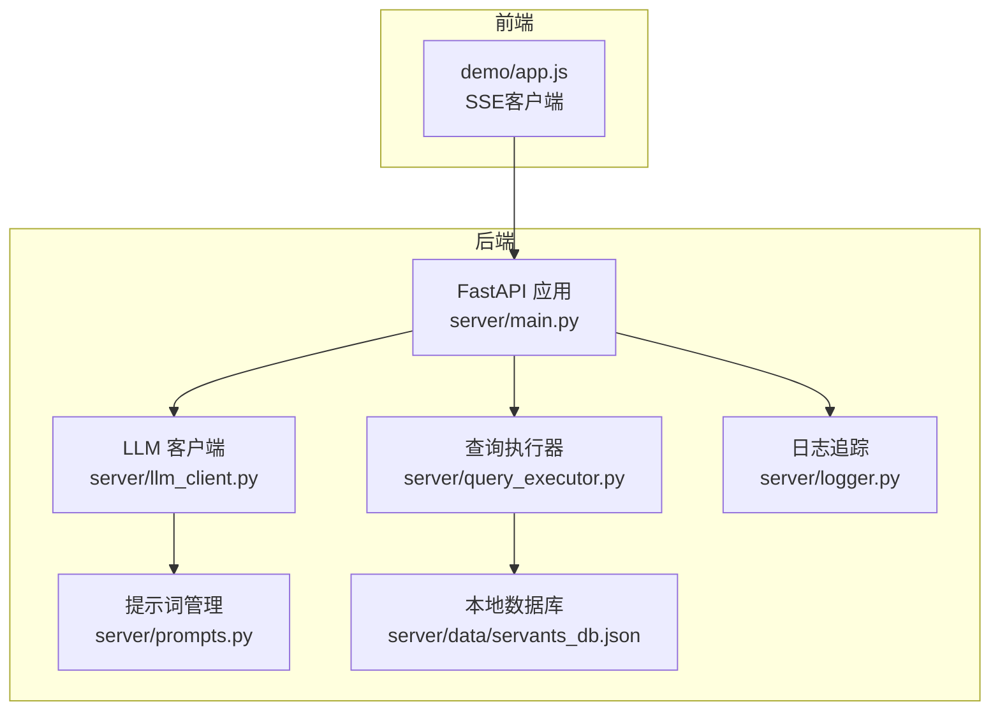
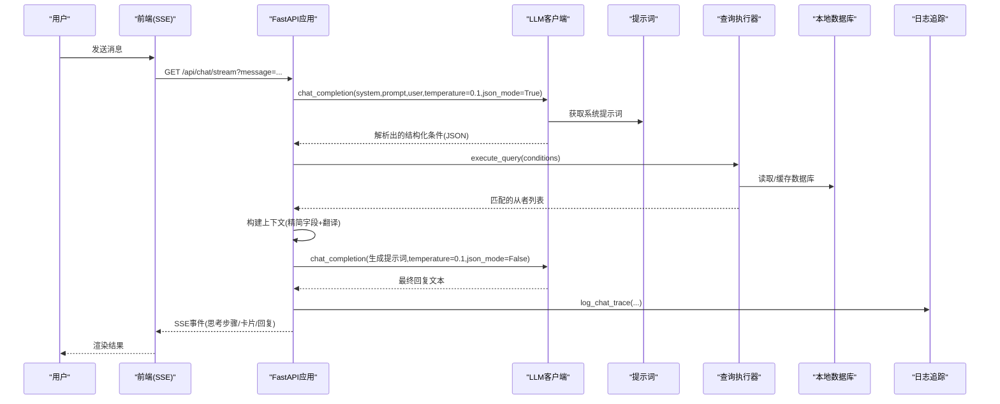
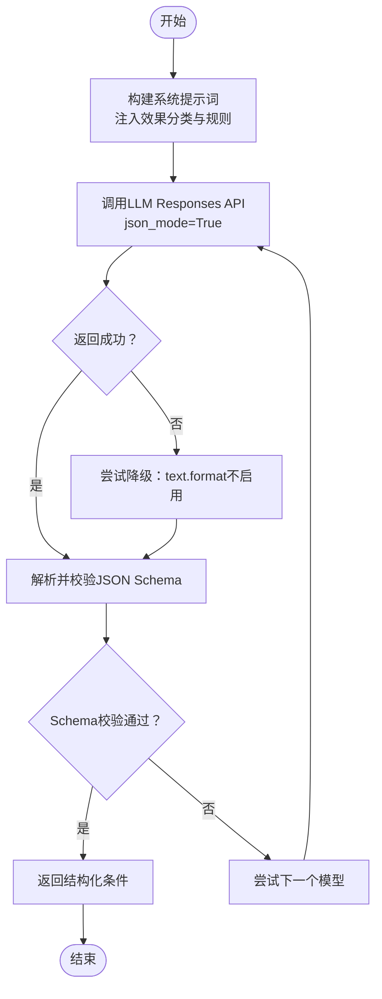
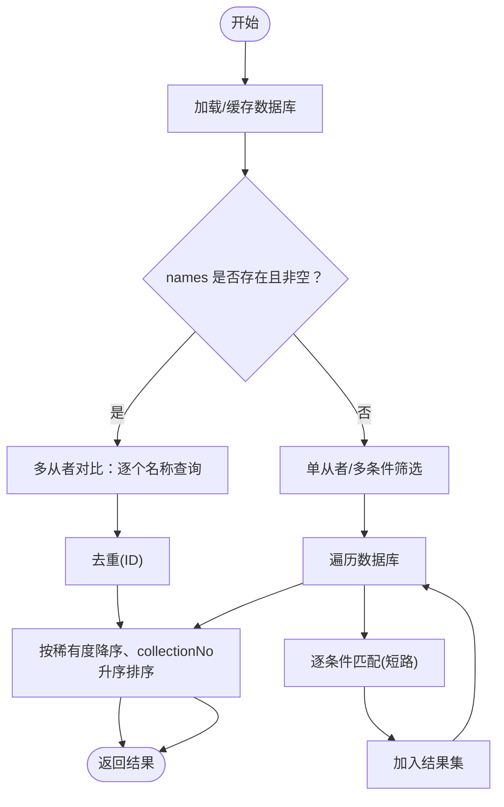
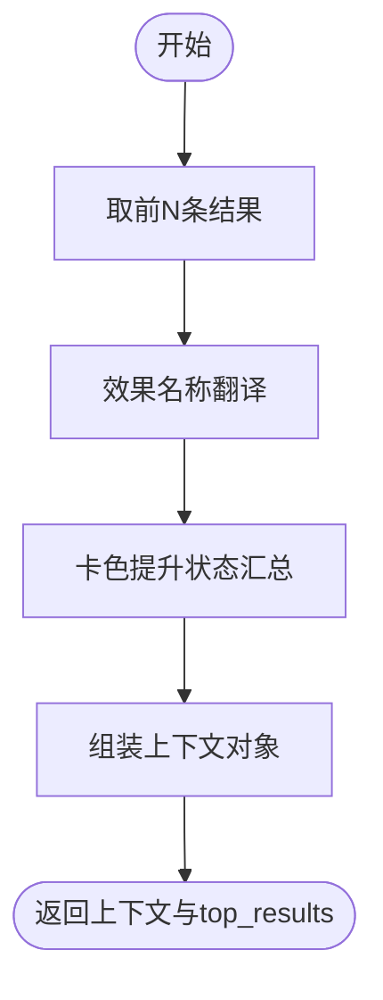
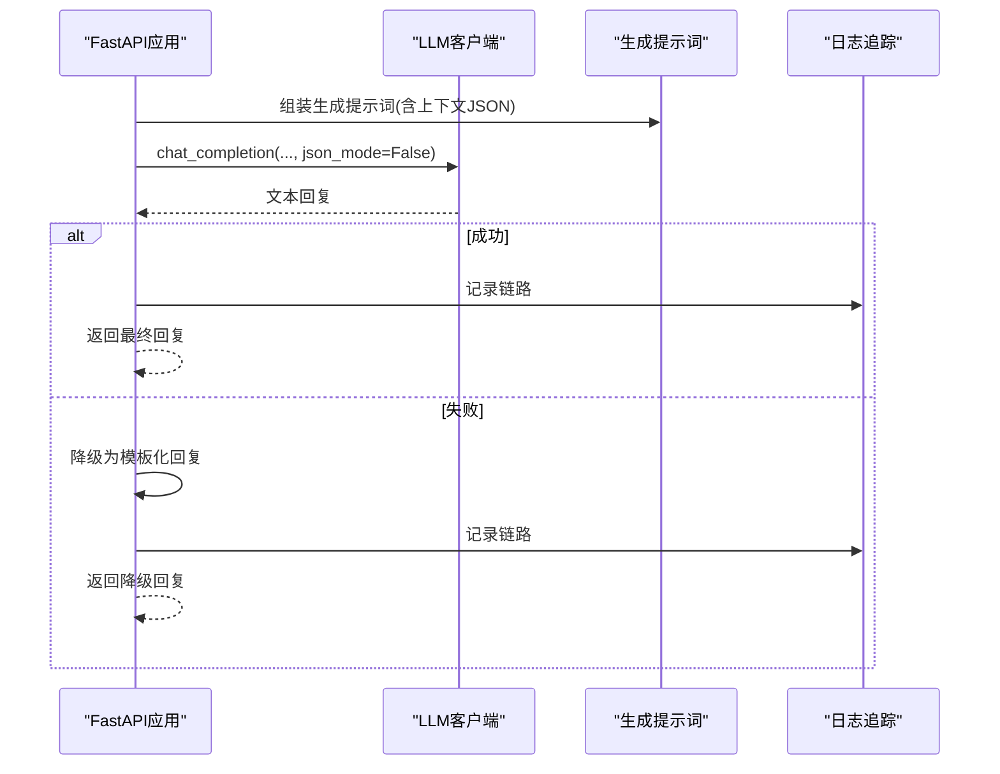
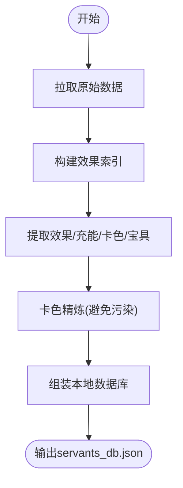
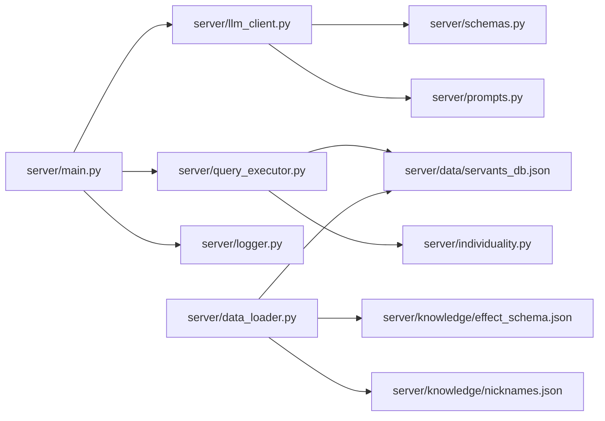

# 数据流架构

<cite>
**本文引用的文件**
- [server/main.py](file://server/main.py)
- [server/llm_client.py](file://server/llm_client.py)
- [server/prompts.py](file://server/prompts.py)
- [server/query_executor.py](file://server/query_executor.py)
- [server/schemas.py](file://server/schemas.py)
- [server/data_loader.py](file://server/data_loader.py)
- [server/logger.py](file://server/logger.py)
- [server/individuality.py](file://server/individuality.py)
- [server/knowledge/effect_schema.json](file://server/knowledge/effect_schema.json)
- [server/knowledge/nicknames.json](file://server/knowledge/nicknames.json)
- [tests/test_query_executor.py](file://tests/test_query_executor.py)
- [tests/test_llm_client.py](file://tests/test_llm_client.py)
- [demo/app.js](file://demo/app.js)
</cite>

## 目录
1. [简介](#简介)
2. [项目结构](#项目结构)
3. [核心组件](#核心组件)
4. [架构总览](#架构总览)
5. [详细组件分析](#详细组件分析)
6. [依赖关系分析](#依赖关系分析)
7. [性能考量](#性能考量)
8. [故障排查指南](#故障排查指南)
9. [结论](#结论)
10. [附录](#附录)

## 简介
本文件面向Laplace项目的数据流架构，系统性梳理从用户输入到最终回复的完整链路，覆盖四个阶段：意图解析、查询执行、上下文构建、自然语言生成（RAG）。文档重点解释：
- 查询条件的解析与验证机制（多条件组合、优先级与逻辑运算）
- 查询执行器的筛选算法与性能优化策略
- 上下文数据的构建流程（效果翻译、数据格式化）
- RAG工作原理与降级策略
- 缓存策略与性能监控指标
- 数据流调试与故障排查方法

## 项目结构
Laplace采用分层清晰的服务端架构：
- Web入口与路由：FastAPI应用，提供REST与SSE两类端点
- LLM客户端：统一调用Responses API，支持结构化输出与降级
- 意图解析与提示词：系统提示词与生成提示词，驱动LLM输出结构化JSON
- 查询执行器：在本地数据库上执行多条件筛选
- 数据加载器：从Atlas Academy API抓取并清洗，生成本地数据库
- 日志追踪：记录完整链路，便于审计与排障

图表来源
- [server/main.py:114-365](file://server/main.py#L114-L365)
- [server/llm_client.py:41-254](file://server/llm_client.py#L41-L254)
- [server/prompts.py:178-219](file://server/prompts.py#L178-L219)
- [server/query_executor.py:53-343](file://server/query_executor.py#L53-L343)
- [server/logger.py:38-55](file://server/logger.py#L38-L55)

章节来源
- [server/main.py:114-365](file://server/main.py#L114-L365)
- [demo/app.js:1-412](file://demo/app.js#L1-L412)

## 核心组件
- FastAPI应用与路由：提供REST与SSE端点，负责链路编排、错误处理与日志记录
- LLM客户端：封装Responses API调用，支持结构化输出与多模型降级
- 提示词模块：动态注入效果分类与规则，保证LLM输出严格符合Schema
- 查询执行器：在本地数据库上执行多条件筛选，支持名称映射、特性过滤、效果组合与排序
- 数据加载器：从外部API抓取原始数据，构建本地数据库，包含效果抽取、卡色统计、宝具解析等
- 日志追踪：记录完整链路，包含意图、结果数量、最终回复与上下文摘要

章节来源
- [server/main.py:150-242](file://server/main.py#L150-L242)
- [server/llm_client.py:41-132](file://server/llm_client.py#L41-L132)
- [server/prompts.py:178-219](file://server/prompts.py#L178-L219)
- [server/query_executor.py:53-116](file://server/query_executor.py#L53-L116)
- [server/data_loader.py:332-363](file://server/data_loader.py#L332-L363)
- [server/logger.py:38-55](file://server/logger.py#L38-L55)

## 架构总览
Laplace采用“LLM意图解析 + 本地数据库检索 + RAG生成”的数据流模式。整体链路如下：

图表来源
- [server/main.py:150-355](file://server/main.py#L150-L355)
- [server/llm_client.py:41-132](file://server/llm_client.py#L41-L132)
- [server/prompts.py:186-219](file://server/prompts.py#L186-L219)
- [server/query_executor.py:53-116](file://server/query_executor.py#L53-L116)
- [server/logger.py:38-55](file://server/logger.py#L38-L55)

## 详细组件分析

### 阶段一：意图解析（LLM解析）
- 角色与职责
  - 通过系统提示词约束LLM输出格式，确保其严格遵循结构化Schema
  - 将用户自然语言转化为结构化查询条件（conditions）
- 关键机制
  - 结构化输出：Responses API使用text.format的json_schema进行强约束
  - 降级策略：当模型不支持结构化输出时，自动回退到文本解析并校验Schema
  - 多模型轮询：主模型失败后依次尝试备用模型
- 错误处理
  - 解析失败或模型不可用时，返回友好提示并记录traceId

图表来源
- [server/llm_client.py:41-132](file://server/llm_client.py#L41-L132)
- [server/prompts.py:178-184](file://server/prompts.py#L178-L184)

章节来源
- [server/llm_client.py:41-132](file://server/llm_client.py#L41-L132)
- [server/prompts.py:178-184](file://server/prompts.py#L178-L184)
- [tests/test_llm_client.py:106-150](file://tests/test_llm_client.py#L106-L150)

### 阶段二：查询执行（数据库筛选）
- 角色与职责
  - 在本地数据库上执行多条件筛选，返回匹配的从者列表
  - 支持名称映射、特性过滤、效果组合、卡色与宝具目标筛选
- 查询条件解析与验证
  - 条件对象由Schema定义，包含数值比较、字符串匹配、效果集合、特性集合、属性与卡色等
  - 空值清理：空字符串、空列表、空字典均转换为None，避免误判
- 筛选算法与优先级
  - 逐条遍历数据库，按条件顺序进行短路判断，优先排除明显不匹配项
  - 多效果AND/OR：默认AND，OR时只要满足任一效果即可
  - 特性过滤：支持必须拥有与排斥特性，采用集合运算
  - 名称匹配：昵称映射 → 精确匹配 → 子串模糊 → 反向子串
- 性能优化
  - 全局缓存：数据库与昵称映射仅首次加载后缓存
  - 排序：按稀有度降序、collectionNo升序，保证展示稳定性
  - 多从者对比：拆分为单个名称查询，去重后合并，再统一排序

图表来源
- [server/query_executor.py:53-116](file://server/query_executor.py#L53-L116)
- [server/query_executor.py:119-343](file://server/query_executor.py#L119-L343)
- [server/schemas.py:25-77](file://server/schemas.py#L25-L77)

章节来源
- [server/query_executor.py:53-116](file://server/query_executor.py#L53-L116)
- [server/query_executor.py:119-343](file://server/query_executor.py#L119-L343)
- [server/schemas.py:25-77](file://server/schemas.py#L25-L77)
- [tests/test_query_executor.py:123-172](file://tests/test_query_executor.py#L123-L172)

### 阶段三：上下文构建（预消化与翻译）
- 角色与职责
  - 将查询结果转换为RAG生成所需的上下文，控制字段数量与格式
- 数据转换与格式化
  - 限制展示数量：最多MAX_CONTEXT_SIZE条
  - 字段精简：仅保留必要字段，避免冗余
  - 效果翻译：将effectName映射为中文别名，提高可读性
  - 卡色状态：汇总是否有蓝/绿/红卡提升，形成简洁提示
- 元信息
  - total_found：查询总数
  - query_conditions：原始条件（由调用方填充）

图表来源
- [server/main.py:60-106](file://server/main.py#L60-L106)
- [server/knowledge/effect_schema.json:10-694](file://server/knowledge/effect_schema.json#L10-L694)

章节来源
- [server/main.py:60-106](file://server/main.py#L60-L106)
- [server/knowledge/effect_schema.json:10-694](file://server/knowledge/effect_schema.json#L10-L694)

### 阶段四：自然语言生成（RAG）
- 角色与职责
  - 基于检索到的上下文生成自然语言回复，严格遵循上下文数据
- 生成提示词
  - 注入上下文JSON与用户问题，要求模型直接回答，不捏造数据
  - 强调统计绝对纪律：必须基于total_found，不得将代表数量当作总数
- 降级策略
  - 若生成失败（空回复或异常），回退到模板化回复，包含总数与提示
- 输出控制
  - 限制返回给前端的结果数量，避免响应过大

图表来源
- [server/main.py:200-242](file://server/main.py#L200-L242)
- [server/prompts.py:186-219](file://server/prompts.py#L186-L219)
- [server/logger.py:38-55](file://server/logger.py#L38-L55)

章节来源
- [server/main.py:200-242](file://server/main.py#L200-L242)
- [server/prompts.py:186-219](file://server/prompts.py#L186-L219)
- [server/logger.py:38-55](file://server/logger.py#L38-L55)

### 数据加载与本地数据库
- 角色与职责
  - 从Atlas Academy API抓取全量从者数据，构建本地数据库
  - 提取技能效果、NP充能、卡色构成、宝具颜色与目标类型
- 关键流程
  - 效果匹配索引：基于effect_schema.json构建funcType/buffType索引
  - 卡色精炼：避免通用枚举污染，仅保留明确颜色提升
  - 宝具解析：识别宝具颜色与目标类型，提取附带效果
  - 输出：生成servants_db.json供查询执行器使用

图表来源
- [server/data_loader.py:91-363](file://server/data_loader.py#L91-L363)
- [server/knowledge/effect_schema.json:10-694](file://server/knowledge/effect_schema.json#L10-L694)

章节来源
- [server/data_loader.py:91-363](file://server/data_loader.py#L91-L363)
- [server/knowledge/effect_schema.json:10-694](file://server/knowledge/effect_schema.json#L10-L694)

## 依赖关系分析
- 组件耦合
  - FastAPI应用依赖LLM客户端、查询执行器与日志模块
  - LLM客户端依赖提示词模块与Schema定义
  - 查询执行器依赖本地数据库与昵称映射
  - 数据加载器独立于运行时，仅在构建阶段使用
- 外部依赖
  - Requests：数据加载器抓取外部API
  - httpx：LLM客户端异步HTTP调用
  - Pydantic：Schema校验与JSON模式
- 循环依赖
  - 未发现循环依赖，模块间职责清晰

图表来源
- [server/main.py:17-21](file://server/main.py#L17-L21)
- [server/llm_client.py:22-34](file://server/llm_client.py#L22-L34)
- [server/query_executor.py:12-19](file://server/query_executor.py#L12-L19)
- [server/data_loader.py:14-23](file://server/data_loader.py#L14-L23)

章节来源
- [server/main.py:17-21](file://server/main.py#L17-L21)
- [server/llm_client.py:22-34](file://server/llm_client.py#L22-L34)
- [server/query_executor.py:12-19](file://server/query_executor.py#L12-L19)
- [server/data_loader.py:14-23](file://server/data_loader.py#L14-L23)

## 性能考量
- 缓存策略
  - 数据库与昵称映射：全局变量缓存，仅在启动时加载
  - 系统提示词：内存缓存，避免重复拼装
- 查询优化
  - 短路匹配：按条件优先级快速排除
  - 集合运算：特性过滤使用集合，提升查找效率
  - 排序稳定：稀有度降序、collectionNo升序，减少前端二次排序
- I/O与网络
  - 数据加载器一次性构建本地数据库，运行时避免网络请求
  - LLM调用超时控制与降级，保障可用性
- 前端体验
  - SSE分阶段推送：思考步骤、卡片先行、回复增量渲染
  - 限制返回数量：MAX_RESULTS控制响应大小

章节来源
- [server/query_executor.py:41-50](file://server/query_executor.py#L41-L50)
- [server/llm_client.py:167-174](file://server/llm_client.py#L167-L174)
- [server/main.py:108-112](file://server/main.py#L108-L112)
- [demo/app.js:40-87](file://demo/app.js#L40-L87)

## 故障排查指南
- LLM解析失败
  - 现象：意图解析阶段返回错误或空响应
  - 排查要点：检查模型配置、响应格式支持、Schema校验
  - 参考：降级逻辑与多模型轮询
- 查询执行异常
  - 现象：查询结果为空或排序异常
  - 排查要点：确认条件字段是否为空、昵称映射是否正确、效果名称是否在effect_schema中
- RAG生成失败
  - 现象：最终回复为空或异常
  - 排查要点：检查上下文JSON是否完整、提示词是否正确注入
- 日志追踪
  - 使用log_chat_trace记录traceId、用户问题、解析意图、结果数量、最终回复与上下文
  - 通过日志定位问题环节与具体参数

章节来源
- [server/llm_client.py:66-84](file://server/llm_client.py#L66-L84)
- [server/main.py:164-174](file://server/main.py#L164-L174)
- [server/main.py:214-221](file://server/main.py#L214-L221)
- [server/logger.py:38-55](file://server/logger.py#L38-L55)

## 结论
Laplace通过“LLM意图解析 + 本地数据库检索 + RAG生成”的数据流，实现了从自然语言到结构化查询再到可读回复的完整闭环。系统在条件解析、筛选算法、上下文构建与生成降级等方面具备完善的机制与优化策略，配合日志追踪与SSE流式渲染，兼顾了准确性、性能与用户体验。

## 附录
- 查询条件Schema与示例
  - 数值比较：npCharge、rarity
  - 字符串匹配：className、name、skillEffect、skillEffects、targetType
  - 集合过滤：traits、excludeTraits、cards、npCard、npTarget
  - 多从者对比：names数组
- 效果名称与中文别名
  - 动态注入到系统提示词，确保LLM与后端一致

章节来源
- [server/schemas.py:25-77](file://server/schemas.py#L25-L77)
- [server/prompts.py:15-44](file://server/prompts.py#L15-L44)
- [server/knowledge/effect_schema.json:10-694](file://server/knowledge/effect_schema.json#L10-L694)