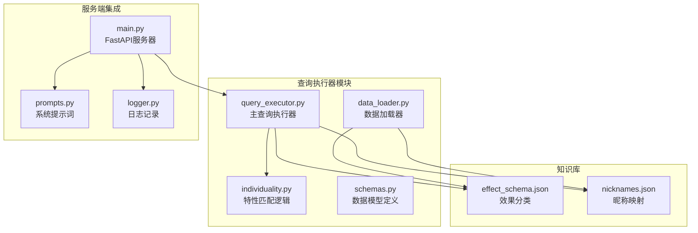
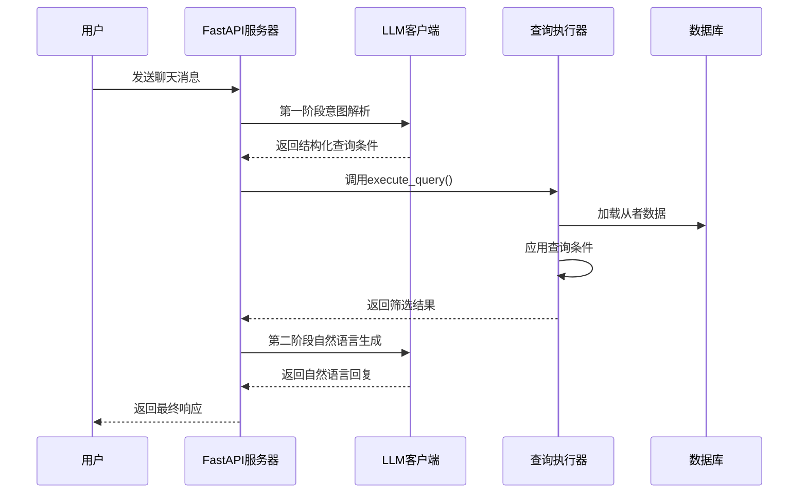
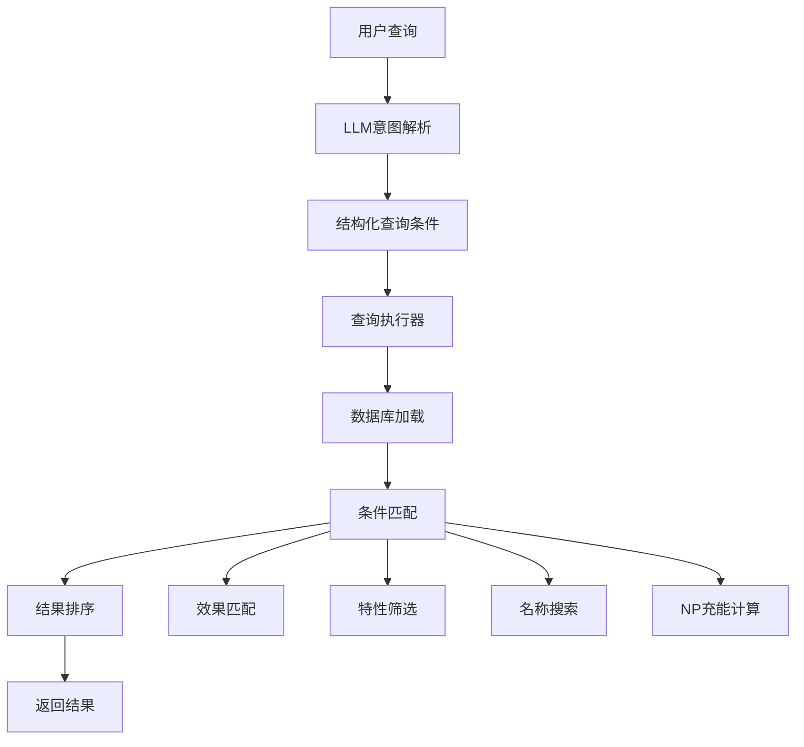
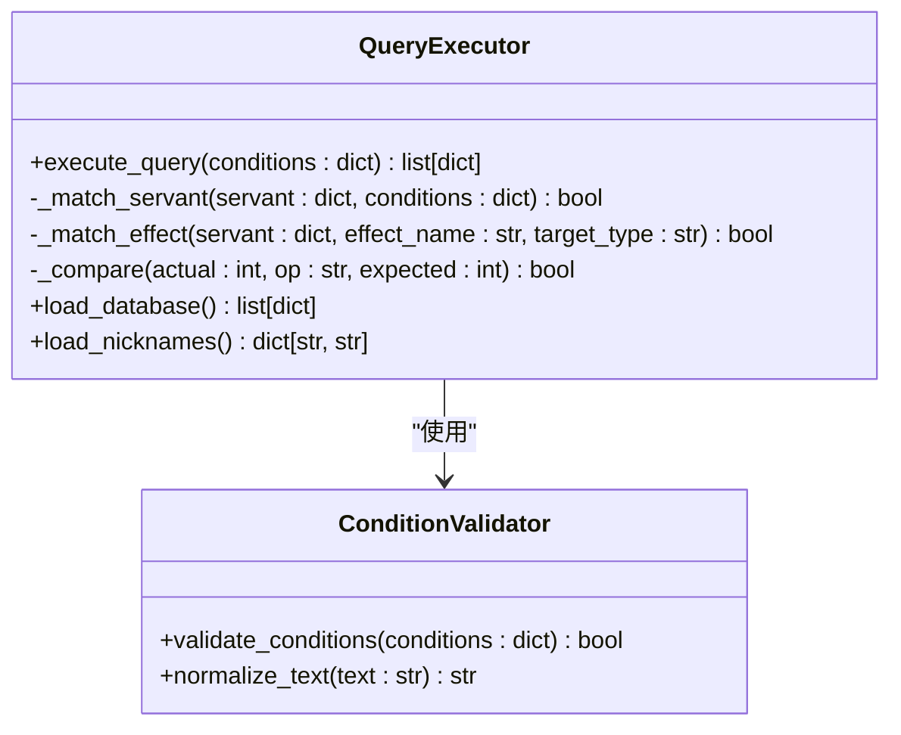
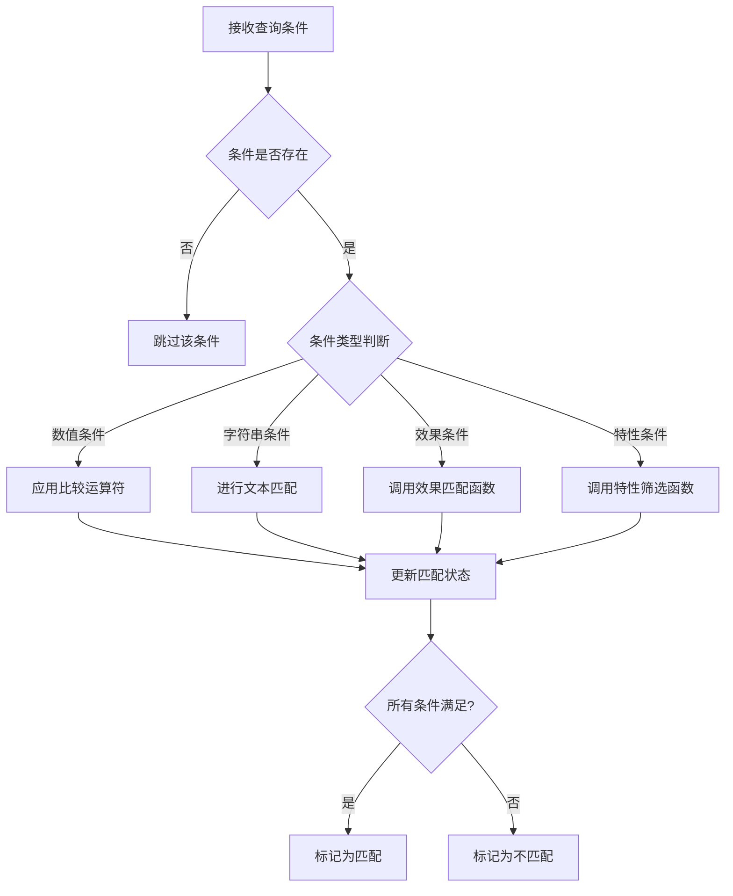
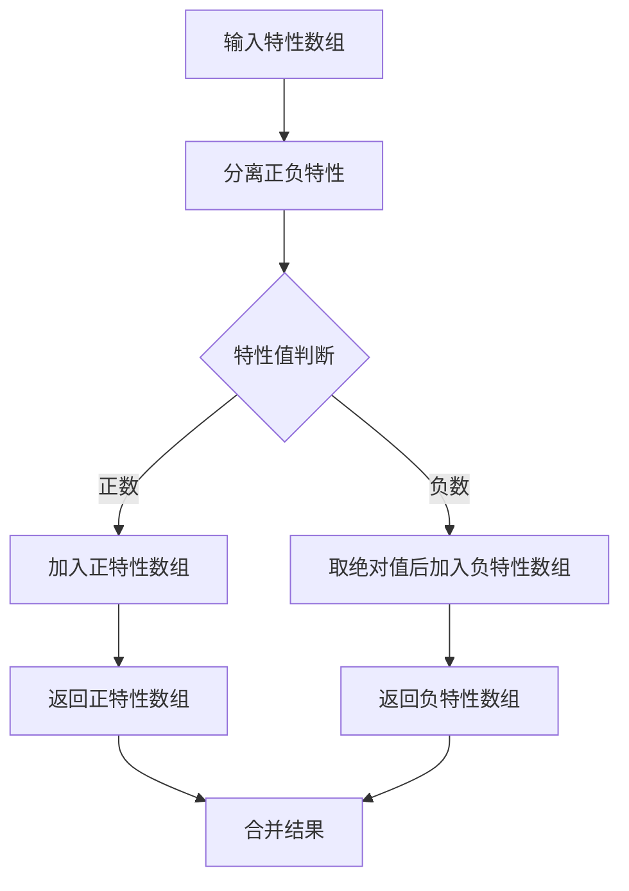
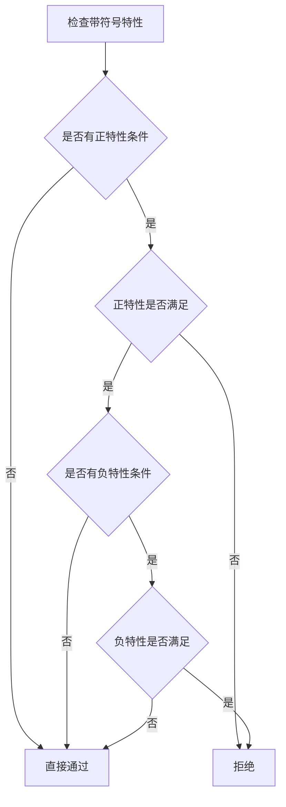
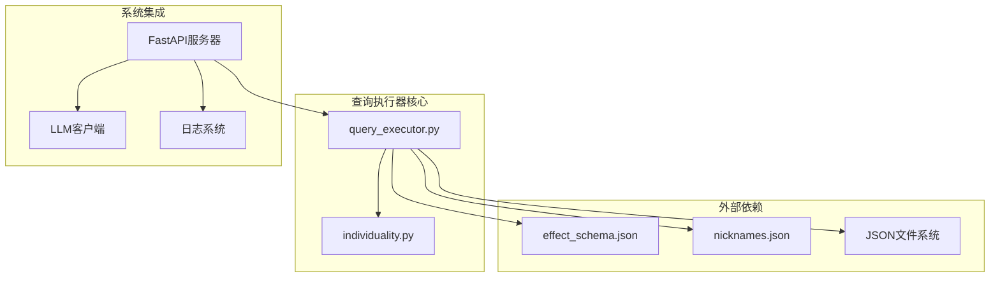
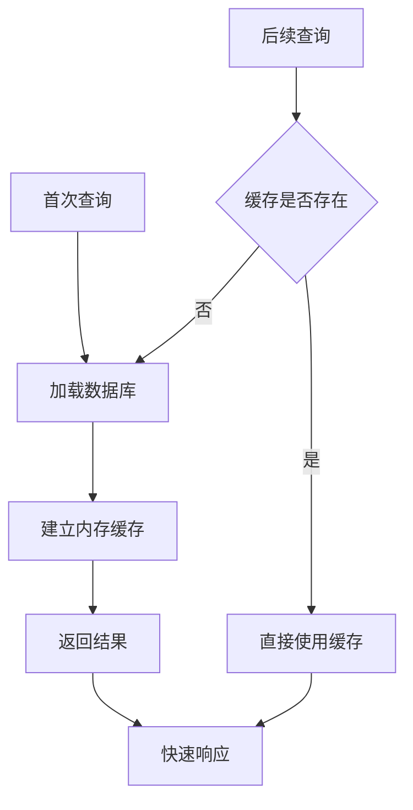
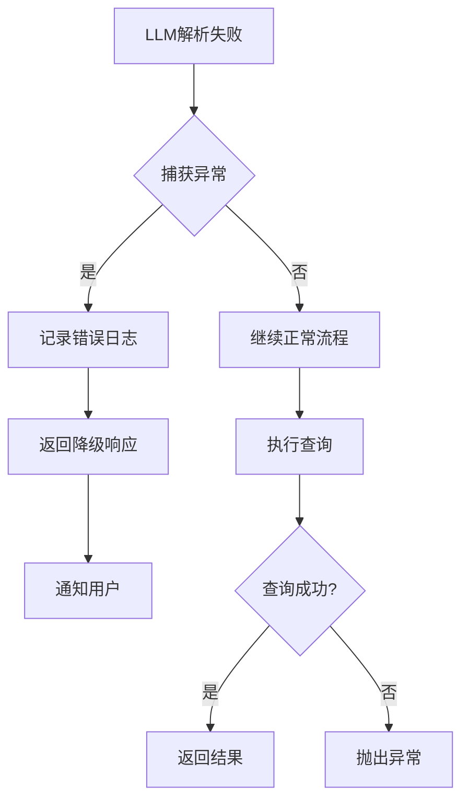

# 查询执行器模块

<cite>
**本文档引用的文件**
- [query_executor.py](file://server/query_executor.py)
- [individuality.py](file://server/individuality.py)
- [main.py](file://server/main.py)
- [schemas.py](file://server/schemas.py)
- [data_loader.py](file://server/data_loader.py)
- [test_query_executor.py](file://tests/test_query_executor.py)
- [test_individuality.py](file://tests/test_individuality.py)
- [prompts.py](file://server/prompts.py)
- [logger.py](file://server/logger.py)
- [effect_schema.json](file://server/knowledge/effect_schema.json)
- [nicknames.json](file://server/knowledge/nicknames.json)
</cite>

## 目录
1. [简介](#简介)
2. [项目结构](#项目结构)
3. [核心组件](#核心组件)
4. [架构概览](#架构概览)
5. [详细组件分析](#详细组件分析)
6. [依赖关系分析](#依赖关系分析)
7. [性能考虑](#性能考虑)
8. [故障排除指南](#故障排除指南)
9. [结论](#结论)

## 简介

Laplace的查询执行器模块是整个系统的核心组件，负责将LLM解析出的自然语言查询转换为结构化的数据库查询，并在预加载的从者数据上执行筛选。该模块实现了复杂的多条件查询功能，支持效果类型、NP充能、职阶、稀有度等多种维度的组合查询。

查询执行器采用分层设计：第一层是LLM意图解析，第二层是查询条件构建，第三层是数据库查询执行，第四层是结果筛选和排序。这种设计使得系统能够灵活处理各种复杂的查询场景。

## 项目结构

查询执行器模块位于`server/`目录下，主要包含以下文件：



**图表来源**
- [query_executor.py:1-305](file://server/query_executor.py#L1-L305)
- [main.py:1-228](file://server/main.py#L1-L228)

**章节来源**
- [query_executor.py:1-305](file://server/query_executor.py#L1-L305)
- [main.py:1-228](file://server/main.py#L1-L228)

## 核心组件

### 查询执行器核心功能

查询执行器模块的核心是`execute_query`函数，它负责：
- 接收LLM解析出的查询条件
- 在预加载的从者数据库上执行筛选
- 支持多条件组合查询
- 返回排序后的结果集

### 特性匹配引擎

`individuality.py`模块实现了FGO特性匹配逻辑，包括：
- 正特性和负特性的分离处理
- 带符号特性的校验逻辑
- 高级特性筛选接口

### 数据模型定义

`schemas.py`文件定义了查询条件的数据结构：
- 数值比较条件（eq, gte, lte, gt, lt）
- 查询条件的完整字段定义
- LLM与查询执行器之间的结构化契约

**章节来源**
- [query_executor.py:53-87](file://server/query_executor.py#L53-L87)
- [individuality.py:58-78](file://server/individuality.py#L58-L78)
- [schemas.py:25-45](file://server/schemas.py#L25-L45)

## 架构概览

查询执行器采用三层架构设计：



**图表来源**
- [main.py:87-218](file://server/main.py#L87-L218)
- [query_executor.py:53-87](file://server/query_executor.py#L53-L87)

### 数据流处理

查询执行器的数据流包括多个处理阶段：



**图表来源**
- [prompts.py:46-161](file://server/prompts.py#L46-L161)
- [query_executor.py:90-261](file://server/query_executor.py#L90-L261)

## 详细组件分析

### execute_query函数详解

`execute_query`函数是查询执行器的核心，实现了完整的查询处理流程：

#### 函数签名和参数



**图表来源**
- [query_executor.py:53-305](file://server/query_executor.py#L53-L305)

#### 查询条件处理流程

查询执行器支持以下查询条件：

| 条件类型 | 字段名 | 描述 | 示例 |
|---------|--------|------|------|
| 数值比较 | npCharge | NP自充百分比 | {"op": "gte", "value": 30} |
| 数值比较 | rarity | 稀有度 | {"op": "eq", "value": 5} |
| 字符串匹配 | className | 职阶名称 | "saber" |
| 字符串匹配 | name | 从者名称 | "阿尔托莉雅" |
| 效果匹配 | skillEffect | 单个技能效果 | "invincible" |
| 效果匹配 | skillEffects | 多个技能效果 | ["invincible", "avoidance"] |
| 目标类型 | targetType | 效果目标类型 | "party" |
| 特性筛选 | traits | 必须拥有的特性 | [300, 303] |
| 特性筛选 | excludeTraits | 不能拥有的特性 | [1002] |
| 其他属性 | gender | 性别 | "female" |
| 其他属性 | attribute | 阵营 | "earth" |
| 其他属性 | cards | 指令卡配比 | {"buster": 3} |
| 其他属性 | npCard | 宝具颜色 | "arts" |
| 其他属性 | npTarget | 宝具目标类型 | "all" |

#### 条件解析和验证

查询执行器采用严格的条件解析机制：



**图表来源**
- [query_executor.py:90-261](file://server/query_executor.py#L90-L261)

**章节来源**
- [query_executor.py:53-305](file://server/query_executor.py#L53-L305)

### 特殊查询逻辑：从者个体性处理

`individuality.py`模块实现了复杂的特性匹配算法，这是查询执行器的重要组成部分。

#### 特性分离和处理

特性系统采用正负分离的设计理念：



**图表来源**
- [individuality.py:8-20](file://server/individuality.py#L8-L20)

#### 带符号特性校验

带符号特性校验实现了复杂的逻辑关系：



**图表来源**
- [individuality.py:29-55](file://server/individuality.py#L29-L55)

#### 高级特性筛选接口

`filter_by_traits`函数提供了高级的特性筛选功能：

```mermaid
classDiagram
class TraitFilter {
+filter_by_traits(servant_traits : list[int],
required_traits : list[int],
exclude_traits : list[int]) bool
-check_required_traits(traits : list[int],
required : list[int]) bool
-check_exclude_traits(traits : list[int],
excluded : list[int]) bool
}
class TraitValidator {
+is_partial_match(self_traits : list[int],
targets : list[int]) bool
+divide_unsigned_and_signed(array : list[int])
tuple[list[int], list[int]]
}
TraitFilter --> TraitValidator : "使用"
```

**图表来源**
- [individuality.py:58-78](file://server/individuality.py#L58-L78)

**章节来源**
- [individuality.py:1-78](file://server/individuality.py#L1-L78)

### SQL语句生成和结果集处理

虽然查询执行器使用Python字典而非传统SQL，但其处理逻辑可以类比为SQL查询的各个阶段：

#### 查询条件构建


**图表来源**
- [schemas.py:25-45](file://server/schemas.py#L25-L45)

#### 结果集处理

查询执行器对结果集进行多级处理：

1. **基础筛选**：应用所有查询条件
2. **排序处理**：按稀有度降序，收集编号升序
3. **格式化输出**：转换为API响应格式

**章节来源**
- [query_executor.py:85-87](file://server/query_executor.py#L85-L87)

## 依赖关系分析

查询执行器模块的依赖关系相对简单，主要依赖于外部知识库和工具模块：



**图表来源**
- [query_executor.py:12-15](file://server/query_executor.py#L12-L15)
- [main.py:14-18](file://server/main.py#L14-L18)

### 关键依赖项

| 依赖项 | 类型 | 用途 | 版本要求 |
|-------|------|------|----------|
| effect_schema.json | 知识库 | 效果分类和映射 | v1.0+ |
| nicknames.json | 映射表 | 用户昵称到正式名称 | v1.0+ |
| JSON文件系统 | 文件系统 | 数据持久化 | Python 3.6+ |
| FastAPI | Web框架 | API服务 | 0.95+ |
| Pydantic | 数据验证 | 结构化数据 | 2.0+ |

**章节来源**
- [query_executor.py:14-15](file://server/query_executor.py#L14-L15)
- [main.py:7-19](file://server/main.py#L7-L19)

## 性能考虑

查询执行器在设计时充分考虑了性能优化：

### 缓存策略



**图表来源**
- [query_executor.py:17-50](file://server/query_executor.py#L17-L50)

### 查询优化技术

1. **早期退出优化**：在条件不满足时立即返回
2. **快速路径优化**：先检查效果集合再进行详细匹配
3. **缓存利用**：全局缓存数据库和昵称映射
4. **批量处理**：一次性加载所有数据到内存

### 性能基准

| 操作类型 | 处理方式 | 时间复杂度 | 空间复杂度 |
|---------|----------|------------|------------|
| 数据加载 | 缓存读取 | O(1) | O(n) |
| 单条件匹配 | 直接比较 | O(1) | O(1) |
| 效果匹配 | 集合查找 | O(k) | O(1) |
| 特性匹配 | 集合操作 | O(m) | O(m) |
| 排序处理 | 多键排序 | O(n log n) | O(1) |

**章节来源**
- [query_executor.py:17-50](file://server/query_executor.py#L17-L50)
- [query_executor.py:292-304](file://server/query_executor.py#L292-L304)

## 故障排除指南

### 常见错误类型和解决方案

#### LLM解析错误



**图表来源**
- [main.py:94-111](file://server/main.py#L94-L111)

#### 查询执行错误

查询执行器提供了完善的错误处理机制：

1. **数据库加载失败**：检查数据文件完整性
2. **条件解析错误**：验证查询条件格式
3. **内存不足**：检查系统资源使用情况
4. **文件权限错误**：验证知识库文件访问权限

#### 日志记录和监控

系统提供了详细的日志记录功能：

```mermaid
classDiagram
class Logger {
+log_chat_trace(trace_id : str,
user_message : str,
parsed_intent : dict,
found_count : int,
final_reply : str,
context : dict,
error : str)
+write_log_entry(entry : dict)
}
class TraceData {
+timestamp : str
+traceId : str
+query : str
+intent : dict
+results_count : int
+reply : str
+context : dict
+error : str
}
Logger --> TraceData : "记录"
```

**图表来源**
- [logger.py:38-55](file://server/logger.py#L38-L55)

**章节来源**
- [main.py:94-111](file://server/main.py#L94-L111)
- [logger.py:1-55](file://server/logger.py#L1-L55)

## 结论

Laplace的查询执行器模块展现了优秀的软件工程实践：

### 设计优势

1. **模块化设计**：清晰的职责分离，便于维护和扩展
2. **性能优化**：合理的缓存策略和早期退出机制
3. **错误处理**：完善的异常捕获和降级策略
4. **可测试性**：完整的单元测试覆盖关键功能

### 技术亮点

1. **特性匹配算法**：实现了复杂的正负特性分离和校验逻辑
2. **多条件查询**：支持灵活的条件组合和逻辑运算
3. **名称规范化**：统一的文本处理和匹配机制
4. **效果映射**：基于知识库的效果分类和翻译

### 改进建议

1. **索引优化**：考虑为常用查询字段建立索引
2. **查询缓存**：实现查询结果的缓存机制
3. **并发处理**：支持多线程查询执行
4. **监控指标**：添加性能监控和统计功能

查询执行器模块为Laplace系统提供了强大的从者数据查询能力，通过精心设计的算法和优化策略，能够高效处理复杂的多条件查询场景，为用户提供准确、及时的查询结果。