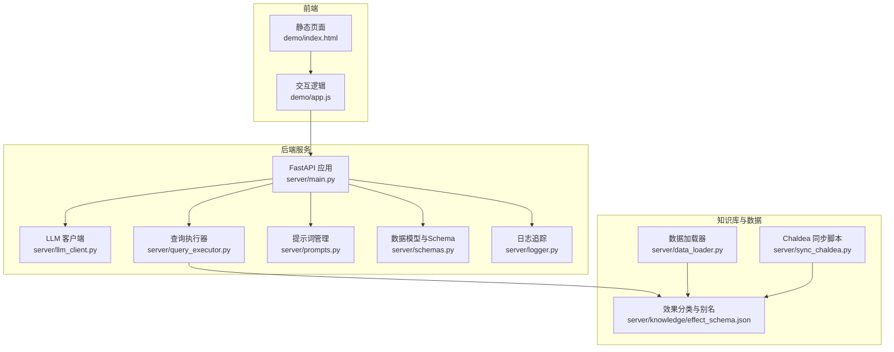
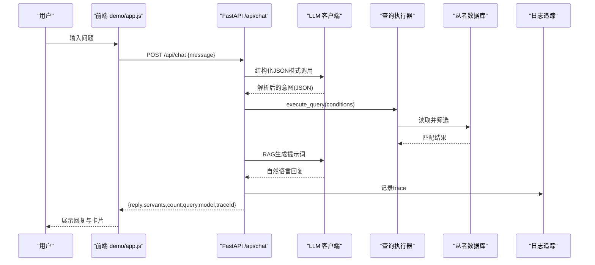
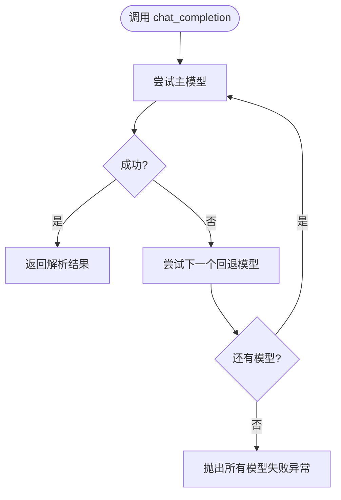
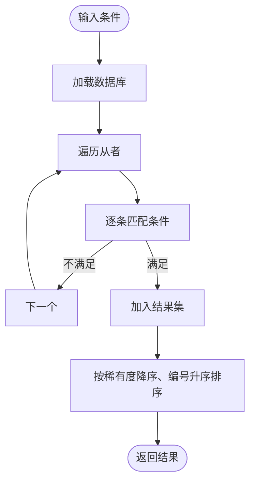
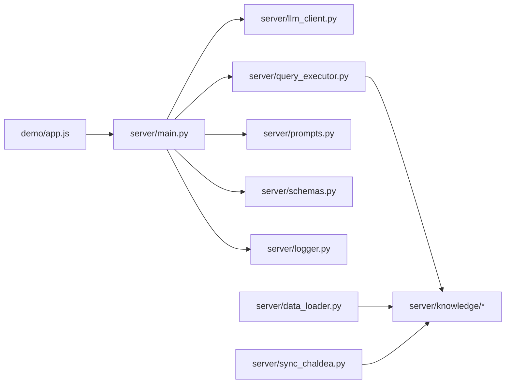
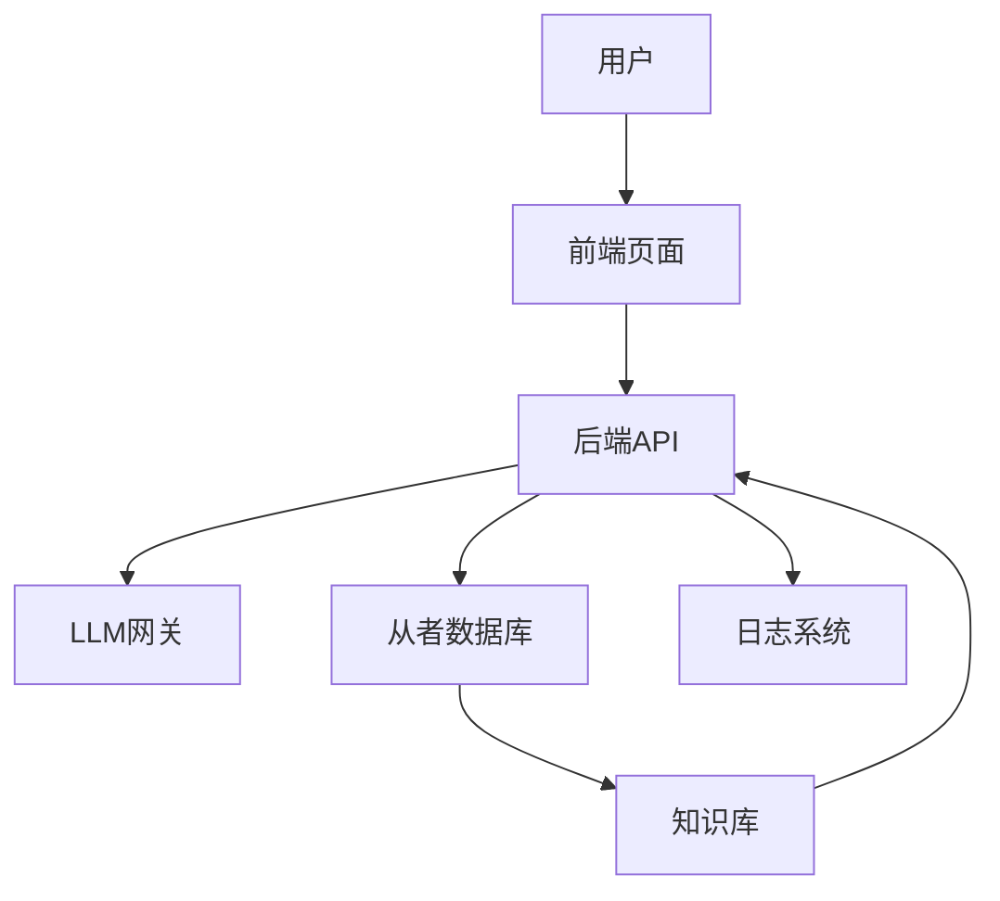

# 系统架构

<cite>
**本文引用的文件**
- [server/main.py](file://server/main.py)
- [server/llm_client.py](file://server/llm_client.py)
- [server/query_executor.py](file://server/query_executor.py)
- [server/schemas.py](file://server/schemas.py)
- [server/prompts.py](file://server/prompts.py)
- [server/logger.py](file://server/logger.py)
- [server/data_loader.py](file://server/data_loader.py)
- [server/sync_chaldea.py](file://server/sync_chaldea.py)
- [server/individuality.py](file://server/individuality.py)
- [server/knowledge/effect_schema.json](file://server/knowledge/effect_schema.json)
- [demo/index.html](file://demo/index.html)
- [demo/app.js](file://demo/app.js)
</cite>

## 目录
1. [简介](#简介)
2. [项目结构](#项目结构)
3. [核心组件](#核心组件)
4. [架构总览](#架构总览)
5. [详细组件分析](#详细组件分析)
6. [依赖关系分析](#依赖关系分析)
7. [性能考量](#性能考量)
8. [故障排查指南](#故障排查指南)
9. [结论](#结论)
10. [附录](#附录)

## 简介
本文件面向Laplace项目的系统架构文档，围绕基于FastAPI的后端、前端聊天界面、AI集成（LLM客户端）、数据流与查询执行、分层架构、异步编程与性能优化、系统边界与组件交互等方面进行深入说明。文档旨在帮助开发者与运维人员快速理解系统设计与实现要点，并提供可扩展与可维护性的指导。

## 项目结构
Laplace采用“后端服务 + 前端静态页面 + 知识库与数据生成工具”的组织方式：
- 后端服务：FastAPI应用，提供REST API、CORS中间件、静态文件挂载
- 前端：静态HTML/CSS/JS，内置Markdown渲染与响应式布局
- 知识库与数据：从Chaldea与Atlas Academy拉取并生成效果分类、职阶映射、从者数据库
- 测试：针对LLM客户端、查询执行器等模块的单元测试

图表来源
- [server/main.py:1-228](file://server/main.py#L1-L228)
- [server/llm_client.py:1-247](file://server/llm_client.py#L1-L247)
- [server/query_executor.py:1-305](file://server/query_executor.py#L1-L305)
- [server/prompts.py:1-208](file://server/prompts.py#L1-L208)
- [server/schemas.py:1-81](file://server/schemas.py#L1-L81)
- [server/logger.py:1-55](file://server/logger.py#L1-L55)
- [server/data_loader.py:1-363](file://server/data_loader.py#L1-L363)
- [server/sync_chaldea.py:1-429](file://server/sync_chaldea.py#L1-L429)
- [server/knowledge/effect_schema.json:1-200](file://server/knowledge/effect_schema.json#L1-L200)
- [demo/index.html:1-72](file://demo/index.html#L1-L72)
- [demo/app.js:1-219](file://demo/app.js#L1-L219)

章节来源
- [server/main.py:1-228](file://server/main.py#L1-L228)
- [demo/index.html:1-72](file://demo/index.html#L1-L72)
- [demo/app.js:1-219](file://demo/app.js#L1-L219)

## 核心组件
- FastAPI后端服务：提供 /api/chat 与 /api/health 接口，CORS跨域支持，静态文件挂载
- LLM客户端：统一调用不同模型，支持结构化JSON模式与降级文本模式，具备多模型回退机制
- 查询执行器：在预加载的从者数据库上执行多条件组合筛选，支持效果、特性、职阶、稀有度、指令卡、宝具等
- 提示词管理：构建系统提示词与RAG生成提示词，动态注入效果分类与中文别名
- 数据模型与Schema：定义意图解析的结构化响应与查询条件的Pydantic模型
- 日志追踪：记录完整查询链路，便于审计与排障
- 知识库与数据生成：从Chaldea与Atlas Academy同步领域知识与从者数据，生成效果分类、映射与数据库

章节来源
- [server/main.py:87-218](file://server/main.py#L87-L218)
- [server/llm_client.py:35-126](file://server/llm_client.py#L35-L126)
- [server/query_executor.py:53-87](file://server/query_executor.py#L53-L87)
- [server/prompts.py:46-160](file://server/prompts.py#L46-L160)
- [server/schemas.py:16-81](file://server/schemas.py#L16-L81)
- [server/logger.py:38-55](file://server/logger.py#L38-L55)
- [server/data_loader.py:332-363](file://server/data_loader.py#L332-L363)
- [server/sync_chaldea.py:308-429](file://server/sync_chaldea.py#L308-L429)

## 架构总览
Laplace采用“意图解析 + 结构化查询 + RAG生成”的两阶段处理链路：
- 第一阶段：LLM将用户自然语言解析为结构化查询意图（JSON），包含条件与模板
- 第二阶段：后端在本地数据库上执行筛选，构建上下文，调用LLM进行自然语言回复生成
- 前端通过静态页面与JavaScript与后端交互，展示回复与从者卡片

图表来源
- [server/main.py:87-218](file://server/main.py#L87-L218)
- [server/llm_client.py:35-126](file://server/llm_client.py#L35-L126)
- [server/query_executor.py:53-87](file://server/query_executor.py#L53-L87)
- [server/logger.py:38-55](file://server/logger.py#L38-L55)
- [demo/app.js:29-74](file://demo/app.js#L29-L74)

## 详细组件分析

### 后端服务（FastAPI）
- 路由与响应模型
  - /api/chat：接收用户消息，执行两阶段处理，返回结构化响应
  - /api/health：健康检查
- 中间件与静态资源
  - CORS允许跨域访问
  - 挂载demo目录为静态文件，支持HTML与资源访问
- 数据与提示词
  - 预加载数据库与效果翻译映射
  - 动态构建系统提示词与生成提示词

章节来源
- [server/main.py:51-228](file://server/main.py#L51-L228)

### LLM客户端（多模型支持与结构化输出）
- 设计模式
  - 统一入口：chat_completion，按顺序尝试主模型与回退模型
  - 结构化输出：优先使用response_format(json_schema)，失败时降级为文本并提取JSON
  - 错误处理：捕获并抛出异常，最终聚合所有模型失败
- 配置与环境变量
  - LLM_BASE_URL、LLM_API_KEY、LLM_MODEL、LLM_FALLBACK_MODELS
- 解析与提取
  - parse_intent_response：基于Pydantic模型验证与解析
  - extract_json_object：从LLM文本中提取首个完整JSON对象
  - _extract_message_content：兼容字符串与列表内容

图表来源
- [server/llm_client.py:35-79](file://server/llm_client.py#L35-L79)
- [server/llm_client.py:81-126](file://server/llm_client.py#L81-L126)

章节来源
- [server/llm_client.py:18-28](file://server/llm_client.py#L18-L28)
- [server/llm_client.py:171-215](file://server/llm_client.py#L171-L215)

### 查询执行器（多条件筛选与排序）
- 数据源
  - 从者数据库：预加载，带缓存
  - 昵称映射：支持昵称到正式名的映射与额外过滤
- 筛选逻辑
  - 支持NP自充、稀有度、职阶、名称、技能效果（单/多）、目标类型、特性（含排斥）、性别、阵营、指令卡、宝具颜色与目标类型
  - 多效果AND/OR组合，名称模糊匹配与规范化
- 排序规则
  - 按稀有度降序、collectionNo升序

图表来源
- [server/query_executor.py:53-87](file://server/query_executor.py#L53-L87)
- [server/query_executor.py:90-261](file://server/query_executor.py#L90-L261)

章节来源
- [server/query_executor.py:29-38](file://server/query_executor.py#L29-L38)
- [server/query_executor.py:133-191](file://server/query_executor.py#L133-L191)
- [server/individuality.py:58-77](file://server/individuality.py#L58-L77)

### 提示词管理（系统提示与RAG生成提示）
- 系统提示
  - 动态加载效果分类与中文别名，构建严格JSON输出约束
  - 提供字段说明、示例与中文职阶映射
- RAG生成提示
  - 基于检索上下文生成自然语言回复，强调“禁绝先验知识”与“绝对纪律统计”

章节来源
- [server/prompts.py:46-160](file://server/prompts.py#L46-L160)
- [server/prompts.py:175-207](file://server/prompts.py#L175-L207)

### 数据模型与Schema（结构化契约）
- IntentResponse：LLM解析后的意图响应，包含intent与conditions
- QueryConditions：查询条件集合，支持空值归一化与字段校验
- JSON Schema：用于OpenAI兼容的response_format

章节来源
- [server/schemas.py:16-81](file://server/schemas.py#L16-L81)

### 日志追踪（链路审计）
- 记录traceId、用户问题、解析意图、结果数量、最终回复、上下文与错误信息
- JSONL格式，便于后续分析与可视化

章节来源
- [server/logger.py:38-55](file://server/logger.py#L38-L55)

### 知识库与数据生成
- Chaldea同步：从Dart源码解析枚举与效果分类，生成JSON知识库
- 数据加载器：从Atlas Academy拉取数据，结合知识库生成通用从者数据库

章节来源
- [server/sync_chaldea.py:308-429](file://server/sync_chaldea.py#L308-L429)
- [server/data_loader.py:332-363](file://server/data_loader.py#L332-L363)
- [server/knowledge/effect_schema.json:1-200](file://server/knowledge/effect_schema.json#L1-L200)

### 前端聊天界面（静态页面与交互）
- 页面结构：头部、欢迎消息、消息区域、输入区与建议按钮
- 交互逻辑：发送消息、显示打字指示、渲染AI回复与从者卡片、Markdown解析
- 响应式设计：基础CSS样式与字体资源

章节来源
- [demo/index.html:1-72](file://demo/index.html#L1-L72)
- [demo/app.js:29-123](file://demo/app.js#L29-L123)

## 依赖关系分析
- 组件耦合
  - main.py 依赖 llm_client、query_executor、prompts、schemas、logger
  - query_executor 依赖 knowledge 效果分类与昵称映射
  - llm_client 依赖 schemas 的JSON Schema
  - data_loader 与 sync_chaldea 生成 knowledge 与数据库
- 外部依赖
  - httpx（异步HTTP客户端）
  - pydantic（结构化模型与校验）
  - requests（数据加载器拉取外部API）

图表来源
- [server/main.py:14-17](file://server/main.py#L14-L17)
- [server/llm_client.py:16](file://server/llm_client.py#L16)
- [server/query_executor.py:12-15](file://server/query_executor.py#L12-L15)
- [server/data_loader.py:20-23](file://server/data_loader.py#L20-L23)
- [server/sync_chaldea.py:26-30](file://server/sync_chaldea.py#L26-L30)
- [demo/app.js:7](file://demo/app.js#L7)

## 性能考量
- 异步与并发
  - LLM调用使用httpx.AsyncClient，提升I/O并发
  - FastAPI默认异步路由，适合高并发请求
- 缓存与预热
  - 数据库与效果翻译映射在启动时预加载
  - 系统提示词缓存，避免重复构建
- 响应大小控制
  - 返回结果限制为固定上限，避免超大数据传输
- 查询优化
  - 仅返回Top-N结果用于RAG上下文，控制LLM输入规模
  - 多效果AND/OR逻辑在内存中高效判断
- 网络与容错
  - 多模型回退，提升可用性
  - 结构化输出失败自动降级为文本模式

[本节为通用性能讨论，无需具体文件分析]

## 故障排查指南
- LLM调用失败
  - 检查环境变量（LLM_BASE_URL、LLM_API_KEY、LLM_MODEL、LLM_FALLBACK_MODELS）
  - 查看日志追踪中的错误字段，定位具体模型与错误原因
- JSON解析失败
  - 确认LLM输出符合IntentResponse模型
  - 检查extract_json_object是否能提取完整JSON对象
- 查询无结果或结果异常
  - 核对conditions字段与中文别名映射
  - 检查昵称映射与名称规范化逻辑
- 前端无法连接后端
  - 确认CORS配置与静态文件挂载
  - 检查API_URL与端口

章节来源
- [server/llm_client.py:21-28](file://server/llm_client.py#L21-L28)
- [server/logger.py:38-55](file://server/logger.py#L38-L55)
- [server/main.py:57-63](file://server/main.py#L57-L63)
- [demo/app.js:7](file://demo/app.js#L7)

## 结论
Laplace通过清晰的两阶段处理链路、严格的结构化契约与稳健的多模型回退机制，实现了从自然语言到结构化查询再到自然语言回复的完整闭环。后端采用FastAPI与异步I/O，前端提供简洁直观的交互体验。知识库与数据生成工具保证了领域知识的持续更新与一致性。整体架构具备良好的可扩展性与可维护性，便于在未来接入更多模型与功能。

[本节为总结性内容，无需具体文件分析]

## 附录
- 系统边界
  - 外部依赖：Atlas Academy API、Chaldea源码与数据
  - 内部边界：后端API、前端静态页面、知识库与数据库
- 组件交互图（概念示意）

[本图为概念示意，无需图表来源]