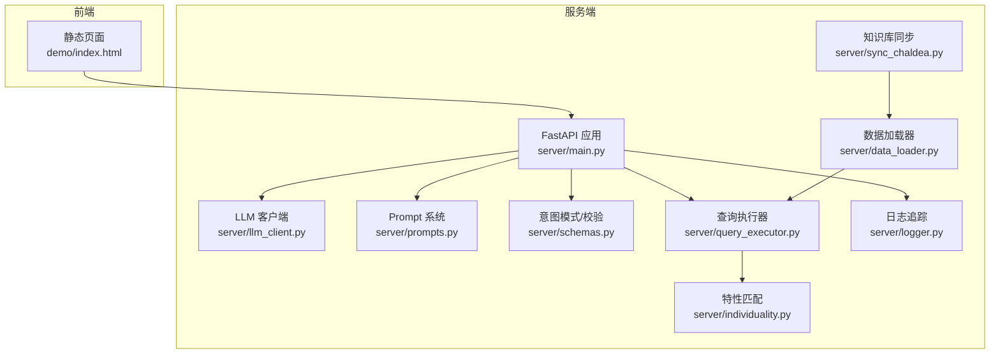
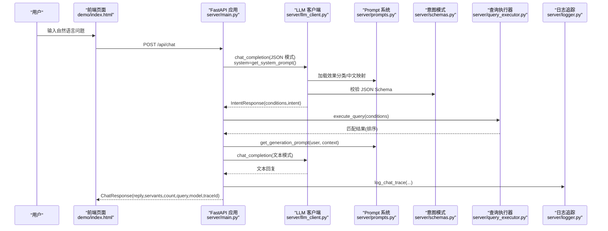
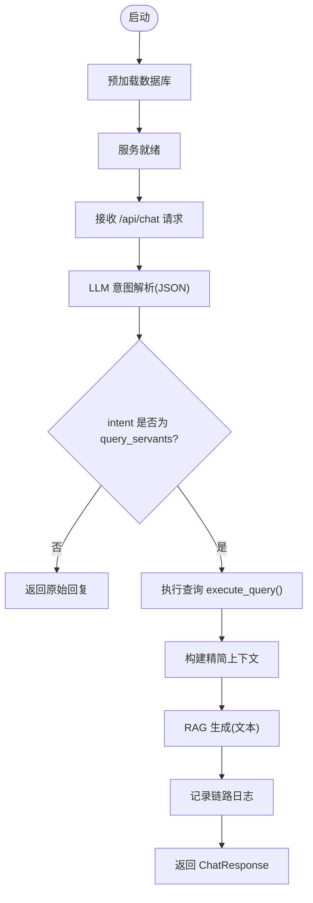
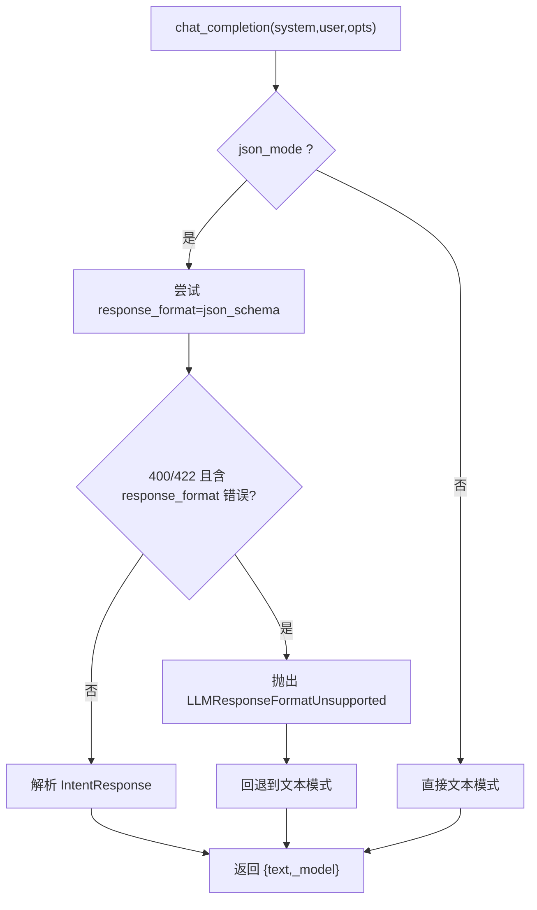
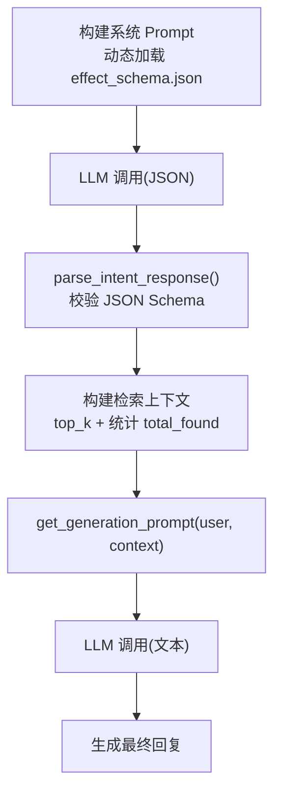
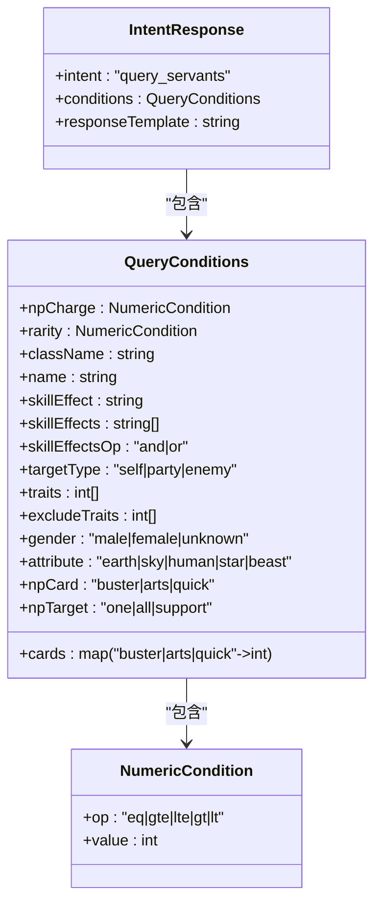
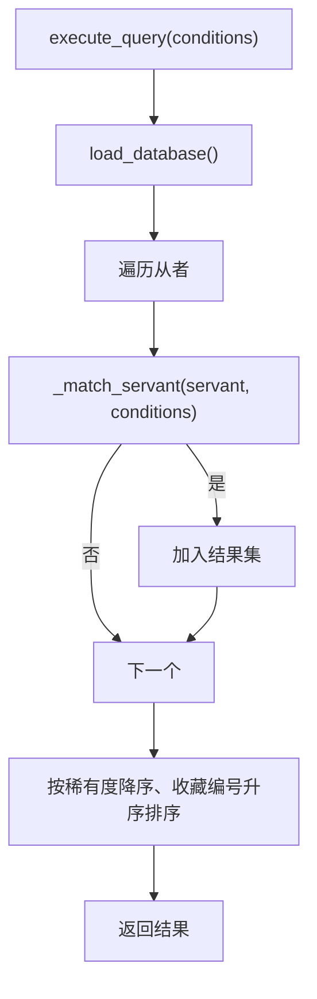
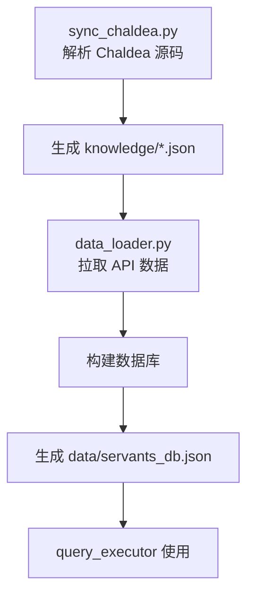
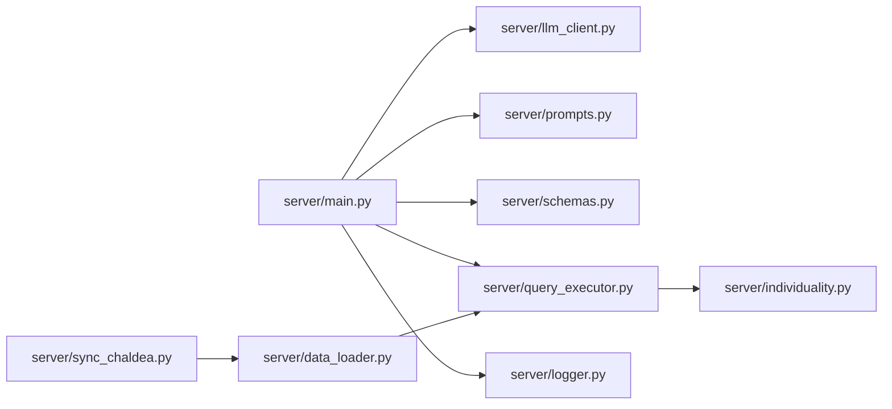

# 系统架构

<cite>
**本文引用的文件**
- [server/main.py](file://server/main.py)
- [server/llm_client.py](file://server/llm_client.py)
- [server/prompts.py](file://server/prompts.py)
- [server/query_executor.py](file://server/query_executor.py)
- [server/schemas.py](file://server/schemas.py)
- [server/logger.py](file://server/logger.py)
- [server/data_loader.py](file://server/data_loader.py)
- [server/sync_chaldea.py](file://server/sync_chaldea.py)
- [server/individuality.py](file://server/individuality.py)
- [server/requirements.txt](file://server/requirements.txt)
- [demo/index.html](file://demo/index.html)
- [.gitignore](file://.gitignore)
</cite>

## 目录
1. [简介](#简介)
2. [项目结构](#项目结构)
3. [核心组件](#核心组件)
4. [架构总览](#架构总览)
5. [详细组件分析](#详细组件分析)
6. [依赖关系分析](#依赖关系分析)
7. [性能考量](#性能考量)
8. [故障排查指南](#故障排查指南)
9. [结论](#结论)
10. [附录](#附录)

## 简介
本架构文档面向 Laplace 系统，这是一个基于 FastAPI 的对话式 FGO 数据查询服务。系统采用“双阶段查询模式”：第一阶段由 LLM 将用户自然语言解析为结构化查询意图；第二阶段由查询执行器在本地预加载的从者数据库上进行精确筛选，并通过 RAG 生成自然语言回复。文档涵盖系统边界、技术决策与约束、组件关系与数据流、可扩展性与性能优化建议，以及部署拓扑。

## 项目结构
- 后端服务
  - FastAPI 应用入口与路由：server/main.py
  - LLM 客户端与模型回退机制：server/llm_client.py
  - Prompt 系统与 RAG 生成提示：server/prompts.py
  - 结构化意图模式与 Pydantic 校验：server/schemas.py
  - 查询执行器与条件匹配：server/query_executor.py
  - 日志追踪与链路记录：server/logger.py
  - 数据加载与知识库同步：server/data_loader.py、server/sync_chaldea.py
  - 特性匹配工具：server/individuality.py
  - 依赖声明：server/requirements.txt
- 前端演示
  - 静态页面挂载：demo/index.html
- 其他
  - Git 忽略规则：.gitignore

**图表来源**
- [server/main.py:1-228](file://server/main.py#L1-L228)
- [server/llm_client.py:1-247](file://server/llm_client.py#L1-L247)
- [server/prompts.py:1-208](file://server/prompts.py#L1-L208)
- [server/schemas.py:1-81](file://server/schemas.py#L1-L81)
- [server/query_executor.py:1-305](file://server/query_executor.py#L1-L305)
- [server/logger.py:1-55](file://server/logger.py#L1-L55)
- [server/data_loader.py:1-363](file://server/data_loader.py#L1-L363)
- [server/sync_chaldea.py:1-429](file://server/sync_chaldea.py#L1-L429)
- [server/individuality.py:1-78](file://server/individuality.py#L1-L78)
- [demo/index.html:1-72](file://demo/index.html#L1-L72)

**章节来源**
- [server/main.py:1-228](file://server/main.py#L1-L228)
- [server/requirements.txt:1-7](file://server/requirements.txt#L1-L7)
- [demo/index.html:1-72](file://demo/index.html#L1-L72)

## 核心组件
- FastAPI 应用与路由
  - 启动事件：预加载数据库
  - 路由：/api/chat（对话）、/api/health（健康检查）
  - 中间件：CORS 允许跨域
  - 静态资源挂载：前端 demo 目录
- LLM 客户端
  - 支持主模型与回退模型序列
  - 结构化 JSON 模式与文本回退
  - 错误处理与响应格式探测
- Prompt 系统
  - 动态注入效果分类与中文映射
  - RAG 生成阶段提示模板
- 结构化意图模式
  - Pydantic 模型定义查询条件与意图
  - JSON Schema 用于模型响应格式约束
- 查询执行器
  - 多条件组合筛选（NP 充能、稀有度、职阶、名称、效果、特性、性别、阵营、指令卡、宝具颜色/目标）
  - 排序规则：稀有度降序、收藏编号升序
- 日志追踪
  - JSONL 格式记录完整链路，便于审计与排障
- 数据加载与知识库
  - 从 Atlas Academy API 拉取数据
  - 从 Chaldea 源码解析领域知识，生成 effect_schema.json、class_mapping.json、mappings.json 等
- 特性匹配
  - 支持正负特性（排斥）AND 逻辑

**章节来源**
- [server/main.py:51-228](file://server/main.py#L51-L228)
- [server/llm_client.py:35-247](file://server/llm_client.py#L35-L247)
- [server/prompts.py:15-208](file://server/prompts.py#L15-L208)
- [server/schemas.py:16-81](file://server/schemas.py#L16-L81)
- [server/query_executor.py:53-305](file://server/query_executor.py#L53-L305)
- [server/logger.py:38-55](file://server/logger.py#L38-L55)
- [server/data_loader.py:332-363](file://server/data_loader.py#L332-L363)
- [server/sync_chaldea.py:308-429](file://server/sync_chaldea.py#L308-L429)
- [server/individuality.py:58-78](file://server/individuality.py#L58-L78)

## 架构总览
Laplace 采用“意图解析 + RAG 生成”的双阶段查询模式：
- 第一阶段：LLM 将用户输入解析为结构化意图（IntentResponse），包含查询条件与意图标识
- 第二阶段：查询执行器在本地数据库上执行筛选，构建精简上下文，LLM 基于上下文生成自然语言回复
- FastAPI 提供统一入口与健康检查，静态资源挂载前端演示页面

**图表来源**
- [server/main.py:87-218](file://server/main.py#L87-L218)
- [server/llm_client.py:35-126](file://server/llm_client.py#L35-L126)
- [server/prompts.py:167-207](file://server/prompts.py#L167-L207)
- [server/schemas.py:68-81](file://server/schemas.py#L68-L81)
- [server/query_executor.py:53-87](file://server/query_executor.py#L53-L87)
- [server/logger.py:38-55](file://server/logger.py#L38-L55)

## 详细组件分析

### FastAPI 应用与路由
- 应用初始化
  - 标题、描述、版本
  - CORS 中间件允许任意源/方法/头
- 路由
  - POST /api/chat：处理对话请求，执行双阶段查询与回复生成
  - GET /api/health：健康检查
- 静态资源
  - 挂载 demo 目录，HTML 为主页
- 启动事件
  - 预加载数据库，减少首次查询延迟

**图表来源**
- [server/main.py:81-218](file://server/main.py#L81-L218)

**章节来源**
- [server/main.py:51-228](file://server/main.py#L51-L228)

### LLM 客户端与模型回退
- 配置
  - 基础 URL、API Key、主模型、回退模型列表
- 调用流程
  - 优先尝试结构化 JSON 模式（response_format=json_schema）
  - 若模型不支持结构化输出，自动回退到文本模式并提取 JSON
- 错误处理
  - 逐个模型尝试，捕获异常并记录
  - 所有模型失败时抛出异常

**图表来源**
- [server/llm_client.py:35-126](file://server/llm_client.py#L35-L126)
- [server/llm_client.py:129-168](file://server/llm_client.py#L129-L168)

**章节来源**
- [server/llm_client.py:18-79](file://server/llm_client.py#L18-L79)
- [server/llm_client.py:81-168](file://server/llm_client.py#L81-L168)

### Prompt 系统与 RAG 生成
- 系统 Prompt
  - 动态注入 effect_schema.json 中的效果分类与中文别名
  - 严格 JSON Schema 输出约束
- RAG 生成 Prompt
  - 基于检索结果上下文生成自然语言回复
  - 强制使用上下文数据，禁止先验知识

**图表来源**
- [server/prompts.py:15-173](file://server/prompts.py#L15-L173)
- [server/prompts.py:175-207](file://server/prompts.py#L175-L207)
- [server/schemas.py:68-81](file://server/schemas.py#L68-L81)

**章节来源**
- [server/prompts.py:46-161](file://server/prompts.py#L46-L161)
- [server/prompts.py:175-207](file://server/prompts.py#L175-L207)

### 结构化意图模式与校验
- 模型定义
  - NumericCondition：比较运算与数值
  - QueryConditions：多条件组合
  - IntentResponse：意图与条件
- 校验
  - JSON Schema 用于 response_format
  - Pydantic 校验解析结果

**图表来源**
- [server/schemas.py:16-81](file://server/schemas.py#L16-L81)

**章节来源**
- [server/schemas.py:16-81](file://server/schemas.py#L16-L81)

### 查询执行器与条件匹配
- 数据来源
  - 预加载 servants_db.json（由 data_loader 生成）
  - 昵称映射 nicknames.json（由 knowledge 目录提供）
- 匹配策略
  - NP 充能：支持等值/范围比较
  - 稀有度：支持等值/范围比较
  - 职阶、性别、阵营、指令卡、宝具颜色/目标
  - 名称：支持英文/日文/中文翻译与昵称映射
  - 技能效果：单个或多个 AND/OR 组合，可按目标类型筛选
  - 特性：支持正负特性（排斥）AND 逻辑
- 排序
  - 稀有度降序 → 收藏编号升序

**图表来源**
- [server/query_executor.py:53-87](file://server/query_executor.py#L53-L87)
- [server/query_executor.py:90-261](file://server/query_executor.py#L90-L261)

**章节来源**
- [server/query_executor.py:41-50](file://server/query_executor.py#L41-L50)
- [server/query_executor.py:53-305](file://server/query_executor.py#L53-L305)
- [server/individuality.py:58-78](file://server/individuality.py#L58-L78)

### 日志追踪与链路记录
- 记录字段
  - traceId、用户问题、解析意图、结果数量、最终回复、上下文、错误信息
- 输出
  - JSONL 文件，便于后续分析与审计

**章节来源**
- [server/logger.py:38-55](file://server/logger.py#L38-L55)

### 数据加载与知识库同步
- 知识库同步
  - 从 Chaldea 源码解析枚举与效果分类，生成 effect_schema.json、class_mapping.json、mappings.json 等
  - 生成 _meta.json 记录同步元数据
- 数据加载
  - 从 Atlas Academy API 拉取 nice_servant_lang_en.json
  - 提取技能效果、NP 充能、宝具信息、指令卡构成、特性、性别、阵营等
  - 生成 servants_db.json 供查询执行器使用

**图表来源**
- [server/sync_chaldea.py:308-429](file://server/sync_chaldea.py#L308-L429)
- [server/data_loader.py:332-363](file://server/data_loader.py#L332-L363)

**章节来源**
- [server/sync_chaldea.py:308-429](file://server/sync_chaldea.py#L308-L429)
- [server/data_loader.py:332-363](file://server/data_loader.py#L332-L363)

## 依赖关系分析
- 组件耦合
  - main.py 依赖 llm_client、prompts、query_executor、logger
  - query_executor 依赖 knowledge 数据与 individuality
  - llm_client 依赖 schemas 的 JSON Schema
  - data_loader 与 sync_chaldea 为上游数据准备
- 外部依赖
  - FastAPI、Uvicorn、httpx、python-dotenv、requests
- 潜在循环依赖
  - 未发现直接循环导入；各模块职责清晰

**图表来源**
- [server/main.py:14-18](file://server/main.py#L14-L18)
- [server/query_executor.py:12-19](file://server/query_executor.py#L12-L19)
- [server/llm_client.py:16-19](file://server/llm_client.py#L16-L19)
- [server/data_loader.py:20-24](file://server/data_loader.py#L20-L24)
- [server/sync_chaldea.py:26-31](file://server/sync_chaldea.py#L26-L31)

**章节来源**
- [server/requirements.txt:1-7](file://server/requirements.txt#L1-L7)

## 性能考量
- 预热与缓存
  - 启动时预加载数据库，减少首次查询延迟
  - effect_schema.json 与昵称映射按需加载并缓存
- 查询优化
  - 限定返回数量（最多 50），避免响应过大
  - 上下文仅包含前若干条（最多 5），降低 LLM 上下文成本
- 模型选择
  - 低温度（0.1）提升确定性，减少幻觉
  - 结构化 JSON 模式优先，失败回退文本模式
- I/O 与网络
  - LLM 调用超时控制（30s）
  - API 拉取设置较长超时（120s）

[本节为通用性能建议，无需具体文件分析]

## 故障排查指南
- LLM 调用失败
  - 检查 LLM_BASE_URL、LLM_API_KEY、LLM_MODEL、LLM_FALLBACK_MODELS 环境变量
  - 观察回退模型序列是否生效
- JSON 模式解析失败
  - 确认模型支持 response_format=json_schema
  - 校验 intent_response_json_schema 与 IntentResponse 定义一致
- 查询无结果或结果异常
  - 检查 knowledge 目录文件是否齐全（effect_schema.json、class_mapping.json、mappings.json）
  - 确认 data/servants_db.json 是否生成
  - 核对昵称映射与名称规范化逻辑
- 日志定位
  - 查看 server/logs/query_trace.jsonl，定位 traceId 对应链路
- 健康检查
  - 访问 /api/health，确认服务状态

**章节来源**
- [server/llm_client.py:18-29](file://server/llm_client.py#L18-L29)
- [server/logger.py:38-55](file://server/logger.py#L38-L55)
- [server/main.py:221-225](file://server/main.py#L221-L225)

## 结论
Laplace 通过“意图解析 + RAG 生成”的双阶段查询模式，实现了对 FGO 从者数据的自然语言查询。系统以 FastAPI 为核心，结合结构化意图模式、本地数据库与知识库，确保了准确性与可控性。通过预热、缓存、上下文裁剪与模型回退等策略，兼顾了性能与稳定性。建议持续维护知识库与数据更新，完善监控与告警，以支撑长期演进。

[本节为总结性内容，无需具体文件分析]

## 附录

### 系统边界与约束
- 边界
  - 外部数据源：Atlas Academy API、Chaldea 源码
  - 外部推理服务：OpenAI 兼容的 LLM 网关
- 约束
  - LLM 必须支持 response_format（否则触发回退）
  - 仅支持“从者查询”意图（intent=query_servants）
  - 禁止使用 LLM 先验知识，必须严格依据检索结果

[本节为概念性说明，无需具体文件分析]

### 部署拓扑建议
- 单机部署
  - uvicorn 运行 FastAPI 应用
  - 预加载数据库，静态资源挂载 demo
- 多实例部署
  - 使用反向代理（如 Nginx）分发请求
  - 数据库与知识库文件共享（或在镜像中预置）
- 监控与日志
  - 收集 server/logs/query_trace.jsonl
  - 配置健康检查与错误告警

[本节为通用部署建议，无需具体文件分析]