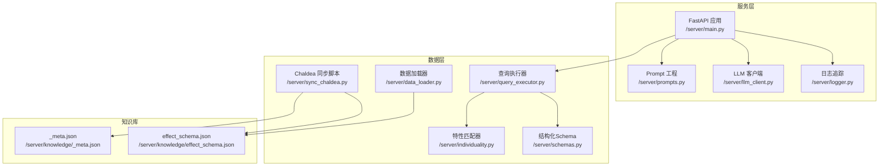
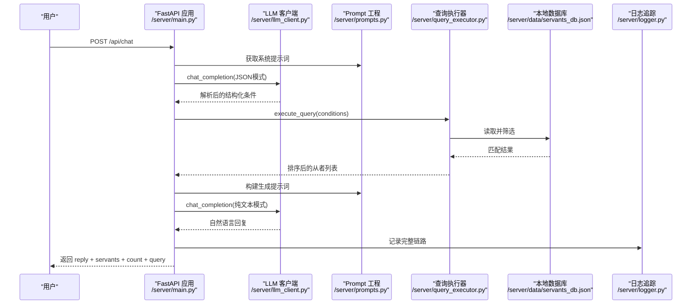
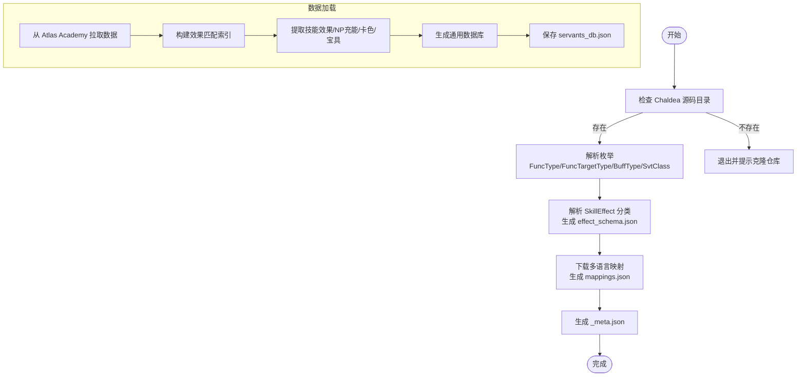
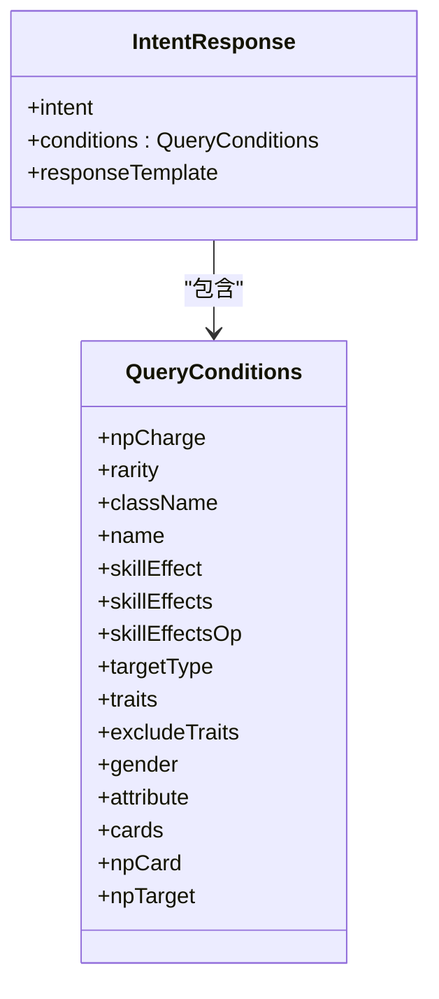
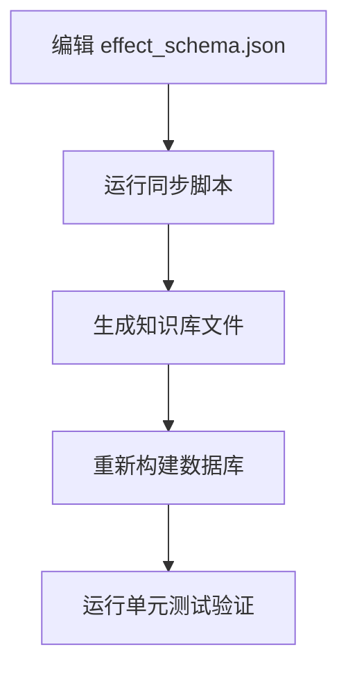
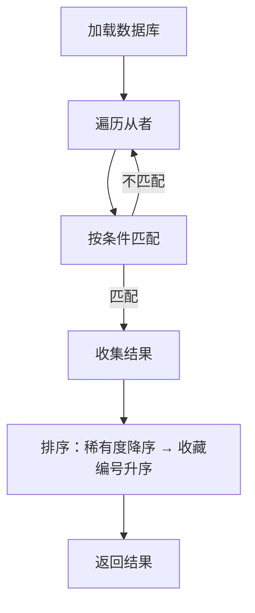
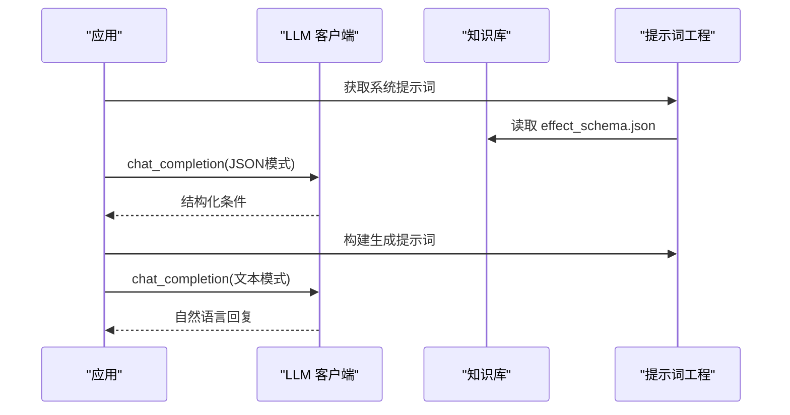
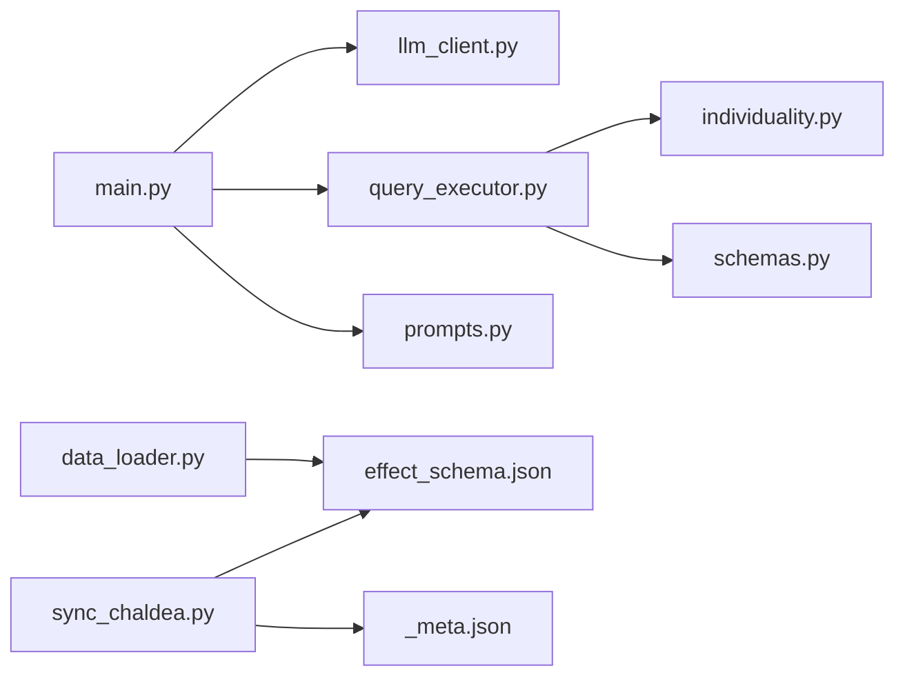

# 维护与扩展

<cite>
**本文引用的文件**   
- [server/main.py](file://server/main.py)
- [server/prompts.py](file://server/prompts.py)
- [server/llm_client.py](file://server/llm_client.py)
- [server/sync_chaldea.py](file://server/sync_chaldea.py)
- [server/data_loader.py](file://server/data_loader.py)
- [server/query_executor.py](file://server/query_executor.py)
- [server/individuality.py](file://server/individuality.py)
- [server/schemas.py](file://server/schemas.py)
- [server/logger.py](file://server/logger.py)
- [server/knowledge/effect_schema.json](file://server/knowledge/effect_schema.json)
- [server/knowledge/_meta.json](file://server/knowledge/_meta.json)
- [tests/test_sync_chaldea.py](file://tests/test_sync_chaldea.py)
- [tests/test_query_executor.py](file://tests/test_query_executor.py)
- [tests/test_llm_client.py](file://tests/test_llm_client.py)
</cite>

## 目录
1. [简介](#简介)
2. [项目结构](#项目结构)
3. [核心组件](#核心组件)
4. [架构总览](#架构总览)
5. [详细组件分析](#详细组件分析)
6. [依赖分析](#依赖分析)
7. [性能考虑](#性能考虑)
8. [故障排除指南](#故障排除指南)
9. [结论](#结论)
10. [附录](#附录)

## 简介
本文件面向Laplace项目的维护者与扩展开发者，系统化阐述数据同步流程、Chaldea源码解析与知识库更新机制，详解功能扩展方法（新增查询维度与效果类型），并提供维护任务清单、性能监控与故障排除指南，涵盖系统升级、版本迁移与兼容性处理，以及监控告警、日志分析与容量规划建议。文档以代码为依据，辅以可视化图示，帮助不同技术背景的读者快速掌握系统的运行方式与扩展路径。

## 项目结构
Laplace采用分层清晰的服务端架构：
- 服务入口与路由：FastAPI应用，提供聊天接口与健康检查，挂载前端静态资源。
- LLM交互层：封装OpenAI兼容的聊天补全调用，支持结构化JSON输出与降级策略。
- Prompt工程：动态注入知识库，构建系统提示词与生成提示词。
- 数据加载与抽取：从Atlas Academy API抓取全量从者数据，基于知识库提取技能效果与NP充能，生成通用数据库。
- 查询执行器：根据LLM解析出的结构化条件，在本地数据库上进行高效筛选。
- 知识库：从Chaldea Dart源码解析生成，包含效果分类、职阶映射、多语言映射等。
- 日志与追踪：记录完整查询链路，便于审计与排障。

图表来源
- [server/main.py:1-228](file://server/main.py#L1-L228)
- [server/prompts.py:1-208](file://server/prompts.py#L1-L208)
- [server/llm_client.py:1-247](file://server/llm_client.py#L1-L247)
- [server/data_loader.py:1-363](file://server/data_loader.py#L1-L363)
- [server/sync_chaldea.py:1-429](file://server/sync_chaldea.py#L1-L429)
- [server/query_executor.py:1-305](file://server/query_executor.py#L1-L305)
- [server/individuality.py:1-78](file://server/individuality.py#L1-L78)
- [server/schemas.py:1-81](file://server/schemas.py#L1-L81)
- [server/logger.py:1-55](file://server/logger.py#L1-L55)
- [server/knowledge/effect_schema.json:1-694](file://server/knowledge/effect_schema.json#L1-L694)
- [server/knowledge/_meta.json:1-12](file://server/knowledge/_meta.json#L1-L12)

章节来源
- [server/main.py:1-228](file://server/main.py#L1-L228)
- [server/prompts.py:1-208](file://server/prompts.py#L1-L208)
- [server/llm_client.py:1-247](file://server/llm_client.py#L1-L247)
- [server/sync_chaldea.py:1-429](file://server/sync_chaldea.py#L1-L429)
- [server/data_loader.py:1-363](file://server/data_loader.py#L1-L363)
- [server/query_executor.py:1-305](file://server/query_executor.py#L1-L305)
- [server/individuality.py:1-78](file://server/individuality.py#L1-L78)
- [server/schemas.py:1-81](file://server/schemas.py#L1-L81)
- [server/logger.py:1-55](file://server/logger.py#L1-L55)
- [server/knowledge/effect_schema.json:1-694](file://server/knowledge/effect_schema.json#L1-L694)
- [server/knowledge/_meta.json:1-12](file://server/knowledge/_meta.json#L1-L12)

## 核心组件
- FastAPI应用与路由：提供/chat接口与健康检查，内置CORS，挂载前端静态资源。
- LLM客户端：统一调用OpenAI兼容接口，支持结构化JSON输出与多模型回退。
- Prompt工程：动态注入效果分类与中文别名，构建系统提示词与生成提示词。
- 数据加载器：从Atlas Academy API拉取全量从者数据，基于知识库提取效果与NP充能，生成通用数据库。
- Chaldea同步脚本：正则解析Dart源码，生成枚举与效果分类JSON，生成元数据。
- 查询执行器：按结构化条件在本地数据库上筛选，支持效果、特性、配卡、宝具等多维组合。
- 特性匹配器：实现正/负特性分离与AND/OR逻辑。
- 结构化Schema：Pydantic模型定义IntentResponse与QueryConditions，保证LLM输出与查询一致性。
- 日志追踪：记录完整查询链路，便于审计与排障。

章节来源
- [server/main.py:87-218](file://server/main.py#L87-L218)
- [server/llm_client.py:35-126](file://server/llm_client.py#L35-L126)
- [server/prompts.py:15-173](file://server/prompts.py#L15-L173)
- [server/data_loader.py:91-329](file://server/data_loader.py#L91-L329)
- [server/sync_chaldea.py:308-418](file://server/sync_chaldea.py#L308-L418)
- [server/query_executor.py:53-304](file://server/query_executor.py#L53-L304)
- [server/individuality.py:58-77](file://server/individuality.py#L58-L77)
- [server/schemas.py:68-81](file://server/schemas.py#L68-L81)
- [server/logger.py:38-55](file://server/logger.py#L38-L55)

## 架构总览
下图展示从用户请求到响应的完整链路，包括意图解析、查询执行与自然语言生成三个阶段。

图表来源
- [server/main.py:87-218](file://server/main.py#L87-L218)
- [server/llm_client.py:35-126](file://server/llm_client.py#L35-L126)
- [server/prompts.py:175-207](file://server/prompts.py#L175-L207)
- [server/query_executor.py:53-87](file://server/query_executor.py#L53-L87)
- [server/logger.py:38-55](file://server/logger.py#L38-L55)

## 详细组件分析

### 数据同步流程与Chaldea源码解析
- Chaldea同步脚本负责：
  - 检查本地Chaldea源码目录是否存在。
  - 解析FuncType、FuncTargetType、BuffType枚举，生成JSON。
  - 解析SkillEffect分类，构建效果名、分类、funcTypes/buffTypes及中文别名。
  - 下载多语言映射（从者名、特性），生成mappings.json。
  - 生成元数据文件，记录同步时间、Chaldea提交号与文件计数。
- 知识库文件：
  - effect_schema.json：包含效果分类、funcTypes/buffTypes与中文别名。
  - class_mapping.json：职阶枚举与可用职阶过滤。
  - mappings.json：多语言映射。
  - _meta.json：同步元信息。
- 数据加载器：
  - 从Atlas Academy API抓取全量从者数据。
  - 基于effect_schema.json构建效果匹配索引。
  - 提取技能效果与NP充能，计算卡色构成、宝具颜色与目标类型。
  - 生成通用数据库servants_db.json并持久化。

图表来源
- [server/sync_chaldea.py:308-418](file://server/sync_chaldea.py#L308-L418)
- [server/data_loader.py:332-359](file://server/data_loader.py#L332-L359)

章节来源
- [server/sync_chaldea.py:308-418](file://server/sync_chaldea.py#L308-L418)
- [server/data_loader.py:332-359](file://server/data_loader.py#L332-L359)
- [server/knowledge/effect_schema.json:1-694](file://server/knowledge/effect_schema.json#L1-L694)
- [server/knowledge/_meta.json:1-12](file://server/knowledge/_meta.json#L1-L12)

### 功能扩展：新增查询维度
当前查询维度包括：
- NP自充、稀有度、职阶、名称、单/多效果、效果目标类型、特性、性别、阵营、配卡、宝具颜色、宝具目标/类型。
- 扩展思路：
  - 在结构化Schema中新增字段（QueryConditions），并在提示词中补充说明。
  - 在查询执行器中增加匹配逻辑，注意与现有字段的AND/OR组合。
  - 若涉及新的数据字段，需在数据加载器中提取并写入数据库。
  - 若涉及新的效果类型，需在知识库中补充effect_schema.json并重新同步。

图表来源
- [server/schemas.py:25-44](file://server/schemas.py#L25-L44)
- [server/schemas.py:68-76](file://server/schemas.py#L68-L76)

章节来源
- [server/schemas.py:25-44](file://server/schemas.py#L25-L44)
- [server/schemas.py:68-76](file://server/schemas.py#L68-L76)
- [server/query_executor.py:53-304](file://server/query_executor.py#L53-L304)

### 功能扩展：新增效果类型
- 在effect_schema.json中新增效果条目，包含：
  - name：效果英文名。
  - category：attack/defence/debuff/others。
  - funcTypes/buffTypes：与效果关联的函数类型与缓冲类型。
  - aliases_zh：中文别名列表。
- 同步脚本会自动为效果添加中文别名映射。
- 重新运行同步脚本生成新的知识库文件，随后重新构建数据库。

图表来源
- [server/sync_chaldea.py:206-270](file://server/sync_chaldea.py#L206-L270)
- [server/data_loader.py:332-359](file://server/data_loader.py#L332-L359)

章节来源
- [server/sync_chaldea.py:206-270](file://server/sync_chaldea.py#L206-L270)
- [server/data_loader.py:332-359](file://server/data_loader.py#L332-L359)
- [tests/test_sync_chaldea.py:26-58](file://tests/test_sync_chaldea.py#L26-L58)

### 查询执行器工作流
- 加载本地数据库（全局缓存）。
- 逐条匹配条件，支持数值比较、字符串匹配、集合包含、特性匹配、目标类型过滤等。
- 对结果按稀有度降序、收藏编号升序排序。
- 支持昵称映射与规范化文本匹配，增强名称搜索体验。

图表来源
- [server/query_executor.py:53-87](file://server/query_executor.py#L53-L87)
- [server/query_executor.py:90-261](file://server/query_executor.py#L90-L261)

章节来源
- [server/query_executor.py:53-304](file://server/query_executor.py#L53-L304)
- [tests/test_query_executor.py:123-172](file://tests/test_query_executor.py#L123-L172)

### LLM客户端与提示词工程
- LLM客户端：
  - 支持主模型与回退模型序列，自动尝试结构化JSON输出，失败则降级为文本并提取JSON。
  - 统一的错误处理与模型切换逻辑。
- 提示词工程：
  - 动态从知识库加载效果列表，构建系统提示词。
  - 生成阶段提示词基于检索上下文生成自然语言回复，严格遵循“禁绝先验知识”原则。

图表来源
- [server/llm_client.py:35-126](file://server/llm_client.py#L35-L126)
- [server/prompts.py:15-173](file://server/prompts.py#L15-L173)
- [server/prompts.py:175-207](file://server/prompts.py#L175-L207)

章节来源
- [server/llm_client.py:35-126](file://server/llm_client.py#L35-L126)
- [server/prompts.py:15-173](file://server/prompts.py#L15-L173)
- [server/prompts.py:175-207](file://server/prompts.py#L175-L207)
- [tests/test_llm_client.py:89-126](file://tests/test_llm_client.py#L89-L126)

## 依赖分析
- 组件耦合与内聚：
  - FastAPI应用与LLM客户端、查询执行器松耦合，通过明确的接口与结构化Schema连接。
  - 知识库与数据加载器强耦合，数据加载器依赖effect_schema.json与mappings.json。
  - 查询执行器依赖特性匹配器与结构化Schema，保证查询条件的合法性。
- 外部依赖：
  - LLM网关（OpenAI兼容）。
  - Atlas Academy API。
  - Chaldea源码仓库。
- 潜在循环依赖：
  - 未发现循环导入；各模块职责清晰，通过文件边界隔离。

图表来源
- [server/main.py:14-18](file://server/main.py#L14-L18)
- [server/query_executor.py:12-19](file://server/query_executor.py#L12-L19)
- [server/data_loader.py:44-61](file://server/data_loader.py#L44-L61)
- [server/sync_chaldea.py:321-411](file://server/sync_chaldea.py#L321-L411)

章节来源
- [server/main.py:14-18](file://server/main.py#L14-L18)
- [server/query_executor.py:12-19](file://server/query_executor.py#L12-L19)
- [server/data_loader.py:44-61](file://server/data_loader.py#L44-L61)
- [server/sync_chaldea.py:321-411](file://server/sync_chaldea.py#L321-L411)

## 性能考虑
- 数据库缓存：查询执行器与应用启动时均加载数据库，减少IO开销。
- 效果匹配索引：数据加载器构建funcType/buffType索引，加速效果匹配。
- 限制返回规模：前端返回上限与上下文截断，避免响应过大。
- LLM调用优化：优先使用结构化JSON输出，失败自动降级；多模型回退提升稳定性。
- 网络超时与重试：HTTP客户端设置合理超时，保障服务可用性。

章节来源
- [server/query_executor.py:41-50](file://server/query_executor.py#L41-L50)
- [server/data_loader.py:64-84](file://server/data_loader.py#L64-L84)
- [server/main.py:208-218](file://server/main.py#L208-L218)
- [server/llm_client.py:162-168](file://server/llm_client.py#L162-L168)

## 故障排除指南
- LLM调用失败：
  - 检查环境变量（基础URL、API Key、主/回退模型）。
  - 观察是否触发结构化输出失败，系统会自动降级为文本模式。
  - 查看日志追踪中的错误字段定位问题。
- 知识库缺失：
  - effect_schema.json或mappings.json不存在时，数据加载器会提示先运行同步脚本。
- 查询无结果：
  - 检查查询条件是否过于严格；确认效果名与中文别名映射正确。
  - 使用特性匹配器逻辑验证正/负特性条件。
- 日志分析：
  - 日志文件位于logs/query_trace.jsonl，包含traceId、查询、意图、结果数量、回复与上下文，便于审计与复现。

章节来源
- [server/llm_client.py:21-28](file://server/llm_client.py#L21-L28)
- [server/llm_client.py:60-78](file://server/llm_client.py#L60-L78)
- [server/data_loader.py:44-61](file://server/data_loader.py#L44-L61)
- [server/logger.py:38-55](file://server/logger.py#L38-L55)

## 结论
Laplace通过“知识库驱动 + LLM意图解析 + 本地数据库查询”的架构，实现了对FGO从者数据的自然语言查询。维护与扩展的关键在于：
- 稳健的知识库同步与版本管理（_meta.json）。
- 明确的结构化Schema与提示词工程。
- 可扩展的查询维度与效果类型。
- 完备的日志追踪与测试覆盖。
遵循本文档的维护任务清单、性能监控与故障排除指南，可确保系统稳定演进与持续交付。

## 附录

### 维护任务清单
- 定期同步Chaldea源码，更新知识库并验证效果分类与中文别名。
- 更新Atlas Academy API数据，重建通用数据库。
- 验证查询执行器对新增维度与效果类型的兼容性。
- 运行单元测试，确保LLM输出解析与查询逻辑正确。
- 检查日志文件大小与轮转策略，必要时配置外部日志系统。

章节来源
- [server/sync_chaldea.py:308-418](file://server/sync_chaldea.py#L308-L418)
- [server/data_loader.py:332-359](file://server/data_loader.py#L332-L359)
- [tests/test_sync_chaldea.py:1-58](file://tests/test_sync_chaldea.py#L1-L58)
- [tests/test_query_executor.py:1-172](file://tests/test_query_executor.py#L1-L172)
- [tests/test_llm_client.py:1-126](file://tests/test_llm_client.py#L1-L126)

### 系统升级、版本迁移与兼容性
- 版本迁移：
  - 保留知识库文件与数据库文件，确保effect_schema.json与servants_db.json版本一致。
  - 升级后运行测试，验证查询结果与提示词工程的兼容性。
- 兼容性处理：
  - 新增字段时，保持默认值与空值处理（如None）。
  - 保持效果名与中文别名映射稳定，避免影响历史查询。

章节来源
- [server/schemas.py:46-66](file://server/schemas.py#L46-L66)
- [server/knowledge/_meta.json:1-12](file://server/knowledge/_meta.json#L1-L12)

### 监控告警、日志分析与容量规划
- 监控指标建议：
  - LLM调用延迟与成功率、错误率。
  - 查询执行耗时与返回结果数量分布。
  - 数据同步耗时与成功/失败次数。
- 日志分析：
  - 使用query_trace.jsonl进行查询链路回放与错误定位。
  - 关注traceId串联用户问题与系统响应。
- 容量规划：
  - 数据库文件大小与查询性能关系评估。
  - LLM调用并发与限流策略配置。

章节来源
- [server/logger.py:38-55](file://server/logger.py#L38-L55)
- [server/main.py:221-224](file://server/main.py#L221-L224)

### 扩展开发最佳实践
- 新增查询维度：
  - 在Schema中声明字段，完善提示词说明，确保LLM能正确解析。
  - 在查询执行器中实现匹配逻辑，注意与既有条件的组合。
- 新增效果类型：
  - 在effect_schema.json中补充条目，运行同步脚本生成新知识库。
  - 重新构建数据库并运行测试。
- 测试与验证：
  - 编写单元测试覆盖新增逻辑，参考现有测试风格。
  - 使用真实数据验证效果与回复质量。

章节来源
- [server/schemas.py:25-44](file://server/schemas.py#L25-L44)
- [server/sync_chaldea.py:206-270](file://server/sync_chaldea.py#L206-L270)
- [tests/test_sync_chaldea.py:26-58](file://tests/test_sync_chaldea.py#L26-L58)
- [tests/test_query_executor.py:123-172](file://tests/test_query_executor.py#L123-L172)
- [tests/test_llm_client.py:89-126](file://tests/test_llm_client.py#L89-L126)