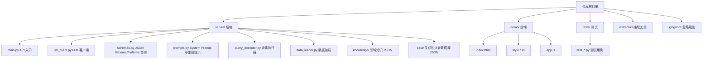
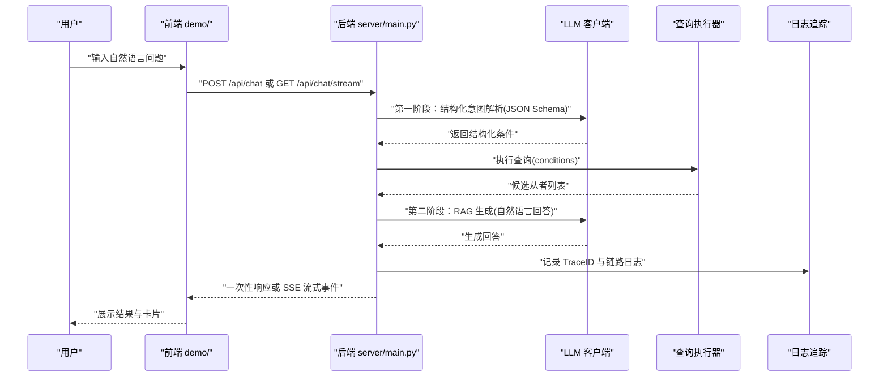
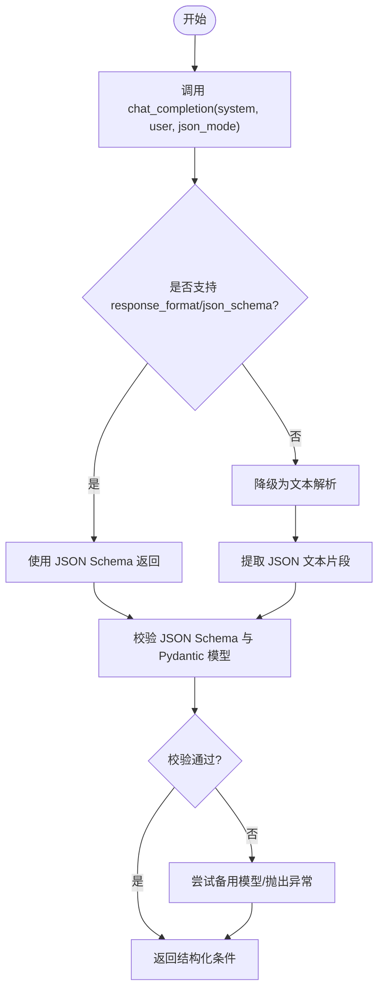
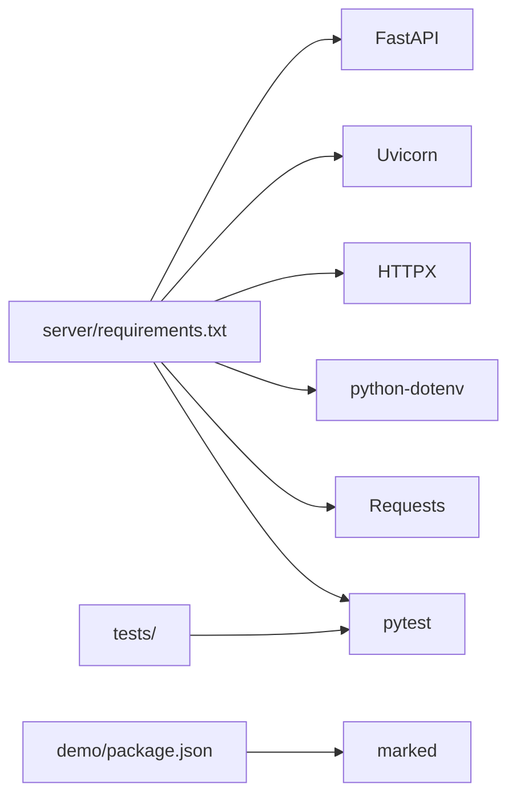

# 贡献指南

<cite>
**本文引用的文件**
- [README.md](file://README.md)
- [.gitignore](file://.gitignore)
- [SOUL.md](file://SOUL.md)
- [server/main.py](file://server/main.py)
- [server/schemas.py](file://server/schemas.py)
- [server/prompts.py](file://server/prompts.py)
- [tests/conftest.py](file://tests/conftest.py)
- [tests/test_llm_client.py](file://tests/test_llm_client.py)
- [demo/package.json](file://demo/package.json)
- [server/requirements.txt](file://server/requirements.txt)
- [extractor/requirements.txt](file://extractor/requirements.txt)
- [CodingReviewReport/CodingReviewReport-20260505-Gemini.md](file://CodingReviewReport/CodingReviewReport-20260505-Gemini.md)
</cite>

## 目录
1. [引言](#引言)
2. [项目结构](#项目结构)
3. [核心组件](#核心组件)
4. [架构总览](#架构总览)
5. [详细组件分析](#详细组件分析)
6. [依赖分析](#依赖分析)
7. [性能考量](#性能考量)
8. [故障排查指南](#故障排查指南)
9. [结论](#结论)
10. [附录](#附录)

## 引言
本贡献指南面向希望参与 Laplace 项目的开发者与文档贡献者，旨在统一开发流程、协作规范与质量标准。Laplace 是一个基于自然语言对话的 FGO 数据助手，采用两阶段 RAG 架构与 LLM Contract（JSON Schema + Pydantic）保障意图解析的确定性与可测试性。本指南覆盖分支管理、提交规范、代码风格、审查流程、新功能开发流程、文档贡献方式、问题与需求模板、行为准则与沟通规范、许可证与知识产权政策、贡献者认可机制以及治理与路线图。

## 项目结构
Laplace 采用前后端分离与测试驱动的组织方式：
- server：Python FastAPI 后端，包含 API 入口、LLM 客户端、意图解析与查询执行、知识库与数据加载、日志追踪与 SSE 流式接口。
- demo：前端静态页面与最小化依赖，用于本地演示与交互。
- tests：pytest 回归测试，覆盖 LLM 客户端与查询执行等核心模块。
- extractor：早期数据抽取工具（向后兼容）。
- 知识库与数据：server/knowledge 与 server/data 下的 JSON 数据与领域知识。
- .gitignore：忽略虚拟环境、日志、依赖缓存与外部参考源。

图表来源
- [server/main.py:1-365](file://server/main.py#L1-L365)
- [server/schemas.py:1-92](file://server/schemas.py#L1-L92)
- [server/prompts.py:1-219](file://server/prompts.py#L1-L219)
- [demo/package.json:1-6](file://demo/package.json#L1-L6)
- [.gitignore:1-50](file://.gitignore#L1-L50)

章节来源
- [README.md:104-132](file://README.md#L104-L132)
- [.gitignore:1-50](file://.gitignore#L1-L50)

## 核心组件
- API 入口与路由：提供 /api/chat 与 /api/chat/stream 两个端点，分别支持一次性响应与 SSE 流式响应，并内置健康检查与静态资源挂载。
- LLM 客户端：负责结构化 JSON 返回、响应格式降级与备用模型切换，确保意图解析稳定可靠。
- 意图解析与合约：通过 JSON Schema 与 Pydantic 模型定义严格输入输出契约，保证解析结果可验证、可回归测试。
- Prompt 系统：动态注入领域知识（效果分类、职阶映射、示例与约束），确保 LLM 输出符合项目规范。
- 查询执行器：将结构化条件转换为数据库查询，返回候选从者集合。
- 日志与追踪：记录完整链路，支持通过 TraceID 回溯解析状态与生成过程。
- 测试体系：pytest 回归测试，包含结构化响应测试与可选的真实 LLM 合约测试。

章节来源
- [server/main.py:144-365](file://server/main.py#L144-L365)
- [server/schemas.py:1-92](file://server/schemas.py#L1-L92)
- [server/prompts.py:1-219](file://server/prompts.py#L1-L219)
- [tests/test_llm_client.py:1-150](file://tests/test_llm_client.py#L1-L150)

## 架构总览
Laplace 采用“对话式意图解析 + 结构化查询 + RAG 生成”的两阶段流程。前端通过 SSE 流式接收解析、检索与生成阶段的中间结果，后端通过 LLM Contract 保证意图解析的确定性与可测试性。

图表来源
- [server/main.py:150-355](file://server/main.py#L150-L355)
- [server/prompts.py:186-219](file://server/prompts.py#L186-L219)
- [tests/test_llm_client.py:106-150](file://tests/test_llm_client.py#L106-L150)

## 详细组件分析

### 组件一：API 入口与路由
- 职责：提供聊天接口、SSE 流式接口、健康检查与静态资源挂载；在启动时预加载数据库；实现链路日志记录与 TraceID 生成。
- 关键点：CORS 允许跨域；限制返回结果数量；SSE 分阶段推送解析、检索与生成阶段信息；错误时降级回文本提示。
- 优化建议：对并发请求进行速率限制；对敏感字段进行脱敏记录；对大响应进行分页或懒加载。

章节来源
- [server/main.py:114-365](file://server/main.py#L114-L365)

### 组件二：LLM 客户端与意图解析
- 职责：封装结构化响应格式（json_schema）、处理响应格式不支持时的文本降级、在 JSON Schema 失败时尝试备用模型。
- 关键点：支持真实 LLM 合约测试（可选）；对无效 JSON 与不符合 Schema 的输出抛出异常；测试用例覆盖多种边界场景。
- 优化建议：增加超时与重试策略；对不同网关的差异进行更细粒度的降级分支；记录模型使用与响应格式统计。

图表来源
- [tests/test_llm_client.py:106-150](file://tests/test_llm_client.py#L106-L150)
- [server/schemas.py:89-92](file://server/schemas.py#L89-L92)

章节来源
- [tests/test_llm_client.py:1-150](file://tests/test_llm_client.py#L1-L150)
- [server/schemas.py:1-92](file://server/schemas.py#L1-L92)

### 组件三：Prompt 系统与领域知识注入
- 职责：动态加载 effect_schema.json，构建技能效果分类与映射；提供系统 Prompt 与生成阶段 Prompt；严格约束输出格式与字段说明。
- 关键点：支持多从者对比（names 字段）；中文别名与效果名称映射；示例驱动的输出规范；缓存构建好的系统 Prompt。
- 优化建议：对知识库变更进行版本化管理；在 Prompt 中加入更丰富的上下文与反例；对未知效果进行安全兜底提示。

章节来源
- [server/prompts.py:1-219](file://server/prompts.py#L1-L219)

### 组件四：查询执行器与数据层
- 职责：将结构化条件转换为数据库查询，返回候选从者集合；与知识库中的效果映射配合，提供预消化上下文。
- 关键点：支持多条件组合（NP 自充、职阶、性别、阵营、指令卡、宝具类型、特性等）；对空值与空集合进行清理；限制返回数量。
- 优化建议：对高频查询建立索引；对条件进行合法性前置校验；对大结果集进行分页与流式输出。

章节来源
- [server/main.py:60-106](file://server/main.py#L60-L106)
- [server/main.py:191-242](file://server/main.py#L191-L242)

### 组件五：日志与追踪
- 职责：记录完整链路日志，包含用户消息、解析条件、结果数量、最终回复与上下文；支持通过 TraceID 回溯。
- 关键点：在解析与生成阶段分别记录；错误时记录错误信息；SSE 场景下分阶段推送。
- 优化建议：对日志进行结构化存储；区分敏感信息与公开信息；提供日志检索与聚合视图。

章节来源
- [server/main.py:150-242](file://server/main.py#L150-L242)
- [server/main.py:245-355](file://server/main.py#L245-L355)

## 依赖分析
- 后端依赖：FastAPI、Uvicorn、HTTPX、python-dotenv、Requests、pytest。
- 前端依赖：marked（Markdown 渲染）。
- 开发与测试：pytest 用于回归测试；可选真实 LLM 合约测试。

图表来源
- [server/requirements.txt:1-7](file://server/requirements.txt#L1-L7)
- [demo/package.json:1-6](file://demo/package.json#L1-L6)

章节来源
- [server/requirements.txt:1-7](file://server/requirements.txt#L1-L7)
- [demo/package.json:1-6](file://demo/package.json#L1-L6)

## 性能考量
- 响应大小控制：限制返回从者数量，避免响应过大。
- 链路日志与 SSE：SSE 分阶段推送，减少前端等待时间；在生成失败时快速降级。
- 预消化上下文：对检索结果进行精简与翻译，降低生成阶段的上下文负担。
- 并发与限流：建议在生产环境中对 API 进行速率限制与队列缓冲，避免 LLM 资源争用。
- 缓存策略：对系统 Prompt 与知识库进行缓存，减少重复加载成本。

章节来源
- [server/main.py:56-58](file://server/main.py#L56-L58)
- [server/main.py:245-355](file://server/main.py#L245-L355)
- [server/prompts.py:178-184](file://server/prompts.py#L178-L184)

## 故障排查指南
- LLM 解析失败：检查 .env 中的模型密钥配置；确认 response_format 是否被网关支持；查看日志中的 TraceID 与错误信息。
- 生成阶段异常：确认知识库与数据是否完整；检查条件是否合法；查看回退逻辑是否生效。
- 测试失败：运行默认回归测试；如需真实 LLM 合约测试，设置 RUN_LIVE_LLM_TESTS 环境变量后执行相应测试。
- 前端无法加载：确认静态资源挂载与 CORS 设置；检查浏览器控制台与网络面板。

章节来源
- [README.md:52-100](file://README.md#L52-L100)
- [server/main.py:150-242](file://server/main.py#L150-L242)
- [tests/test_llm_client.py:1-150](file://tests/test_llm_client.py#L1-L150)

## 结论
本贡献指南明确了 Laplace 项目的开发与协作规范，强调了结构化意图解析、可测试性与用户体验的重要性。建议贡献者在提交前完成本地测试与代码风格检查，并在代码审查中重点关注可维护性、性能与安全性。

## 附录

### 分支管理策略
- 主分支：master/main 用于发布稳定版本，合并前需通过测试与审查。
- 开发分支：develop 用于集成新功能，定期与主分支同步。
- 功能分支：feature/* 用于具体功能开发，完成后合并至 develop。
- 修复分支：hotfix/* 用于紧急修复，修复后同时合并至主分支与 develop。
- 发布分支：release/* 用于准备发布，合并至主分支并打标签。

### 代码提交规范
- 提交信息格式：类型(scope): 描述（不超过 50 字），正文说明动机与影响。
- 类型：feat、fix、docs、style、refactor、test、chore。
- 避免一次性提交过多改动，尽量原子化提交以便审查。

### 代码风格指南
- Python：PEP 8 风格，使用 4 空格缩进；函数与类命名清晰；注释简洁明确。
- Prompt：严格遵循 JSON Schema 输出；示例与约束明确；避免歧义表达。
- 前端：HTML/CSS/JS 最小化，避免引入无关依赖；样式与脚本分离。
- 测试：pytest 规范，覆盖边界与异常路径；必要时使用 fixture 与 mock。

### 代码审查流程与质量标准
- 审查范围：功能正确性、性能影响、可测试性、可维护性、安全性与可读性。
- 审查清单：是否通过测试、是否满足需求、是否有回归风险、是否符合风格与规范。
- 审查工具：pytest、lint 工具、覆盖率报告；必要时进行性能与安全扫描。
- 合并要求：至少一名维护者批准；CI 通过；无未解决的审查意见。

章节来源
- [tests/conftest.py:1-8](file://tests/conftest.py#L1-L8)
- [tests/test_llm_client.py:1-150](file://tests/test_llm_client.py#L1-L150)
- [CodingReviewReport/CodingReviewReport-20260505-Gemini.md](file://CodingReviewReport/CodingReviewReport-20260505-Gemini.md)

### 新功能开发流程与要求
- 需求评审：在 issue 中描述背景、目标与验收标准。
- 设计文档：说明涉及的模块、数据流与潜在风险。
- 实现步骤：功能分支开发、单元测试、集成测试、文档更新。
- 回归测试：确保现有功能不受影响；必要时更新知识库与数据。
- 发布准备：更新版本号、发布说明与部署脚本。

### 文档贡献方式与标准
- 文档类型：需求文档、设计文档、用户手册、API 文档与运维指南。
- 内容要求：结构清晰、术语一致、示例完整、版本对应。
- 提交方式：通过 Pull Request，附带变更摘要与影响说明。

### 问题报告与功能请求模板
- 问题报告模板
  - 标题：简述问题
  - 环境：操作系统、Python 版本、依赖版本
  - 复现步骤：最小可复现步骤
  - 期望行为：预期结果
  - 实际行为：实际结果
  - 日志与截图：TraceID、错误日志、截图
- 功能请求模板
  - 背景：为什么需要该功能
  - 目标：达成的具体目标
  - 方案：建议的实现思路
  - 风险与影响：可能的风险与对现有功能的影响

### 社区行为准则与沟通指南
- 行为准则：尊重、包容、建设性反馈；禁止人身攻击与歧视性言论。
- 沟通渠道：Issue/PR 评论、邮件列表、即时通讯群组。
- 语言：优先使用中文；技术术语保留英文并在首次出现时给出解释。
- 审查参与：鼓励社区成员参与审查，但最终决定权在维护者。

章节来源
- [SOUL.md:1-40](file://SOUL.md#L1-L40)

### 许可证信息与知识产权政策
- 许可证：CC-BY-NC-SA-4.0
- 知识来源：数据与部分领域逻辑源自开源项目 Chaldea 与 Atlas Academy。
- 使用限制：非商业用途；需署名与相同许可证分享衍生作品。

章节来源
- [README.md:133-140](file://README.md#L133-L140)

### 贡献者认可与奖励机制
- 贡献统计：在变更日志与致谢中记录贡献者姓名与贡献类型。
- 社区激励：优秀 PR 与文档可获得公开致谢与社区推荐。
- 职业发展：项目经验可作为技术能力证明材料。

### 治理结构与发展路线图
- 治理结构：维护者负责代码审查与发布；社区共同参与需求评审与功能决策。
- 路线图：短期（修复与优化）、中期（能力扩展与性能提升）、长期（生态与平台化）。
- 透明度：会议纪要、决策记录与版本发布计划公开可见。