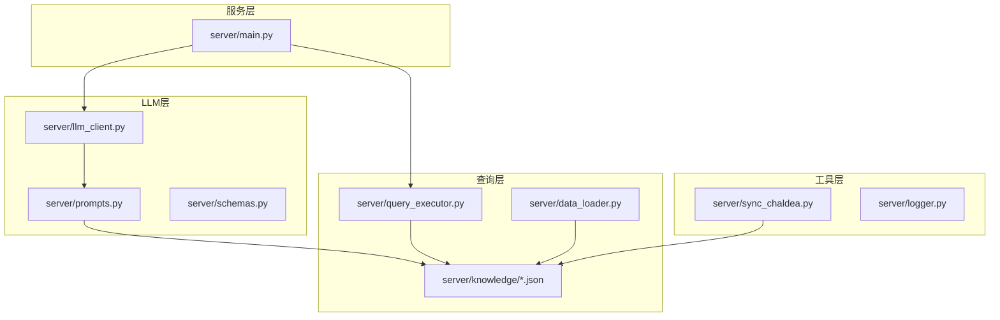
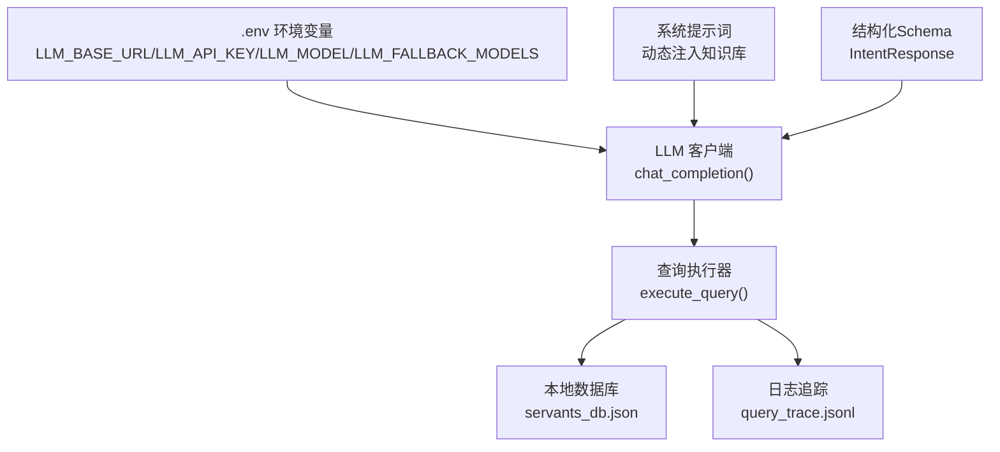
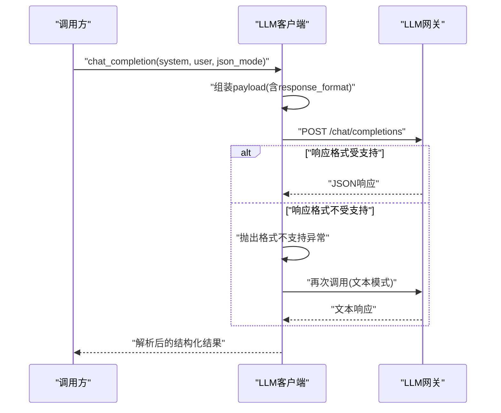
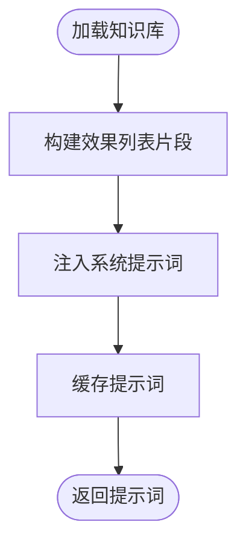
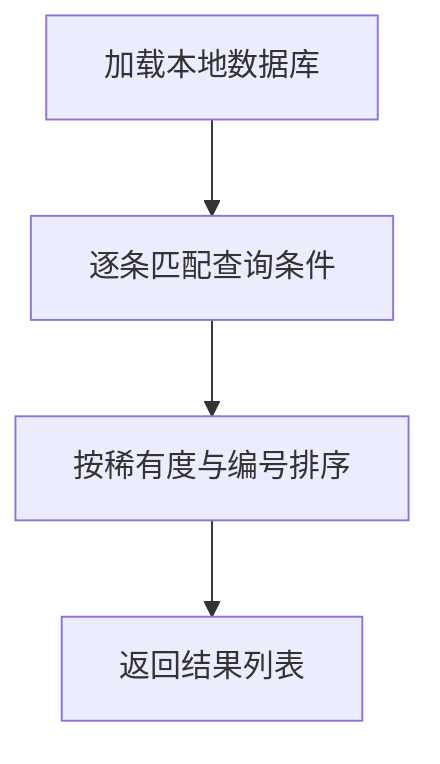
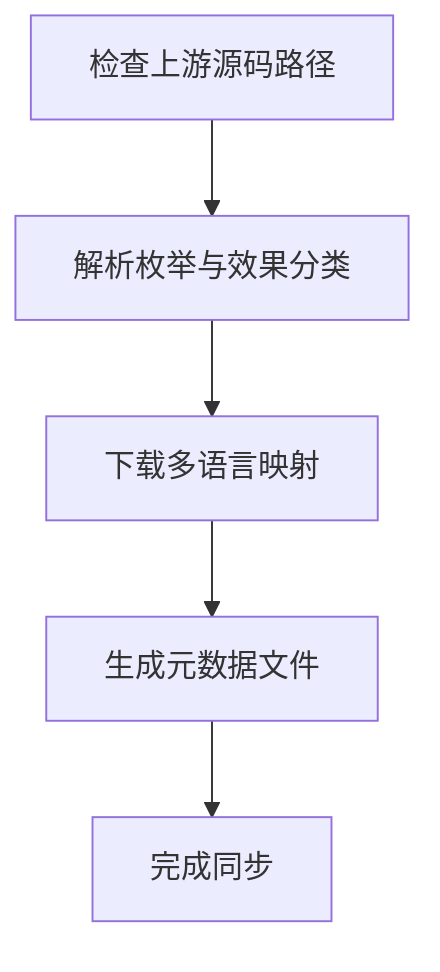
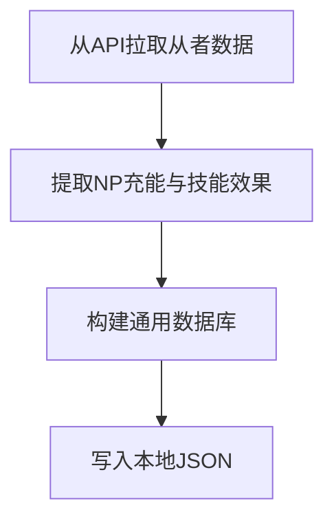
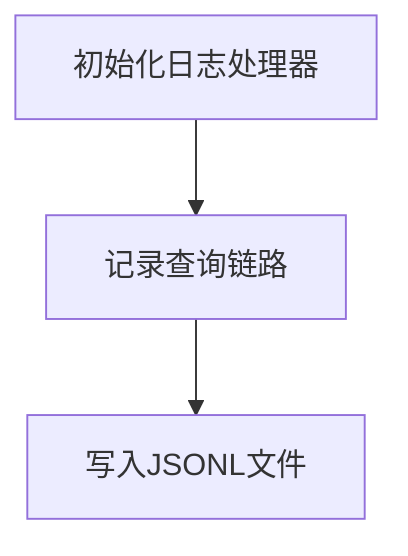
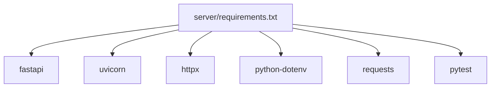

# 配置管理

<cite>
**本文引用的文件**
- [server/main.py](file://server/main.py)
- [server/llm_client.py](file://server/llm_client.py)
- [server/prompts.py](file://server/prompts.py)
- [server/schemas.py](file://server/schemas.py)
- [server/query_executor.py](file://server/query_executor.py)
- [server/data_loader.py](file://server/data_loader.py)
- [server/sync_chaldea.py](file://server/sync_chaldea.py)
- [server/logger.py](file://server/logger.py)
- [server/requirements.txt](file://server/requirements.txt)
- [server/knowledge/_meta.json](file://server/knowledge/_meta.json)
- [server/knowledge/effect_schema.json](file://server/knowledge/effect_schema.json)
- [server/knowledge/class_mapping.json](file://server/knowledge/class_mapping.json)
</cite>

## 目录
1. [简介](#简介)
2. [项目结构](#项目结构)
3. [核心组件](#核心组件)
4. [架构总览](#架构总览)
5. [详细组件分析](#详细组件分析)
6. [依赖分析](#依赖分析)
7. [性能考虑](#性能考虑)
8. [故障排除指南](#故障排除指南)
9. [结论](#结论)
10. [附录](#附录)

## 简介
本文件面向Laplace项目的配置管理，系统性阐述环境配置、依赖管理、知识库配置与LLM API、数据库连接、缓存设置的关系与影响范围。文档提供配置项的结构、参数含义与修改建议，给出不同部署环境的配置模板与最佳实践，并覆盖安全配置、性能调优与故障排除，以及配置变更的影响范围与回滚策略。

## 项目结构
Laplace采用分层与功能模块化的组织方式：
- 服务层：FastAPI应用入口与路由控制
- LLM层：LLM客户端封装与提示词工程
- 查询层：查询执行器与本地数据库
- 知识库层：从上游源同步的领域知识与映射
- 工具层：数据加载器、同步脚本、日志记录

图表来源
- [server/main.py:1-228](file://server/main.py#L1-L228)
- [server/llm_client.py:1-247](file://server/llm_client.py#L1-L247)
- [server/prompts.py:1-208](file://server/prompts.py#L1-L208)
- [server/schemas.py:1-81](file://server/schemas.py#L1-L81)
- [server/query_executor.py:1-305](file://server/query_executor.py#L1-L305)
- [server/data_loader.py:1-363](file://server/data_loader.py#L1-L363)
- [server/sync_chaldea.py:1-429](file://server/sync_chaldea.py#L1-L429)
- [server/logger.py:1-55](file://server/logger.py#L1-L55)

章节来源
- [server/main.py:1-228](file://server/main.py#L1-L228)
- [server/requirements.txt:1-7](file://server/requirements.txt#L1-L7)

## 核心组件
- LLM客户端与API配置：通过环境变量驱动，支持主备模型与结构化解析
- 提示词与结构化Schema：系统提示词动态注入知识库，保证LLM输出严格JSON
- 查询执行器与本地数据库：预加载本地JSON数据库，支持多维条件筛选
- 知识库同步与版本追踪：从上游源解析并生成领域知识文件，记录元数据
- 日志与追踪：统一记录查询链路，便于审计与排障

章节来源
- [server/llm_client.py:18-29](file://server/llm_client.py#L18-L29)
- [server/prompts.py:15-44](file://server/prompts.py#L15-L44)
- [server/schemas.py:16-81](file://server/schemas.py#L16-L81)
- [server/query_executor.py:41-51](file://server/query_executor.py#L41-L51)
- [server/sync_chaldea.py:308-419](file://server/sync_chaldea.py#L308-L419)
- [server/logger.py:38-55](file://server/logger.py#L38-L55)

## 架构总览
下图展示配置在系统中的作用与交互：

图表来源
- [server/llm_client.py:18-29](file://server/llm_client.py#L18-L29)
- [server/prompts.py:15-44](file://server/prompts.py#L15-L44)
- [server/schemas.py:68-81](file://server/schemas.py#L68-L81)
- [server/query_executor.py:41-51](file://server/query_executor.py#L41-L51)
- [server/logger.py:38-55](file://server/logger.py#L38-L55)

## 详细组件分析

### LLM API配置与客户端
- 环境变量
  - LLM_BASE_URL：LLM网关基础URL，默认值见实现
  - LLM_API_KEY：认证密钥
  - LLM_MODEL：主模型名称
  - LLM_FALLBACK_MODELS：备用模型列表，逗号分隔
- 客户端行为
  - 支持结构化JSON模式与文本回退
  - 自动尝试主模型与备用模型
  - 对响应格式不支持的情况进行降级处理
- 关键路径
  - 环境加载：[server/llm_client.py:18-19](file://server/llm_client.py#L18-L19)
  - 配置读取：[server/llm_client.py:21-28](file://server/llm_client.py#L21-L28)
  - 结构化调用与回退：[server/llm_client.py:81-126](file://server/llm_client.py#L81-L126)
  - 文本模式调用：[server/llm_client.py:89-100](file://server/llm_client.py#L89-L100)

图表来源
- [server/llm_client.py:81-126](file://server/llm_client.py#L81-L126)
- [server/llm_client.py:129-168](file://server/llm_client.py#L129-L168)

章节来源
- [server/llm_client.py:18-29](file://server/llm_client.py#L18-L29)
- [server/llm_client.py:81-126](file://server/llm_client.py#L81-L126)
- [server/llm_client.py:129-168](file://server/llm_client.py#L129-L168)

### 提示词与结构化Schema
- 动态知识库注入
  - 从知识库effect_schema.json读取效果分类与别名，注入系统提示词
  - 提示词构建缓存，避免重复IO
- 结构化Schema
  - IntentResponse定义LLM输出的严格JSON结构
  - QueryConditions定义查询条件字段与校验规则
- 关键路径
  - 效果列表构建：[server/prompts.py:15-44](file://server/prompts.py#L15-L44)
  - 系统提示词构建与缓存：[server/prompts.py:46-173](file://server/prompts.py#L46-L173)
  - 结构化Schema定义：[server/schemas.py:16-81](file://server/schemas.py#L16-L81)

图表来源
- [server/prompts.py:15-44](file://server/prompts.py#L15-L44)
- [server/prompts.py:167-173](file://server/prompts.py#L167-L173)

章节来源
- [server/prompts.py:15-44](file://server/prompts.py#L15-L44)
- [server/prompts.py:46-173](file://server/prompts.py#L46-L173)
- [server/schemas.py:16-81](file://server/schemas.py#L16-L81)

### 查询执行器与本地数据库
- 数据库加载
  - 预加载servants_db.json至内存，提供全局缓存
- 查询条件
  - 支持NP自充、稀有度、职阶、名称、技能效果、特性、性别、阵营、配卡、宝具颜色与目标类型等多维条件
  - 名称支持昵称映射与规范化匹配
- 关键路径
  - 数据库加载与缓存：[server/query_executor.py:41-51](file://server/query_executor.py#L41-L51)
  - 条件匹配与排序：[server/query_executor.py:53-87](file://server/query_executor.py#L53-L87)
  - 名称与昵称匹配：[server/query_executor.py:134-192](file://server/query_executor.py#L134-L192)
  - 技能效果匹配：[server/query_executor.py:264-289](file://server/query_executor.py#L264-L289)

图表来源
- [server/query_executor.py:41-87](file://server/query_executor.py#L41-L87)

章节来源
- [server/query_executor.py:41-87](file://server/query_executor.py#L41-L87)
- [server/query_executor.py:134-192](file://server/query_executor.py#L134-L192)
- [server/query_executor.py:264-289](file://server/query_executor.py#L264-L289)

### 知识库同步与版本追踪
- 同步来源
  - 从上游Chaldea源码解析枚举与效果分类
  - 下载多语言映射数据
- 生成文件
  - func_types.json、func_target_types.json、buff_types.json、effect_schema.json、class_mapping.json
  - _meta.json记录同步时间、Chaldea提交与文件清单
- 关键路径
  - 主流程与文件写出：[server/sync_chaldea.py:308-419](file://server/sync_chaldea.py#L308-L419)
  - 元数据生成：[server/sync_chaldea.py:396-413](file://server/sync_chaldea.py#L396-L413)

图表来源
- [server/sync_chaldea.py:308-419](file://server/sync_chaldea.py#L308-L419)

章节来源
- [server/sync_chaldea.py:308-419](file://server/sync_chaldea.py#L308-L419)
- [server/knowledge/_meta.json:1-12](file://server/knowledge/_meta.json#L1-L12)

### 数据加载器与数据库构建
- 数据来源
  - 从Atlas Academy API拉取全量从者数据
- 处理逻辑
  - 提取NP充能、技能效果、宝具效果、卡色构成等
  - 构建通用数据库并持久化到本地JSON
- 关键路径
  - 拉取与过滤：[server/data_loader.py:91-102](file://server/data_loader.py#L91-L102)
  - 效果匹配索引：[server/data_loader.py:64-84](file://server/data_loader.py#L64-L84)
  - 数据库构建：[server/data_loader.py:231-329](file://server/data_loader.py#L231-L329)

图表来源
- [server/data_loader.py:91-102](file://server/data_loader.py#L91-L102)
- [server/data_loader.py:231-329](file://server/data_loader.py#L231-L329)

章节来源
- [server/data_loader.py:64-84](file://server/data_loader.py#L64-L84)
- [server/data_loader.py:231-329](file://server/data_loader.py#L231-L329)

### 日志与追踪
- 日志格式
  - JSONL格式，包含时间戳、级别与业务字段
- 记录内容
  - traceId、用户问题、意图解析、结果数量、最终回复、上下文、错误信息
- 关键路径
  - 日志初始化与格式化：[server/logger.py:13-37](file://server/logger.py#L13-L37)
  - 记录接口：[server/logger.py:38-55](file://server/logger.py#L38-L55)

图表来源
- [server/logger.py:13-37](file://server/logger.py#L13-L37)
- [server/logger.py:38-55](file://server/logger.py#L38-L55)

章节来源
- [server/logger.py:13-37](file://server/logger.py#L13-L37)
- [server/logger.py:38-55](file://server/logger.py#L38-L55)

## 依赖分析
- 运行时依赖
  - FastAPI、Uvicorn、HTTPX、python-dotenv、Requests、Pytest
- 依赖来源
  - [server/requirements.txt:1-7](file://server/requirements.txt#L1-L7)

图表来源
- [server/requirements.txt:1-7](file://server/requirements.txt#L1-L7)

章节来源
- [server/requirements.txt:1-7](file://server/requirements.txt#L1-L7)

## 性能考虑
- LLM调用
  - 使用结构化JSON模式提升解析稳定性；若网关不支持，自动回退文本模式
  - 通过备用模型列表实现容灾与负载分散
- 查询执行
  - 预加载数据库至内存，避免重复IO
  - 名称匹配前进行规范化与昵称映射，减少无效遍历
- 数据构建
  - 效果匹配建立索引，加速查询
- 日志
  - JSONL异步写入，避免阻塞主线程

章节来源
- [server/llm_client.py:81-126](file://server/llm_client.py#L81-L126)
- [server/query_executor.py:41-51](file://server/query_executor.py#L41-L51)
- [server/data_loader.py:64-84](file://server/data_loader.py#L64-L84)
- [server/logger.py:13-37](file://server/logger.py#L13-L37)

## 故障排除指南
- LLM连接失败
  - 检查LLM_BASE_URL与LLM_API_KEY是否正确
  - 观察备用模型是否生效
  - 若出现响应格式不支持，确认网关是否支持response_format
  - 参考路径：[server/llm_client.py:21-28](file://server/llm_client.py#L21-L28)，[server/llm_client.py:129-168](file://server/llm_client.py#L129-L168)
- 意图解析失败
  - 确认系统提示词已注入知识库，且effect_schema.json存在
  - 检查LLM输出是否符合IntentResponse结构
  - 参考路径：[server/prompts.py:15-44](file://server/prompts.py#L15-L44)，[server/schemas.py:68-81](file://server/schemas.py#L68-L81)
- 查询无结果或错误
  - 检查servants_db.json是否生成与加载成功
  - 核对查询条件是否与数据库字段一致
  - 参考路径：[server/query_executor.py:41-51](file://server/query_executor.py#L41-L51)，[server/query_executor.py:53-87](file://server/query_executor.py#L53-L87)
- 知识库不同步
  - 确认上游Chaldea源码路径存在
  - 检查元数据文件是否更新
  - 参考路径：[server/sync_chaldea.py:313-318](file://server/sync_chaldea.py#L313-L318)，[server/knowledge/_meta.json:1-12](file://server/knowledge/_meta.json#L1-L12)
- 日志无法写入
  - 检查日志目录权限与磁盘空间
  - 参考路径：[server/logger.py:10-11](file://server/logger.py#L10-L11)，[server/logger.py:18-37](file://server/logger.py#L18-L37)

章节来源
- [server/llm_client.py:21-28](file://server/llm_client.py#L21-L28)
- [server/llm_client.py:129-168](file://server/llm_client.py#L129-L168)
- [server/prompts.py:15-44](file://server/prompts.py#L15-L44)
- [server/schemas.py:68-81](file://server/schemas.py#L68-L81)
- [server/query_executor.py:41-51](file://server/query_executor.py#L41-L51)
- [server/query_executor.py:53-87](file://server/query_executor.py#L53-L87)
- [server/sync_chaldea.py:313-318](file://server/sync_chaldea.py#L313-L318)
- [server/knowledge/_meta.json:1-12](file://server/knowledge/_meta.json#L1-L12)
- [server/logger.py:10-11](file://server/logger.py#L10-L11)
- [server/logger.py:18-37](file://server/logger.py#L18-L37)

## 结论
Laplace的配置管理围绕“环境变量驱动的LLM API、本地知识库与数据库、结构化提示词与Schema”展开。通过合理的配置与同步机制，系统实现了稳定的意图解析与高效查询。建议在生产环境中启用备用模型、定期同步知识库、监控日志与性能指标，并制定配置变更与回滚策略以保障稳定性。

## 附录

### 配置项与参数说明
- 环境变量
  - LLM_BASE_URL：LLM网关基础URL
  - LLM_API_KEY：认证密钥
  - LLM_MODEL：主模型名称
  - LLM_FALLBACK_MODELS：备用模型列表（逗号分隔）
- 知识库文件
  - effect_schema.json：效果分类与别名
  - class_mapping.json：职阶映射
  - _meta.json：同步元数据
- 数据库文件
  - servants_db.json：本地从者数据库

章节来源
- [server/llm_client.py:21-28](file://server/llm_client.py#L21-L28)
- [server/knowledge/effect_schema.json:1-200](file://server/knowledge/effect_schema.json#L1-L200)
- [server/knowledge/class_mapping.json:1-200](file://server/knowledge/class_mapping.json#L1-L200)
- [server/knowledge/_meta.json:1-12](file://server/knowledge/_meta.json#L1-L12)

### 不同部署环境的配置模板与最佳实践
- 开发环境
  - 使用本地或测试LLM网关，开启详细日志
  - 保持知识库与数据库最新，便于调试
- 生产环境
  - 配置主备模型，启用结构化JSON模式
  - 限制响应超时与并发，确保稳定性
  - 定期同步知识库，监控错误率与延迟
- 安全建议
  - 将LLM_API_KEY置于安全位置，避免硬编码
  - 限制CORS策略，仅开放必要域名
  - 对外部API调用增加重试与熔断

### 配置变更的影响范围与回滚策略
- 影响范围
  - LLM API配置：影响意图解析与生成质量
  - 知识库：影响效果识别与提示词准确性
  - 数据库：影响查询结果与排序
- 回滚策略
  - LLM API：切换回上一版本模型或恢复密钥
  - 知识库：回滚至上次同步的元数据与文件
  - 数据库：替换为备份的servants_db.json