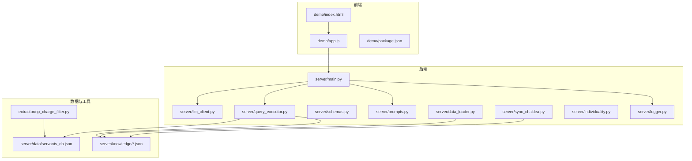
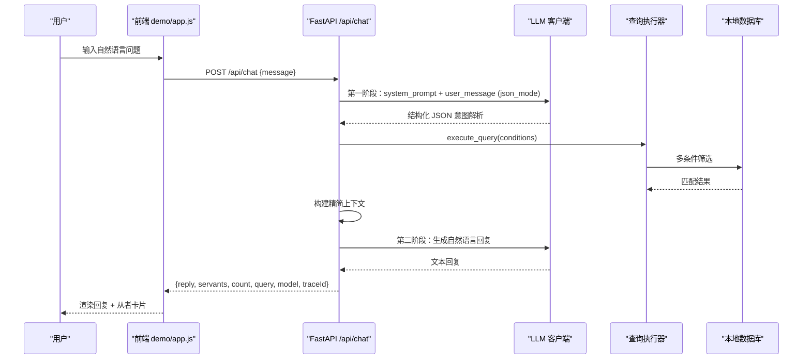
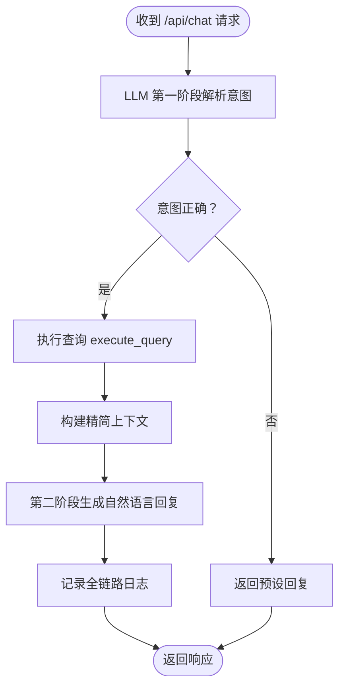
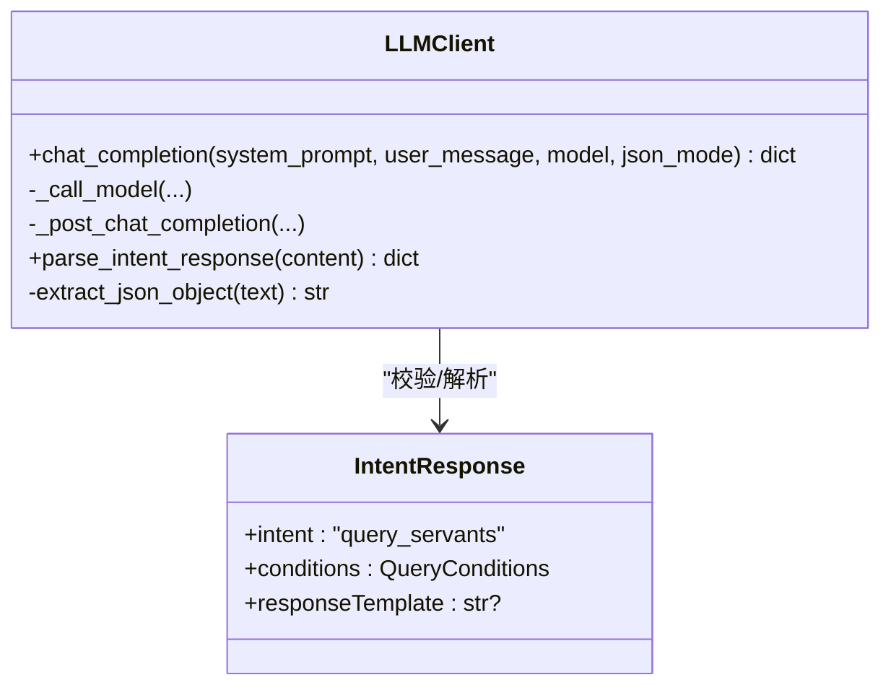
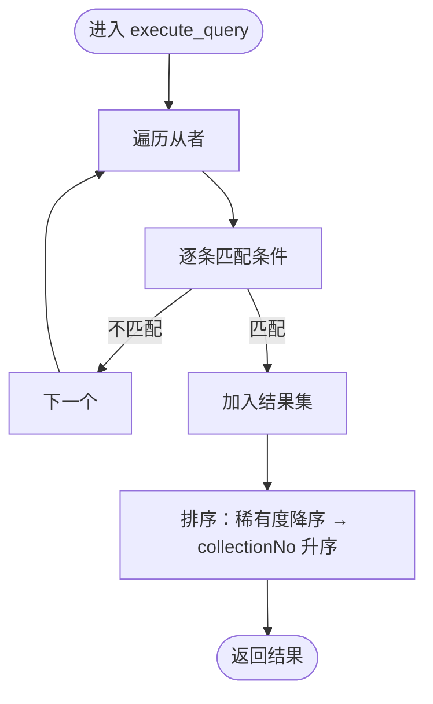
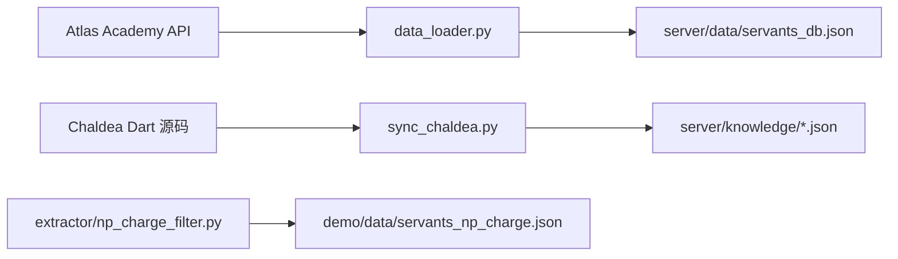
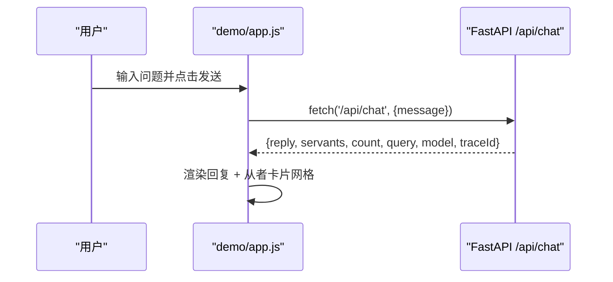
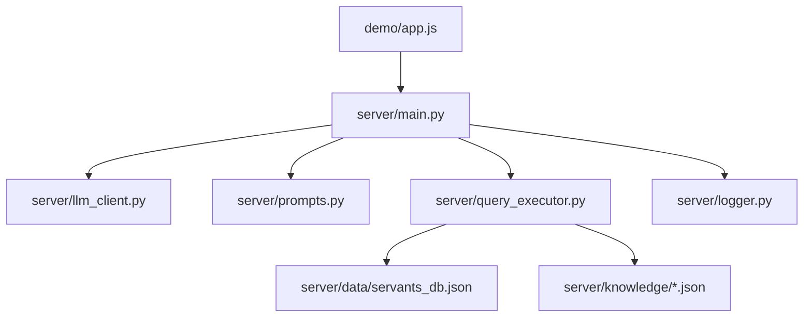

# 项目概述

<cite>
**本文引用的文件**
- [README.md](file://README.md)
- [server/main.py](file://server/main.py)
- [server/prompts.py](file://server/prompts.py)
- [server/llm_client.py](file://server/llm_client.py)
- [server/schemas.py](file://server/schemas.py)
- [server/query_executor.py](file://server/query_executor.py)
- [server/data_loader.py](file://server/data_loader.py)
- [server/sync_chaldea.py](file://server/sync_chaldea.py)
- [server/individuality.py](file://server/individuality.py)
- [server/logger.py](file://server/logger.py)
- [demo/index.html](file://demo/index.html)
- [demo/app.js](file://demo/app.js)
- [demo/package.json](file://demo/package.json)
- [extractor/np_charge_filter.py](file://extractor/np_charge_filter.py)
- [tests/test_llm_client.py](file://tests/test_llm_client.py)
</cite>

## 目录
1. [简介](#简介)
2. [项目结构](#项目结构)
3. [核心组件](#核心组件)
4. [架构总览](#架构总览)
5. [详细组件分析](#详细组件分析)
6. [依赖关系分析](#依赖关系分析)
7. [性能考量](#性能考量)
8. [故障排查指南](#故障排查指南)
9. [结论](#结论)
10. [附录](#附录)

## 简介
Laplace 是一个基于人工智能的 Fate/Grand Order（Fate/Grand Order，简称FGO）从者数据查询助手。其核心价值在于将传统繁琐的筛选工具转变为“自然语言对话式智能助手”。用户只需用自然语言提问，即可获得精确的从者数据与拟人化总结回答。

- 项目目标：以对话方式提供从者查询、多条件筛选、技能效果匹配、实时聊天界面等能力。
- 技术特色：采用两阶段检索增强生成（Two-Step RAG）架构，结合 Schema Mirror 架构将开源 Chaldea 的领域知识注入大模型，确保输出准确、可追溯。
- 技术栈：后端使用 FastAPI + Uvicorn，前端使用原生 HTML/CSS/JS，AI 驱动采用 OpenAI 兼容的 LLM（如 Claude/Deepseek），数据源来自 Atlas Academy API 与 Chaldea。

**章节来源**
- [README.md:1-125](file://README.md#L1-L125)

## 项目结构
项目采用前后端分离架构，核心目录与职责如下：
- demo：前端静态资源（HTML/CSS/JS），提供聊天界面与卡片展示。
- server：Python 后端，包含 FastAPI 应用、LLM 客户端、提示词模板、查询执行器、数据加载与知识库同步脚本、日志追踪等。
- extractor：独立的数据筛选与导出工具，用于生成特定查询的预置数据集。
- tests：pytest 测试，覆盖 LLM 客户端、查询执行器、数据同步等模块。

**图表来源**
- [server/main.py:1-228](file://server/main.py#L1-L228)
- [demo/index.html:1-72](file://demo/index.html#L1-L72)
- [demo/app.js:1-219](file://demo/app.js#L1-L219)
- [server/data_loader.py:1-363](file://server/data_loader.py#L1-L363)
- [server/sync_chaldea.py:1-429](file://server/sync_chaldea.py#L1-L429)
- [extractor/np_charge_filter.py:1-191](file://extractor/np_charge_filter.py#L1-L191)

**章节来源**
- [README.md:93-116](file://README.md#L93-L116)

## 核心组件
- FastAPI 应用与路由
  - 提供 /api/chat 对话接口与 /api/health 健康检查，挂载前端静态资源。
  - 在启动时预加载从者数据库，支持 CORS 跨域访问。
- LLM 客户端
  - 统一封装 OpenAI 兼容的 chat/completions 调用，支持结构化 JSON 输出与自动降级。
  - 通过 JSON Schema + Pydantic 校验意图解析输出，形成 LLM Contract。
- 提示词与系统约束
  - 动态注入 effect_schema.json 中的效果分类，确保 LLM 输出严格 JSON。
  - 定义两阶段提示词：第一阶段解析意图，第二阶段基于检索结果生成自然语言回复。
- 查询执行器
  - 在本地数据库上执行多条件筛选，支持 NP 充能、技能效果、职阶、稀有度、特性、性别、阵营、配卡、宝具颜色与目标类型等。
- 数据加载与知识库
  - 从 Atlas Academy API 抓取全量从者数据，基于 effect_schema.json 构建通用数据库。
  - 从 Chaldea Dart 源码解析枚举与效果分类，生成 JSON 知识库。
- 日志追踪
  - 全链路记录 traceId、用户问题、解析意图、结果数量、最终回复与上下文，便于问题回溯与调试。

**章节来源**
- [server/main.py:81-228](file://server/main.py#L81-L228)
- [server/llm_client.py:35-247](file://server/llm_client.py#L35-L247)
- [server/prompts.py:46-208](file://server/prompts.py#L46-L208)
- [server/query_executor.py:53-305](file://server/query_executor.py#L53-L305)
- [server/data_loader.py:332-363](file://server/data_loader.py#L332-L363)
- [server/sync_chaldea.py:308-429](file://server/sync_chaldea.py#L308-L429)
- [server/logger.py:38-55](file://server/logger.py#L38-L55)

## 架构总览
Laplace 采用“对话式意图解析 + 检索增强生成”的两阶段架构：
- 第一阶段：LLM 将自然语言解析为结构化 JSON 查询指令（Intent），并进行严格校验。
- 第二阶段：后端在本地数据库上执行筛选，构建精简上下文，调用 LLM 生成自然语言回复。
- Schema Mirror：将 Chaldea 的领域知识（效果分类、枚举、映射）注入系统，确保术语一致与输出可信。

**图表来源**
- [server/main.py:87-218](file://server/main.py#L87-L218)
- [server/llm_client.py:35-127](file://server/llm_client.py#L35-L127)
- [server/query_executor.py:53-87](file://server/query_executor.py#L53-L87)
- [demo/app.js:29-74](file://demo/app.js#L29-L74)

## 详细组件分析

### FastAPI 应用与路由
- 责任边界：统一入口、CORS、静态资源挂载、健康检查、对话处理。
- 关键流程：
  - 启动时加载数据库。
  - /api/chat 接收用户消息，调用 LLM 解析意图，执行查询，构建上下文，生成回复，记录日志。
  - /api/health 健康检查。
- 错误处理：LLM 解析失败或网络异常时返回友好提示与 traceId。

**图表来源**
- [server/main.py:87-218](file://server/main.py#L87-L218)

**章节来源**
- [server/main.py:81-228](file://server/main.py#L81-L228)

### LLM 客户端与意图解析
- 设计要点：
  - 优先使用 response_format/json_schema 进行结构化输出。
  - 若网关不支持，自动降级为文本解析并提取 JSON。
  - 支持主备模型轮询，提升可用性。
- Pydantic 校验：IntentResponse 模型确保输出符合预期结构，形成 LLM Contract。
- 测试保障：单元测试覆盖 JSON 提取、降级逻辑与模型切换。

**图表来源**
- [server/llm_client.py:35-247](file://server/llm_client.py#L35-L247)
- [server/schemas.py:68-81](file://server/schemas.py#L68-L81)

**章节来源**
- [server/llm_client.py:35-247](file://server/llm_client.py#L35-L247)
- [server/schemas.py:16-81](file://server/schemas.py#L16-L81)
- [tests/test_llm_client.py:1-126](file://tests/test_llm_client.py#L1-L126)

### 提示词与系统约束
- 系统提示词动态注入 effect_schema.json 的效果分类，确保术语一致。
- 定义严格的 JSON 输出格式与字段说明，涵盖效果、职阶、特性、配卡、宝具等。
- 两阶段生成提示词：基于检索结果上下文生成自然语言回复，避免先验知识与幻觉。

**章节来源**
- [server/prompts.py:15-208](file://server/prompts.py#L15-L208)

### 查询执行器
- 多条件筛选：支持 NP 充能（比较运算）、稀有度、职阶、名称（含昵称映射）、技能效果（单/多效果 AND/OR）、目标类型、特性（含排斥）、性别、阵营、配卡、宝具颜色与目标类型。
- 排序策略：按稀有度降序、collectionNo 升序。
- 特性匹配：实现 Chaldea 风格的带符号特性匹配逻辑。

**图表来源**
- [server/query_executor.py:53-87](file://server/query_executor.py#L53-L87)

**章节来源**
- [server/query_executor.py:53-305](file://server/query_executor.py#L53-L305)
- [server/individuality.py:58-78](file://server/individuality.py#L58-L78)

### 数据加载与知识库同步
- 数据加载：从 Atlas Academy API 拉取全量从者，提取 NP 充能、技能效果、宝具效果、配卡、特性、性别、阵营等，构建通用数据库。
- 知识库同步：从 Chaldea Dart 源码解析枚举与效果分类，生成 effect_schema.json、buff_types.json、func_types.json、func_target_types.json、class_mapping.json、mappings.json 等。
- 预消化：前端 demo 中的预置数据（如 30% 自充）由独立脚本生成，减少 LLM 翻译成本与幻觉风险。

**图表来源**
- [server/data_loader.py:91-363](file://server/data_loader.py#L91-L363)
- [server/sync_chaldea.py:308-429](file://server/sync_chaldea.py#L308-L429)
- [extractor/np_charge_filter.py:125-191](file://extractor/np_charge_filter.py#L125-L191)

**章节来源**
- [server/data_loader.py:1-363](file://server/data_loader.py#L1-L363)
- [server/sync_chaldea.py:1-429](file://server/sync_chaldea.py#L1-L429)
- [extractor/np_charge_filter.py:1-191](file://extractor/np_charge_filter.py#L1-L191)

### 前端聊天界面
- 交互流程：发送消息 → 调用后端 /api/chat → 渲染 AI 回复与从者卡片 → 支持 Markdown 渲染与建议按钮。
- 响应控制：限制返回结果数量，避免响应过大；显示当前模型名称徽章。

**图表来源**
- [demo/app.js:29-123](file://demo/app.js#L29-L123)
- [demo/index.html:31-72](file://demo/index.html#L31-L72)

**章节来源**
- [demo/index.html:1-72](file://demo/index.html#L1-L72)
- [demo/app.js:1-219](file://demo/app.js#L1-L219)

## 依赖关系分析
- 组件耦合与内聚
  - server/main.py 作为协调者，依赖 llm_client、prompts、query_executor、logger 等模块。
  - query_executor 依赖本地数据库与知识库文件，耦合度适中。
  - 前后端通过 HTTP API 解耦，前端通过静态资源部署，便于独立演进。
- 外部依赖
  - LLM：通过环境变量配置 Base URL、API Key、主备模型。
  - 数据源：Atlas Academy API、Chaldea 源码与映射数据。
- 循环依赖
  - 未发现循环导入；模块间通过函数调用与配置传递数据。

**图表来源**
- [server/main.py:14-18](file://server/main.py#L14-L18)
- [server/llm_client.py:18-29](file://server/llm_client.py#L18-L29)
- [server/query_executor.py:14-15](file://server/query_executor.py#L14-L15)

**章节来源**
- [server/main.py:1-228](file://server/main.py#L1-L228)
- [server/llm_client.py:1-247](file://server/llm_client.py#L1-L247)
- [server/query_executor.py:1-305](file://server/query_executor.py#L1-L305)

## 性能考量
- 响应大小控制：后端限制返回的从者数量，前端也限制渲染数量，避免超大响应。
- 上下文精简：仅传递前若干条结果与统计信息，降低 LLM 上下文成本。
- 预加载与缓存：启动时加载数据库，减少首次查询延迟。
- 模型降级：当网关不支持结构化输出时自动降级，保证可用性。
- 数据预消化：前端 demo 的预置数据减少 LLM 翻译与推理负担。

**章节来源**
- [server/main.py:132-218](file://server/main.py#L132-L218)
- [server/llm_client.py:102-126](file://server/llm_client.py#L102-L126)

## 故障排查指南
- LLM 调用失败
  - 现象：返回错误提示或空回复。
  - 排查：检查 .env 中 LLM_BASE_URL、LLM_API_KEY、LLM_MODEL 配置；查看日志文件中的 traceId 与错误信息。
- JSON Schema 不受支持
  - 现象：出现 response_format/json_schema 相关错误。
  - 排查：客户端会自动降级为文本解析；确认网关支持情况。
- 查询结果为空
  - 现象：总数为 0。
  - 排查：检查条件是否过于严格；确认知识库与数据库是否最新。
- 前端无法连接后端
  - 现象：请求失败或跨域错误。
  - 排查：确认后端已启动并监听 8000 端口；检查 CORS 设置。

**章节来源**
- [server/llm_client.py:129-247](file://server/llm_client.py#L129-L247)
- [server/logger.py:38-55](file://server/logger.py#L38-L55)
- [demo/app.js:44-74](file://demo/app.js#L44-L74)

## 结论
Laplace 通过“自然语言 + 检索增强生成 + 领域知识注入”的架构，实现了从者数据的智能查询与人性化表达。其前后端分离设计、严格的意图解析与查询执行、完善的日志追踪与测试体系，使其具备良好的可维护性与可扩展性。对于初学者，Laplace 提供了直观的对话式体验；对于开发者，其清晰的模块划分与工程实践提供了良好的参考。

## 附录
- 快速开始与数据同步流程见 README 的相应章节。
- 前端依赖通过 npm 安装 marked，用于 Markdown 渲染。

**章节来源**
- [README.md:35-89](file://README.md#L35-L89)
- [demo/package.json:1-6](file://demo/package.json#L1-L6)