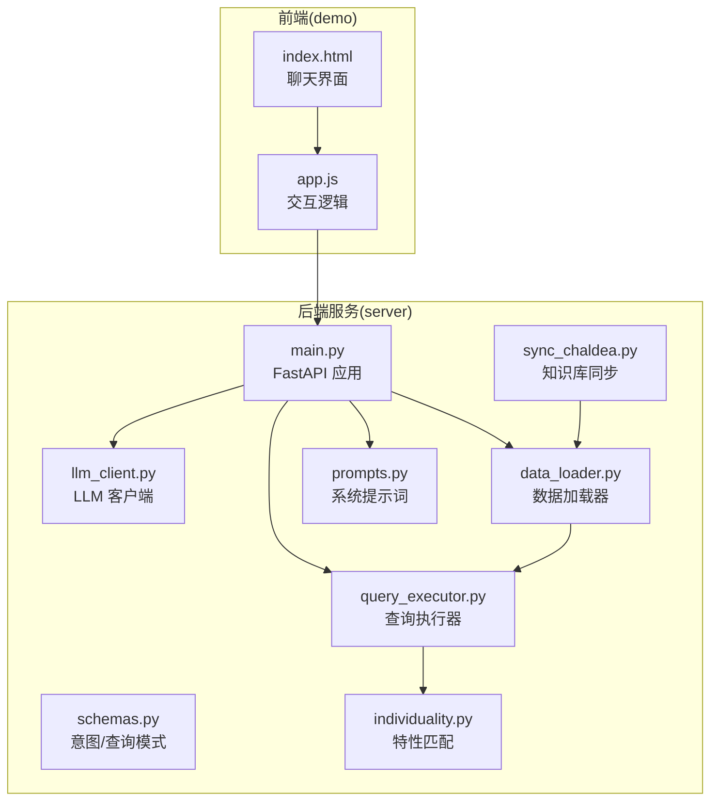
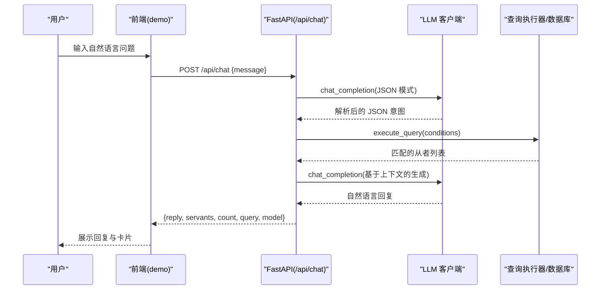
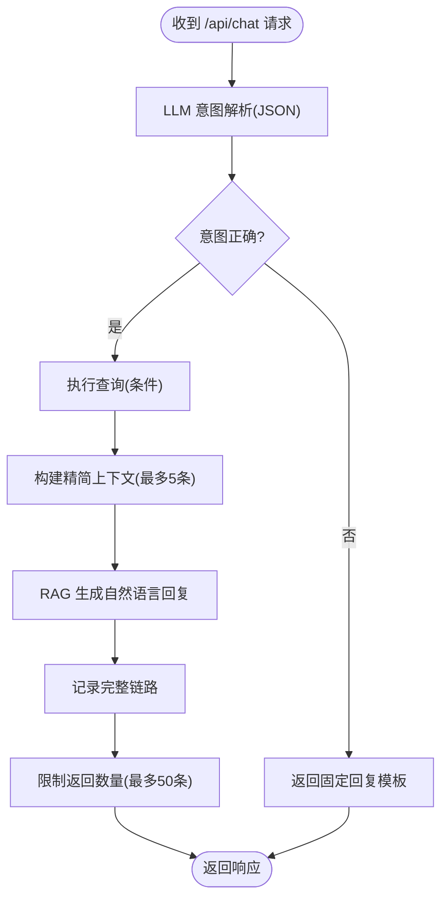
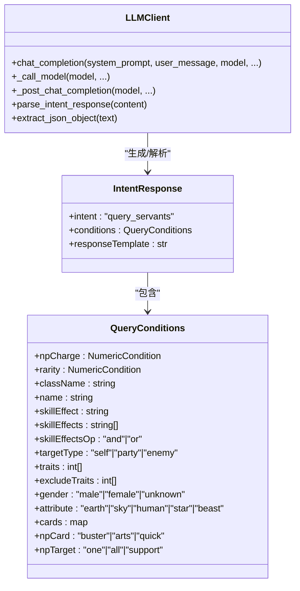
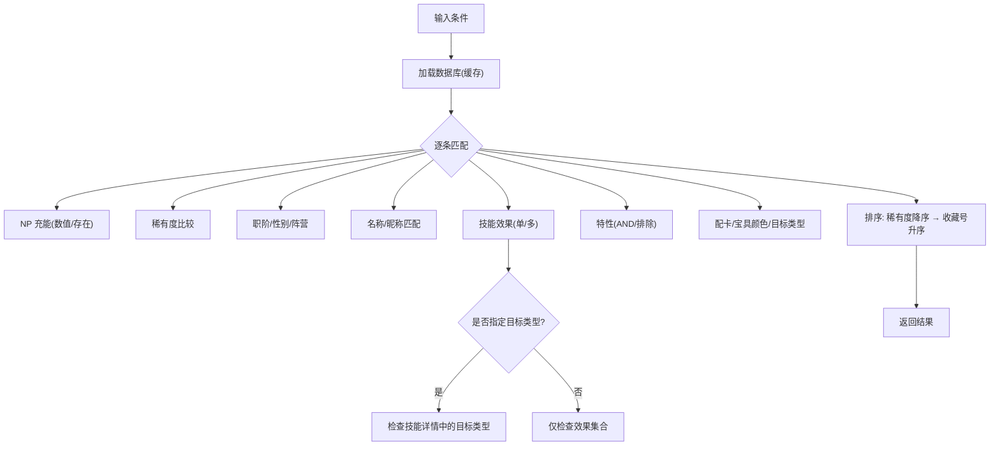
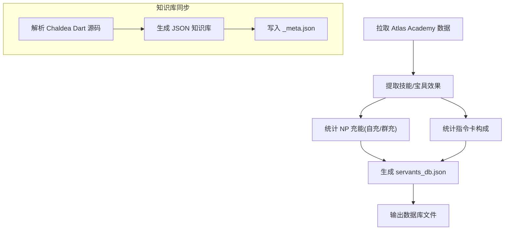
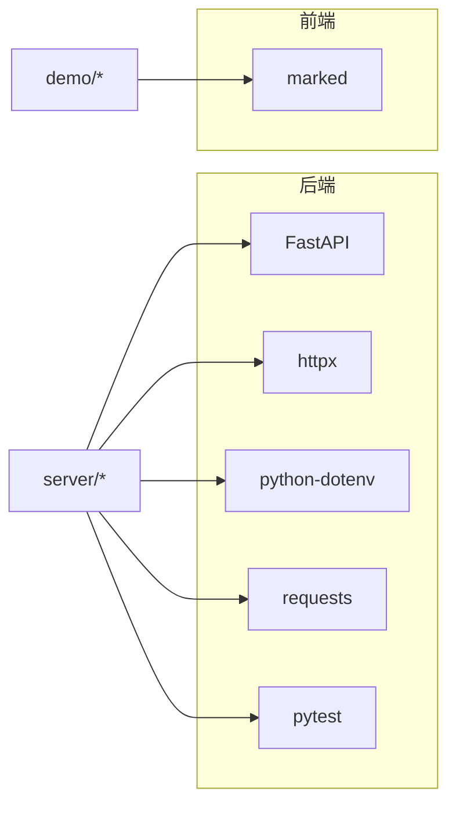

# 项目概述

<cite>
**本文档引用的文件**
- [server/main.py](file://server/main.py)
- [server/prompts.py](file://server/prompts.py)
- [server/llm_client.py](file://server/llm_client.py)
- [server/query_executor.py](file://server/query_executor.py)
- [server/data_loader.py](file://server/data_loader.py)
- [server/sync_chaldea.py](file://server/sync_chaldea.py)
- [server/schemas.py](file://server/schemas.py)
- [server/individuality.py](file://server/individuality.py)
- [demo/index.html](file://demo/index.html)
- [demo/app.js](file://demo/app.js)
- [server/requirements.txt](file://server/requirements.txt)
- [SOUL.md](file://SOUL.md)
</cite>

## 目录
1. [简介](#简介)
2. [项目结构](#项目结构)
3. [核心组件](#核心组件)
4. [架构总览](#架构总览)
5. [详细组件分析](#详细组件分析)
6. [依赖分析](#依赖分析)
7. [性能考量](#性能考量)
8. [故障排查指南](#故障排查指南)
9. [结论](#结论)
10. [附录](#附录)

## 简介
Laplace 是一个基于 AI 的《Fate/Grand Order》（简称 FGO）从者查询助手，通过自然语言对话实现智能查询。项目采用“意图解析 + 结构化检索 + RAG 生成”的两阶段流程：第一阶段由 LLM 将用户自然语言解析为严格的 JSON 查询意图；第二阶段在预构建的从者数据库上执行高效筛选，并结合检索上下文生成自然语言回复。系统以 FastAPI 提供 REST API，内置简易前端用于演示与交互。

项目价值主张：
- 降低学习成本：无需记忆复杂 UI，直接用自然语言提问即可获取从者数据。
- 提升查询效率：支持多维条件组合（如自充百分比、技能效果、职阶、特性、阵营、配卡、宝具类型等）。
- 可靠与可控：通过严格 JSON Schema 约束意图解析，避免 LLM 的不确定性；后端执行器保证结果可追溯、可审计。
- 可扩展与可维护：模块化设计，知识库与数据抽取解耦，便于持续更新 FGO 游戏数据。

## 项目结构
项目采用分层与功能模块化组织：
- server：后端服务与核心逻辑（FastAPI 应用、LLM 客户端、提示词、查询执行器、数据加载与同步、领域模型等）
- demo：静态前端（HTML/CSS/JS），演示聊天界面与卡片展示
- extractor：数据抽取工具（依赖 requests）

图表来源
- [server/main.py:1-228](file://server/main.py#L1-L228)
- [server/prompts.py:1-208](file://server/prompts.py#L1-L208)
- [server/llm_client.py:1-247](file://server/llm_client.py#L1-L247)
- [server/query_executor.py:1-305](file://server/query_executor.py#L1-L305)
- [server/data_loader.py:1-363](file://server/data_loader.py#L1-L363)
- [server/sync_chaldea.py:1-429](file://server/sync_chaldea.py#L1-L429)
- [server/schemas.py:1-81](file://server/schemas.py#L1-L81)
- [server/individuality.py:1-78](file://server/individuality.py#L1-L78)
- [demo/index.html:1-72](file://demo/index.html#L1-L72)
- [demo/app.js:1-219](file://demo/app.js#L1-L219)

章节来源
- [server/main.py:1-228](file://server/main.py#L1-L228)
- [demo/index.html:1-72](file://demo/index.html#L1-L72)
- [demo/app.js:1-219](file://demo/app.js#L1-L219)

## 核心组件
- FastAPI 应用与路由
  - 提供 /api/chat（POST）进行对话式查询，/api/health（GET）健康检查
  - 预加载数据库，启用 CORS，挂载静态前端资源
- LLM 客户端
  - 支持主备模型轮询、结构化 JSON 输出（response_format）与文本回退
  - 严格解析与验证 JSON Schema，确保意图解析稳定
- 系统提示词与模式
  - 动态注入效果分类、职阶映射、字段说明与示例，约束输出格式
- 查询执行器
  - 在本地预构建的从者数据库上执行多条件筛选，支持名称/昵称映射、特性、卡色、宝具类型等
- 数据加载与同步
  - 从 Atlas Academy 拉取全量从者数据，基于 Chaldea 知识库提取技能效果与分类，生成通用数据库
  - 同步脚本从 Chaldea Dart 源码解析枚举与效果分类，生成 JSON 知识库
- 前端演示
  - 简洁的聊天界面，支持快捷建议、Markdown 渲染、从者卡片展示

章节来源
- [server/main.py:87-218](file://server/main.py#L87-L218)
- [server/llm_client.py:35-126](file://server/llm_client.py#L35-L126)
- [server/prompts.py:46-160](file://server/prompts.py#L46-L160)
- [server/query_executor.py:53-87](file://server/query_executor.py#L53-L87)
- [server/data_loader.py:332-362](file://server/data_loader.py#L332-L362)
- [server/sync_chaldea.py:308-429](file://server/sync_chaldea.py#L308-L429)
- [demo/index.html:13-71](file://demo/index.html#L13-L71)
- [demo/app.js:30-123](file://demo/app.js#L30-L123)

## 架构总览
Laplace 采用“两阶段 LLM + 结构化检索”的对话式查询架构：
- 第一阶段：LLM 将自然语言解析为严格 JSON 意图（包含查询条件）
- 第二阶段：查询执行器在本地数据库上执行筛选，生成自然语言回复（RAG）

图表来源
- [server/main.py:87-218](file://server/main.py#L87-L218)
- [server/llm_client.py:35-126](file://server/llm_client.py#L35-L126)
- [server/query_executor.py:53-87](file://server/query_executor.py#L53-L87)

## 详细组件分析

### FastAPI 应用与路由
- 责任边界清晰：路由负责参数封装、调用链编排、错误降级与日志追踪
- 两阶段流程控制：意图解析失败时快速返回错误提示；生成阶段失败时降级为模板化回复
- 上下文裁剪与安全：对返回结果数量与上下文大小进行限制，避免响应膨胀
- 效果翻译与映射：在回复前对效果名称进行中文别名映射，提升可读性

图表来源
- [server/main.py:87-218](file://server/main.py#L87-L218)

章节来源
- [server/main.py:81-218](file://server/main.py#L81-L218)

### LLM 客户端与意图解析
- 模型轮询：支持主备模型切换，提升可用性
- 结构化输出：优先使用 response_format(json_schema) 确保 JSON 可解析；失败时自动回退为文本解析
- JSON Schema 校验：基于 Pydantic 模型严格校验，保证后续执行器输入稳定
- 错误处理：捕获并上报底层错误，统一返回可读提示

图表来源
- [server/llm_client.py:35-126](file://server/llm_client.py#L35-L126)
- [server/schemas.py:16-81](file://server/schemas.py#L16-L81)

章节来源
- [server/llm_client.py:18-126](file://server/llm_client.py#L18-L126)
- [server/schemas.py:16-81](file://server/schemas.py#L16-L81)

### 系统提示词与效果知识库
- 动态注入：从 knowledge 目录加载效果分类、职阶映射、昵称等，确保提示词与数据一致
- 严格格式：提供字段说明、示例与中文映射，降低歧义
- 生成阶段约束：RAG Prompt 明确“禁绝先验知识”“必须基于上下文统计总数”等原则，避免 LLM 脑补

章节来源
- [server/prompts.py:15-160](file://server/prompts.py#L15-L160)
- [server/prompts.py:175-207](file://server/prompts.py#L175-L207)

### 查询执行器与特性匹配
- 多条件组合：支持数值比较、字符串匹配、集合包含、特性 AND/OR 排斥等
- 名称与昵称：规范化处理，支持英文/日文/中文名与昵称映射
- 特性逻辑：实现带符号特性（正/负）的混合匹配，满足“必须拥有且不能拥有”的复杂查询
- 性能优化：按稀有度降序、收藏编号升序排序，兼顾可读性与一致性

图表来源
- [server/query_executor.py:53-305](file://server/query_executor.py#L53-L305)
- [server/individuality.py:58-78](file://server/individuality.py#L58-L78)

章节来源
- [server/query_executor.py:53-305](file://server/query_executor.py#L53-L305)
- [server/individuality.py:1-78](file://server/individuality.py#L1-L78)

### 数据加载与知识库同步
- 数据源：Atlas Academy API 拉取全量从者数据
- 技能效果提取：基于 effect_schema.json 与 Buff/Func 类型映射，提取效果名称与目标类型
- NP 充能统计：计算最大自充、总自充、是否具备自充等指标
- 知识库同步：从 Chaldea Dart 源码解析枚举与效果分类，生成 JSON 知识库并记录元数据

图表来源
- [server/data_loader.py:91-329](file://server/data_loader.py#L91-L329)
- [server/sync_chaldea.py:321-418](file://server/sync_chaldea.py#L321-L418)

章节来源
- [server/data_loader.py:1-363](file://server/data_loader.py#L1-L363)
- [server/sync_chaldea.py:1-429](file://server/sync_chaldea.py#L1-L429)

### 前端演示与交互
- 聊天界面：欢迎语、快捷建议、输入框与发送按钮
- 交互逻辑：调用后端 /api/chat，渲染 Markdown 回复与从者卡片网格
- 卡片展示：稀有度星级、职阶、头像、最大自充等关键信息

章节来源
- [demo/index.html:13-71](file://demo/index.html#L13-L71)
- [demo/app.js:30-123](file://demo/app.js#L30-L123)

## 依赖分析
- 后端依赖（Python）
  - FastAPI：Web 框架与路由
  - httpx：异步 HTTP 客户端
  - python-dotenv：环境变量加载
  - requests：数据拉取
  - pytest：测试框架
- 前端依赖（浏览器）
  - marked：Markdown 渲染
  - 无第三方 UI 框架，保持轻量

图表来源
- [server/requirements.txt:1-7](file://server/requirements.txt#L1-L7)
- [demo/app.js:11](file://demo/app.js#L11)

章节来源
- [server/requirements.txt:1-7](file://server/requirements.txt#L1-L7)

## 性能考量
- 数据库预加载：应用启动时一次性加载本地 JSON 数据库，避免每次请求 IO
- 上下文裁剪：检索上下文仅保留前 5 条，回复前仅返回最多 50 条结果，控制响应体积
- 严格 JSON：通过结构化输出与模式校验，减少后处理与重试开销
- 模型轮询：主备模型切换提高可用性，避免单点故障
- 建议优化
  - 对常用查询建立二级索引（如按 rarity/className/collectionNo）
  - 对效果集合进行预聚合，加速多效果 AND/OR 匹配
  - 增加缓存层（如 Redis）存储热点查询结果

## 故障排查指南
- LLM 调用失败
  - 现象：返回错误提示或空回复
  - 排查：检查 LLM_BASE_URL、LLM_API_KEY、LLM_MODEL 与 LLM_FALLBACK_MODELS 配置；确认网络连通性
- JSON 解析失败
  - 现象：提示“JSON schema validation failed”
  - 排查：确认 LLM 输出符合 IntentResponse 模式；检查 response_format 是否被网关拒绝
- 数据库为空或未加载
  - 现象：查询无结果或报错
  - 排查：确认 data/servants_db.json 存在；检查 knowledge 目录下的 effect_schema.json、mappings.json 等是否生成
- 前端无法连接后端
  - 现象：发送按钮禁用或出现错误提示
  - 排查：确认 uvicorn 服务已启动；检查 CORS 设置与端口

章节来源
- [server/llm_client.py:21-28](file://server/llm_client.py#L21-L28)
- [server/main.py:81-84](file://server/main.py#L81-L84)
- [demo/app.js:44-74](file://demo/app.js#L44-L74)

## 结论
Laplace 以“AI Native”理念为核心，将自然语言对话与结构化数据检索深度融合。通过严格 JSON Schema 的意图解析、高效的本地数据库查询与稳健的 RAG 生成，系统在准确性、可解释性与用户体验之间取得平衡。项目模块化设计与持续的知识库同步机制，使其能够随游戏版本演进而保持数据新鲜度与查询能力。

## 附录
- 项目使命与价值观
  - 使命：通过自然语言对话，让 FGO 玩家无需学习复杂 UI 即可查询游戏数据
  - 价值观：AI Native 优先、代码质量优先、渐进式复杂度、可读性优先、严格 JSON
- 关键术语
  - 意图解析：将自然语言转化为结构化 JSON 查询条件的过程
  - RAG：基于检索上下文生成自然语言回复
  - 特性（Trait）：从者身上的标识（如秩序、善、龙等），支持正负混合匹配
  - 自充：从者通过技能/宝具获得的 NP 增加能力

章节来源
- [SOUL.md:1-40](file://SOUL.md#L1-L40)