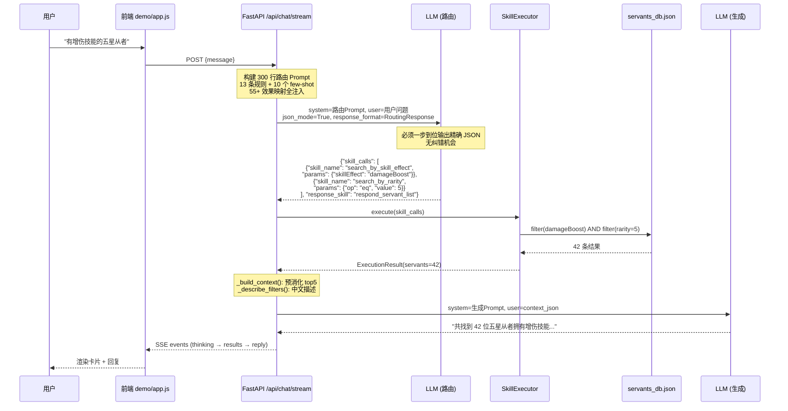
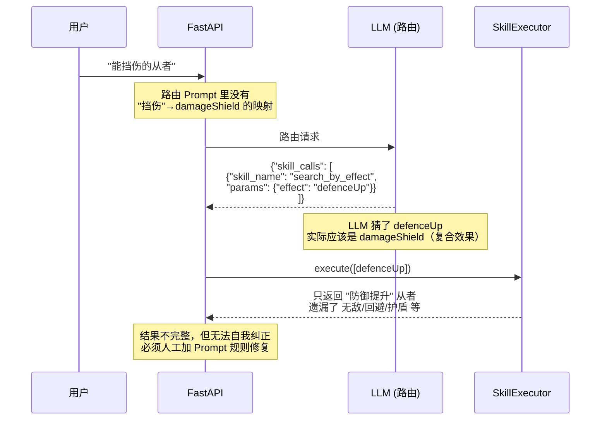
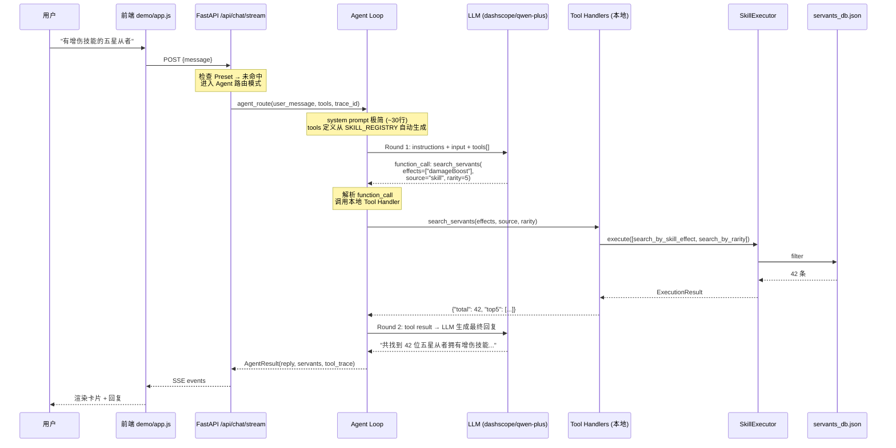
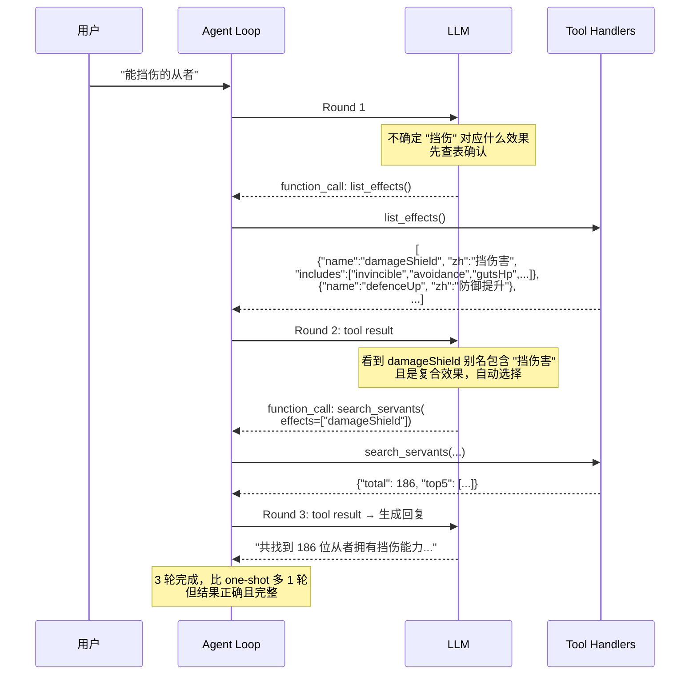
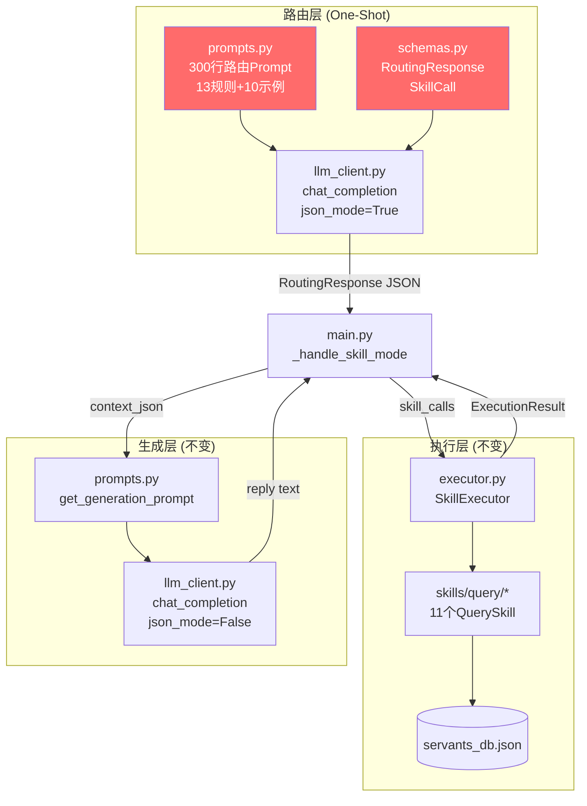
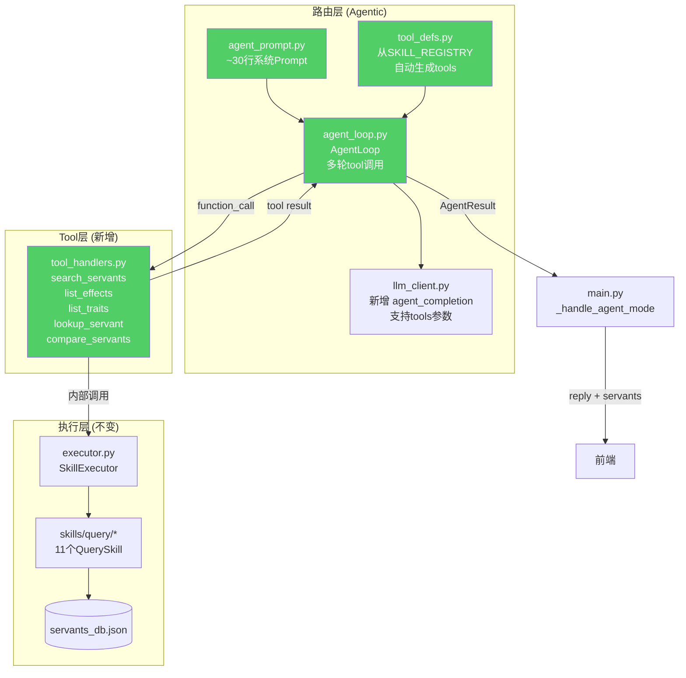
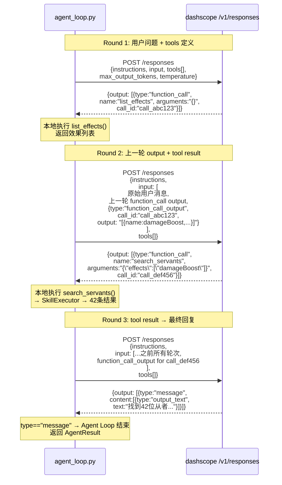

# 架构讨论：Agentic Tool Use 路由重构

> 讨论发起日期：2026-05-11
> 状态：讨论中

## 1. 问题陈述

### 1.1 现状

当前路由架构是 **One-Shot Prompt 模式**：

```
用户自然语言 → LLM 一次性输出 SkillCall JSON → SkillExecutor → 结果
               ↑ 300行路由Prompt + 13条规则 + 10个few-shot
               ↑ 必须一次做对，没有纠错机会
```

### 1.2 日志分析暴露的 4 类问题（2026-05-10 ~ 05-11，94 条日志，25 条失败）

| 问题类型 | 失败数 | 根因 | 当前修复方式 |
|:---------|:------|:-----|:-----------|
| 昵称缺失 | 6 | "仇凛"等昵称不在 nicknames.json | 手工加映射 |
| 效果不可查 | 3 | 被动效果不在数据库中，LLM 不知道 | 手工加 Prompt 规则 |
| 特性路由失败 | 2 | LLM 不知道用 search_by_traits | 手工加 Prompt 规则 |
| Prompt 规则膨胀 | - | 规则从 8→13 条，持续增长 | 无解 |

### 1.3 根本矛盾

**LLM 必须一步到位输出精确的结构化指令，没有试错和自我纠正的能力。每个新业务场景都需要人工在 Prompt 里补规则/示例/映射。**

未来要新增礼装查询、关卡数据、素材计算等大量业务场景时，这个模式无法支撑。

---

## 2. 方案对比

### 方案 A：Function Calling 替代 Prompt 路由（之前讨论，已否决）

把 Skill 注册为 function/tool 定义，用 JSON Schema 约束参数。

**为什么不够**：只是换了输出格式，仍然是 one-shot 模式。LLM 仍需一次性正确映射"增伤"→`damageBoost`，没有试错能力。新业务场景仍需手工扩展 function 定义。

### 方案 B：确定性前置层（之前讨论，已否决）

高频查询用正则/模板匹配，长尾才进 LLM。

**为什么不够**：模板脆弱，覆盖率有上限，对新业务场景无帮助。本质上是另一种形式的"穷举打补丁"。

### 方案 C：Agentic Tool Use（推荐方向）

让 LLM 变成一个 **有工具、能试错的 Agent**，通过多轮 tool 调用实现自我纠正。

#### 核心思路

```
用户自然语言
      ↓
┌──────────────────────────────────────┐
│  LLM Agent（带 tools 定义）           │
│                                      │
│  Step 1: 调 list_effects()           │ ← "增伤是什么效果？"
│          → 返回效果列表               │
│  Step 2: 调 search(effect=damageBoost)│ ← "用这个搜"
│          → 返回 442 条结果            │
│  Step 3: 生成最终回复                 │
│                                      │
│  如果 Step 2 返回 0 条：              │
│  Step 2': 调 list_effects() 重新匹配  │ ← 自我纠正
│  Step 2'': 换参数重新 search          │
└──────────────────────────────────────┘
```

#### 可提供的 Tools

| Tool | 数据源 | 作用 | 解决的问题 |
|:-----|:------|:-----|:----------|
| `list_effects` | effect_schema + overlay | 返回所有可用效果名+中文别名 | 效果名映射问题 |
| `list_traits` | effect_schema traits | 返回所有可用特性名 | 特性路由失败问题 |
| `list_classes` | translations.json | 返回所有可用职阶 | 职阶名映射 |
| `search_servants` | servants_db.json (MV) | 按条件搜索从者 | 核心查询 |
| `lookup_servant` | servants_db.json (MV) | 查询单个从者详情 | 从者详情 |
| `compare_servants` | servants_db.json (MV) | 对比多个从者 | 从者对比 |
| `lookup_skill_detail` | Atlas API (runtime) | 查询从者技能的各等级详细数值 | MV 缺失的低频数据（见 5.6） |

#### 对比当前架构

| 维度 | 当前 One-Shot | Agentic Tool Use |
|:-----|:-------------|:----------------|
| **新业务场景** | 每个都要加 Prompt 规则 | 只需新增 tool 定义 |
| **昵称缺失** | 手工加 nicknames.json | Agent 可调 `search_servants(name="仇凛")` 自动模糊匹配 |
| **效果映射** | Prompt 里穷举 55+ 种效果 | Agent 先调 `list_effects()` 查表再搜索 |
| **特性路由** | Prompt 规则引导 | Agent 先调 `list_traits()` 查表再筛选 |
| **试错能力** | 无 | 有（结果为空时可调整参数重试） |
| **Prompt 长度** | 300+ 行，持续增长 | 固定短 system prompt + tools 定义 |
| **LLM 调用次数** | 2 次（路由+生成） | 3-5 次（多轮 tool 调用） |
| **Token 成本** | 低 | 中（多轮增加） |
| **延迟** | 快（2 次 LLM） | 较慢（多轮串行） |

---

## 3. 关键技术问题

### 3.1 LLM API 兼容性 — 验证结果（2026-05-11）

当前使用 **OpenAI Responses API**（`/v1/responses`）。验证结果：

| 提供商 | 模型 | API | tools 支持 | 备注 |
|:------|:-----|:----|:----------|:-----|
| **dashscope** | qwen-plus | Responses API | **✅ 支持** | 正确返回 `function_call`，243 tokens，自动映射"增伤"→`damageBoost` |
| **obao** | claude-sonnet-4-6 | Responses API | **⏳ 待验证** | 本地 DNS 解析失败，需在 ECS 服务器上验证 |

关键发现：
- dashscope Responses API 原生支持 `tools` 参数，返回 `output[].type == "function_call"`
- tool 定义中的 description 足以引导 LLM 做正确的语义映射（"增伤"→`damageBoost`），无需额外 Prompt 规则
- 单次 tool 调用仅 243 tokens，成本可控

待完成：
- [ ] 在 ECS 服务器上验证 obao 提供商的 tools 支持
- [ ] 验证多轮 tool 调用（tool result → 继续调用 → 最终输出）是否正常

### 3.2 延迟控制

Agentic Loop 的多轮 tool 调用会增加延迟。优化策略：
- **本地 tool 即时返回**：`list_effects`/`list_traits` 等查表操作在 Python 内存中完成，< 1ms
- **限制最大轮次**：设置 max_iterations = 5，防止无限循环
- **并行 tool 调用**：部分模型支持一次返回多个 tool call，可并行执行

### 3.3 成本控制

多轮调用增加 Token 消耗。优化策略：
- **精简 tool results**：`list_effects` 只返回 `{name, aliases_zh[0]}`，不返回完整 schema
- **缓存热门查询**：对完全相同的查询返回缓存结果
- **简单查询走 Preset 快捷路径**：已有的 Preset 机制继续生效，跳过 Agent loop

### 3.4 与现有架构的关系

- **SkillExecutor 保持不变**：Agent 的 `search_servants` tool 内部调用 SkillExecutor
- **Skill 模块保持不变**：所有 QuerySkill/ResponseSkill 继续工作
- **Preset 保持不变**：快捷查询不走 Agent loop
- **变更集中在路由层**：只是把"LLM 一步输出 JSON"替换为"LLM 多轮 tool 调用"

---

## 4. 渐进式落地路径

### Phase 1：验证可行性
- 验证 LLM 网关 tools 支持
- 实现最小化 Agent loop（3 个核心 tools）
- 与现有 one-shot 路由 A/B 对比准确率

### Phase 2：全量切换
- 补齐所有 tools
- 优化延迟和 Token 成本
- 迁移所有路由逻辑到 Agent 模式

### Phase 3：业务扩展
- 新增礼装查询 tools
- 新增关卡/素材查询 tools
- 每个新业务域只需新增 tool 定义

---

## 5. 数据链路图

### 5.1 当前架构：One-Shot Prompt 路由



**失败链路（效果映射错误）：**



---

### 5.2 新架构：Agentic Tool Use 路由



**自我纠正链路（效果映射不确定时）：**



---

### 5.3 模块交互图：新旧对比

**当前架构（模块依赖）：**



**新架构（模块依赖）：**



---

### 5.4 Responses API 多轮 Tool 调用协议



---

### 5.5 整体请求生命周期对比

```mermaid
graph LR
    subgraph "当前架构 (~3s)"
        A1[用户输入] --> A2[Preset检查<br/>~0ms]
        A2 -->|miss| A3[LLM路由<br/>~1.5s<br/>300行Prompt]
        A3 --> A4[SkillExecutor<br/>~50ms]
        A4 --> A5[LLM生成<br/>~1.5s]
        A5 --> A6[SSE响应]
    end

    subgraph "新架构-简单查询 (~3.5s)"
        B1[用户输入] --> B2[Preset检查<br/>~0ms]
        B2 -->|miss| B3[Agent Round1<br/>~1.5s<br/>30行Prompt]
        B3 -->|function_call| B4[Tool执行<br/>~50ms]
        B4 --> B5[Agent Round2<br/>~1.5s<br/>含tool result]
        B5 -->|message| B6[SSE响应]
    end

    subgraph "新架构-复杂查询 (~5s)"
        C1[用户输入] --> C2[Agent Round1<br/>~1.5s]
        C2 -->|list_effects| C3[查表<br/>~1ms]
        C3 --> C4[Agent Round2<br/>~1.5s]
        C4 -->|search_servants| C5[SkillExecutor<br/>~50ms]
        C5 --> C6[Agent Round3<br/>~1.5s]
        C6 -->|message| C7[SSE响应]
    end
```



## 6. 待讨论问题

1. ~~**延迟 vs 准确率 trade-off**~~：用户已确认可接受，准确率和可扩展性优先
2. ~~**Token 成本增加**~~：用户已确认方向可以先做，后续做成本优化
3. ~~**LLM 网关兼容性**~~：dashscope 已验证支持，obao 暂不考虑
4. **回退策略**：Agent loop 失败时是否 fallback 到当前 one-shot 模式？
5. **生成阶段合并**：Agent 最后一轮直接输出用户回复，还是仍然走独立的 RAG 生成 LLM 调用？
