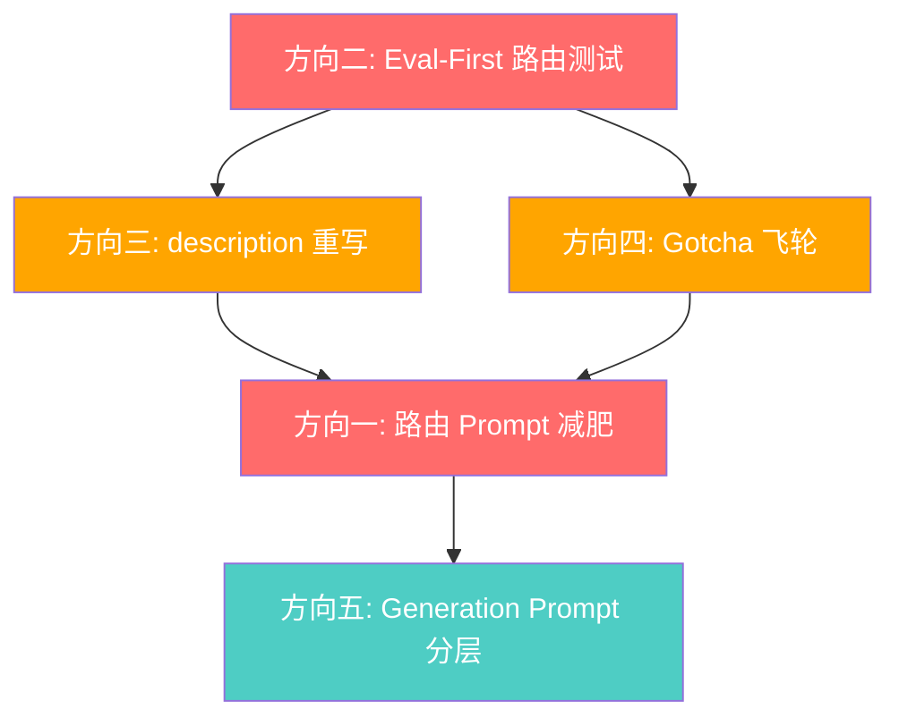

# Skill-Based Architecture 升级讨论

> 参考文献：[Designing, Refining, and Maintaining Agent Skills at Perplexity](https://research.perplexity.ai/articles/designing-refining-and-maintaining-agent-skills-at-perplexity)

## 背景

Laplace 在 ADR-018 中引入了 Skill-Based Architecture，将查询逻辑拆分为独立的 Skill 模块（`@register_skill` 注册），通过 LLM 路由层将自然语言映射到 Skill 调用组合。当前架构已稳定运行，支撑 15 个 Skill（11 个 Query + 4 个 Response）。

Perplexity 于 2025 年公开了其 Agent Skills 的设计、打磨与维护指南。尽管 Perplexity 的 Skill 是"给 LLM 注入的上下文文档"（SKILL.md），与我们的"后端执行型 Python 模块"本质不同，但其中多个设计哲学具有普适价值。

本文基于该文献，对照 Laplace 现状，识别出 5 个可落地的优化方向。

---

## 现状量化

| 指标 | 当前值 |
|:---|:---|
| 已注册 Skill 总数 | 15（11 Query + 4 Response） |
| 路由 Prompt 字符数 | **7,676 字符**（~4,000 token） |
| 其中：效果 hints 行数 | **57 行 / 2,705 字符**（每次全量注入） |
| 其中：few-shot 示例数 | **12 个** |
| 其中：路由规则数 | **10 条** |
| 生成 Prompt 字符数 | 2,337 字符（~2,300 token） |
| 路由 + 生成 总固定成本 | **~6,300 token / 每次对话** |

---

## 优化方向一：路由 Prompt 分层减肥（P1）

### Perplexity 的核心洞察

> "索引层每个 token 都要斤斤计较，因为每个 session、每个用户都在为它付费。"

Perplexity 将 Skill 的上下文成本分为三层：

| 层级 | 预算 | 何时付费 |
|:---|:---|:---|
| Index（索引层） | ~100 token/Skill | **每次对话永远在付** |
| Load（加载层） | ~5,000 token | Skill 被加载时一次性付 |
| Runtime（运行时层） | 不限 | Agent 真去读了才付 |

### 我们的问题

当前路由 Prompt 是**单层全量注入**——所有信息（Skill 列表、效果语义表、规则、示例）每次对话都完整注入。~4,000 token 的路由 Prompt 中：

- **效果 hints（57 行 / 2,705 字符）**：占路由 Prompt 的 35%，但只有效果类查询才需要
- **few-shot 示例（12 个）**：占约 25%，但很多场景用不到（如量化筛选示例只在"超过50%"类查询时有用）
- **路由规则 9（OR 禁令）和规则 10（量化参数）**：只在特定效果查询场景才需要

### 方案对比

| 方案 | 描述 | Token 节省 | 复杂度 | 风险 |
|:---|:---|:---|:---|:---|
| **A. 效果 hints 按需注入** | 路由分两步：先判断是否涉及效果 → 是则注入效果表 | ~35%（~1,400 token） | 中（需两步路由或启发式预判） | 预判可能误判 |
| **B. 效果 hints 压缩** | 只保留 effectName + 首个中文别名，去掉 description | ~15%（~600 token） | 低 | 路由精度可能下降 |
| **C. few-shot 精简** | 从 12 个减到 5 个核心示例 | ~15%（~600 token） | 低 | 需验证覆盖率 |
| **D. B + C 组合** | 压缩 hints + 精简示例 | ~30%（~1,200 token） | 低 | 综合 |

**建议**：先执行 **方案 D（B+C 组合）**，低风险高收益。后续如 Skill 数量继续增长，再考虑方案 A 的两步路由。

### 具体优化细节

**效果 hints 压缩（方案 B）**：

当前格式：
```
- `upAtk`: 攻击力提升 / 加攻 — 提升攻击力，增加所有攻击的基础伤害
```

压缩为：
```
- `upAtk`: 攻击力提升 / 加攻
```

去掉 description 部分（"— 提升攻击力，增加..."），因为 LLM 通过中文别名已经能理解效果语义，description 更多是给人看的文档。

**few-shot 精简（方案 C）**：

保留 5 个核心示例（覆盖主要查询模式），移除 7 个可由规则推导的示例：

| 保留 | 理由 |
|:---|:---|
| NP 自充 + 职阶组合 | 最常见的多 Skill AND 组合 |
| 单从者查询（lookup） | 区别于筛选类 |
| 效果查询（search_by_effect） | 默认效果路由 |
| 从者对比（compare） | 独特模式 |
| 虚拟复合效果（damageShield） | 需要示例引导 |

移除的 7 个示例都可以由路由规则 + Skill description 推导：
- 精确技能效果查询（规则 8 已覆盖）
- 精确宝具效果查询（规则 8 已覆盖）
- 蓝魔放五星从者（效果查询变种）
- 解除负面状态（效果查询变种）
- 量化条件示例 x2（规则 10 已覆盖）
- 全队加攻示例（量化变种）

---

## 优化方向二：Eval-First 路由测试（P1）

### Perplexity 的核心洞察

> "Step 0：先写 Eval。至少要保证你测试的是 Skill 在该加载的时候确实加载了。反面例子的威力极大，有时候比正面例子还重要。"

### 我们的问题

当前测试体系存在一个巨大盲区：**路由准确性完全没有自动化 eval**。

| 测试类型 | 当前覆盖 | 缺失 |
|:---|:---|:---|
| Skill 执行逻辑（filter） | `test_skill_api.py` ✅ | — |
| Skill 框架（注册/分组） | `test_skill_framework.py` ✅ | — |
| Schema 契约 | `test_schemas.py` ✅ | — |
| **路由准确性** | **无** ❌ | 用户查询 → 期望 Skill 选择 |
| **路由反面例子** | **无** ❌ | 不该路由到某 Skill 的查询 |
| **邻近域混淆** | **无** ❌ | 如"配卡" vs "色卡增伤" |

### 方案

新增 `tests/test_routing_eval.py`，建立路由 eval 套件：

```python
# 正面例子：期望路由到 search_by_effect
POSITIVE_CASES = [
    ("有增伤技能的从者", ["search_by_effect"], {"effect": "damageBoost"}),
    ("能挡伤害的从者", ["search_by_effect"], {"effect": "damageShield"}),
    ...
]

# 反面例子：不该路由到某 Skill
NEGATIVE_CASES = [
    ("梅林厉害吗", "search_by_effect"),  # 应该是 lookup，不是效果搜索
    ...
]

# 邻近域混淆：容易混淆的查询对
CONFUSION_PAIRS = [
    ("蓝卡多的从者", "search_by_cards"),      # 配卡查询
    ("有蓝魔放的从者", "search_by_effect"),    # 效果查询，不是配卡
    ...
]
```

**实现方式**：
- 默认标记为 `@pytest.mark.skipif(not os.getenv("RUN_LIVE_LLM_TESTS"))`，避免日常测试消耗 LLM quota
- 每次新增 Skill 或修改路由规则时，手动运行一次验证
- 可选：记录历史 routing_output 日志作为"录制回放"式 eval，零 LLM 消耗

---

## 优化方向三：description 重写为触发器（P2）

### Perplexity 的核心洞察

> "差的描述写'这个 Skill 是干嘛的'。好的描述写'什么时候 Agent 应该加载它'。用 'Load when...' 开头。"

### 我们的问题

当前所有 Skill 的 description 都是功能说明式的：

| Skill | 当前 description | 问题 |
|:---|:---|:---|
| `search_by_class` | "按职阶筛选从者（如 Saber、Caster）" | 是文档，不是触发器 |
| `search_by_effect` | "按效果筛选从者，默认同时搜技能效果和宝具效果" | 是文档 |
| `search_by_cards` | "按配卡组合、宝具颜色、宝具目标筛选从者" | 是文档 |
| `search_by_np_charge` | "按 NP 充能量筛选从者（如自充 ≥ 50%）" | 部分触发器意味 |

### 方案

将 description 从"功能说明"改为"触发条件"，更贴近用户的真实查询意图：

| Skill | 建议新 description |
|:---|:---|
| `search_by_class` | "当用户提到职阶名称（如 Saber、Caster、骑阶、术阶、狂阶等）时使用" |
| `search_by_effect` | "当用户查询某种效果或能力（如无敌、加攻、充能、增伤等），且未指定来源（技能/宝具）时使用" |
| `search_by_cards` | "当用户提到配卡构成（如几蓝几红）、宝具颜色（红宝具）、宝具目标（全体/单体）时使用" |
| `search_by_np_charge` | "当用户提到自充、充能、NP 充电、XX% 充能时使用" |
| `search_by_rarity` | "当用户提到星级/稀有度（如五星、4星、金卡等）时使用" |
| `lookup_servant` | "当用户询问特定一个从者的信息（如'查一下梅林'、'孔明怎么样'）时使用" |
| `compare_servants` | "当用户想对比两个或多个从者（如'对比梅林和孔明'、'村正和武尊谁强'）时使用" |

**注意事项**：
- Perplexity 警告"description 里的小幅措辞调整，对路由的影响往往是巨大的"
- 必须配合 Eval 套件（优化方向二）验证改动不会破坏现有路由
- 建议逐个 Skill 修改 + 验证，而不是一次性全改

---

## 优化方向四：Gotcha 飞轮机制（P2）

### Perplexity 的核心洞察

> "Skill 是只增不删（append-mostly）的。时间一长，最有价值积累的就是 gotcha 这一节。Agent 翻车一次就加一条 gotcha。"

### 我们的问题

当前的"坑"散落在路由 Prompt 的全局规则中：

- **规则 5**：色卡性能提升 vs 配卡查询的区分 → 应属于 `search_by_cards` 和 `search_by_effect` 的 gotcha
- **规则 9**：禁止同 Skill 多次调用表达 OR → 应属于效果类 Skill 的 gotcha
- **规则 8**：效果类查询的 Skill 选择 → 应属于 `search_by_effect` / `search_by_skill_effect` / `search_by_np_effect` 三者的 gotcha

这种做法导致两个问题：
1. 全局规则越来越多，路由 Prompt 持续膨胀
2. 新增 Skill 时无法判断哪些规则跟自己相关

### 方案

在 `BaseSkill` 中增加 `gotchas` 属性，将场景特定的规则下沉到 Skill 级别：

```python
class BaseSkill:
    name: str = ""
    description: str = ""
    gotchas: list[str] = []  # 新增
```

路由 Prompt 构建时，将 gotcha 按 Skill 分组注入，而不是作为全局规则：

```
## 可用 Skills
- `search_by_effect`: 当用户查询某种效果或能力时使用
  ⚠ 涉及色卡性能提升时用此 Skill，不要用 search_by_cards
  ⚠ 多效果 OR 用 effects+effectsOp:"or"，禁止多次调用同 Skill
```

**收益**：
- 全局规则从 10 条减少到 ~4 条（仅保留真正全局的规则）
- 每个 Skill 的 gotcha 紧跟 description，LLM 更容易关联
- 新增 Skill 时，gotcha 自然归属到具体 Skill，不污染全局

### 飞轮机制

建立 gotcha 积累流程（纳入 AGENTS.md）：

```
线上发现路由错误 → 分析根因 → 追加到对应 Skill 的 gotchas 列表 
→ 添加 eval 反面例子 → 验证修复
```

---

## 优化方向五：Generation Prompt 分层（P3）

### 问题

当前 `get_generation_prompt()` 包含 9 条规则 + 检查清单，**每次生成都全量注入**（~2,300 token）。但部分规则只对特定 Response Skill 有意义：

| 规则 | 适用场景 | 不适用场景 |
|:---|:---|:---|
| 规则 2（结合全局统计） | `respond_servant_list` | `respond_servant_detail`（单从者无统计） |
| 规则 4 中"禁止以偏概全" | `respond_servant_list` | `respond_servant_compare`（不存在代表性问题） |
| 规则 7（能力边界） | 所有 | — |
| 规则 8（零技术术语） | 所有 | — |

### 方案

将 generation prompt 拆分为：

- **核心规则**（~5 条，始终注入）：规则 1/3/7/8/9 + 检查清单
- **列表场景规则**（按需注入）：规则 2（全局统计）、规则 4 后半段（禁止以偏概全）
- **特化补充**（已有机制）：各 Response Skill 的 `_DETAIL_SUPPLEMENT` 等

```python
class ResponseSkill(BaseSkill):
    @abstractmethod
    def build_prompt(self, user_message: str, context_json: str) -> str:
        ...

    @property
    def extra_rules(self) -> list[str]:
        """此 Response Skill 需要的额外规则索引。"""
        return []
```

**预计收益**：对 `respond_servant_detail` 和 `respond_servant_compare` 场景节省 ~300-500 token。

**优先级低的原因**：生成阶段只执行一次，不像路由 Prompt 那样每次对话都要付费。且当前 Response Skill 只有 4 个，规则冗余的影响有限。

---

## 整体优先级与依赖关系



| 优先级 | 方向 | 预计 Token 节省 | 前置依赖 | 建议时机 |
|:---|:---|:---|:---|:---|
| **P1** | 方向二：Eval-First 路由测试 | 0（基础设施） | 无 | **立即** |
| **P1** | 方向一：路由 Prompt 减肥（D 方案） | ~1,200 token/次 (~30%) | 方向二（需验证不回归） | 方向二之后 |
| **P2** | 方向三：description 重写 | 间接（提升路由精度） | 方向二（需验证不回归） | 稳定后 |
| **P2** | 方向四：Gotcha 飞轮 | ~200-400 token（全局规则下沉） | 方向二 | 稳定后 |
| **P3** | 方向五：Generation Prompt 分层 | ~300-500 token/次 | 无 | 后续迭代 |

---

## 不采纳的 Perplexity 理念

| 理念 | 不采纳原因 |
|:---|:---|
| **Skill 是一个目录**（SKILL.md + scripts/ + references/ + assets/） | Perplexity 的 Skill 是文档型（LLM 阅读），我们的 Skill 是代码型（Python 类执行）。当前 `query/` + `response/` 分目录已足够 |
| **config.json 用户配置** | 我们是单用户助手，不需要 per-user Skill 配置 |
| **depends: Skill 依赖链** | 当前 Skill 粒度较小且相互独立，不需要层级依赖 |
| **让 LLM 自己写 Skill** | 原文引用研究结论"模型自己生成的 Skill 平均没有任何效果"，确认不走这条路 |

---

## 待决策问题

1. **方向一的 hints 压缩**：去掉 description 后路由精度是否会下降？需要用 eval 验证。
2. **方向三的 description 重写**：是一次性全改还是逐个改？Perplexity 警告"description 的小幅措辞调整影响巨大"。
3. **方向四的 gotcha 注入方式**：是紧跟在 Skill description 后面，还是单独开一个 `## Gotchas` section？
4. **方向二的 eval 粒度**：是只测路由选择（选了哪些 Skill），还是同时测参数准确性（params 是否正确）？
